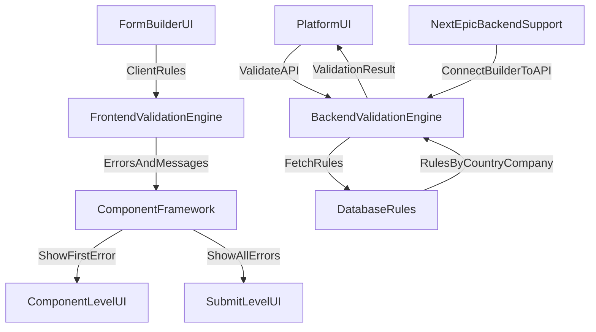

# Validation Architecture Reference

**Purpose:** Single source of truth for validation goals, current architecture, and review notes for the Form Builder and public renderer.

**Primary Sources:**
- `docs/VALIDATION-ARCHITECTURE-STORY-1.20.md`
- `docs/COMPONENT-FRAMEWORK-REFERENCE.md`
- `docs/stories/STORY-3.8-3.9-UAT-TEST-GUIDE.md`

---

## Validation Goal

1. **Consistency across surfaces**: Builder canvas, builder preview, and public preview/production should enforce the same validation rules with the same error semantics.  
2. **Deterministic rule ordering**: When multiple rules apply, errors should be deterministic and stable (priority ordering).  
3. **User guidance without noise**:
   - Component-level: show **first** failing rule only.
   - Submit-level: show **all** blocking errors.  
4. **Configurable rules**: Rules are defined in component props and surfaced in the Properties Panel where applicable.
5. **International + rule-specific behavior**: Email, phone, date, numeric, and text rules should align to the validation engine’s canonical behavior.

**Source:** `docs/COMPONENT-FRAMEWORK-REFERENCE.md` (Validation Rule System + display behavior)

---

## Current Validation Architecture (Form Builder + Runtime)

### 1) Validation Engine (Frontend)

The canonical rule evaluation logic is implemented in the frontend validation engine.  
**Primary file:** `frontend/src/features/builder/utils/validationEngine.ts`

Key characteristics:
- Validates by component type (`text`, `email`, `phone`, `date`, etc.).
- Applies rule ordering and returns structured errors.
- Includes email/business domain rules and phone country-code requirements.

**Source:** `docs/COMPONENT-FRAMEWORK-REFERENCE.md` (Validation Rule System)

### 2) Component Rendering Surfaces

Validation messages are rendered through the component framework:
- Builder canvas and runtime use the shared object layout structure.
- Validation objects render only when errors are present (or when form-level errors exist).

**Source:** `docs/COMPONENT-FRAMEWORK-REFERENCE.md` (UniversalFieldShell, validation object display behavior)

### 3) UAT Validation Coverage

The UAT guide provides the checklist of rules and scenarios for validation testing:
- Text rules: min/max length, pattern, alpha, alphanumeric, XSS blocking, etc.
- Email rules: business-only, domain allow/deny, no disposable, no plus addressing.
- Phone rules: country code required, mobile-only, allowed countries.
- Date rules: min/max, future/past, weekday-only, age constraints.

**Source:** `docs/stories/STORY-3.8-3.9-UAT-TEST-GUIDE.md` (Validation Rules Checklist)

---

## Story 1.20 Architecture (Active + Review Required)

Story 1.20 defined a multi-layer validation system centered on database rules and a backend validation engine:
- Country + validation rule tables in the DB.
- Backend validation service with rule precedence and normalization.
- Frontend hook calling a backend validation endpoint.

This architecture was used early in platform development and remains in use. The Form Builder is currently frontend-first while backend + database support for builder validation is planned for the next Epic.

**Source:** `docs/VALIDATION-ARCHITECTURE-STORY-1.20.md`

### Review Questions (Answered)

1. **Is the backend validation service still authoritative for any form inputs?**  
   - **Yes.** The platform uses the Story 1.20 validation architecture today.
2. **Are database-driven rules actively used, or is validation now solely client-side?**  
   - **Database-driven rules are active** in the existing platform; the Form Builder is currently frontend-only.
3. **Do any components still call the Story 1.20 validation API?**  
   - **Yes.**
4. **If the backend path is deprecated, should it be formally retired or updated?**  
   - **No.** It should not be retired. The next Epic will implement backend + DB support for the Form Builder.

---

## Validation Display Behavior (Contract)

**Component-level:** show only the first failed rule.  
**Submit-level:** aggregate all errors, sorted by tab order.

This behavior is required to keep validation predictable and user-friendly.

**Source:** `docs/COMPONENT-FRAMEWORK-REFERENCE.md` (Validation Display Behavior)

---

## Engine Architecture (Current + Planned)

**Notes:**
- The Form Builder currently uses the **frontend validation engine** for builder + public preview.
- The broader platform uses the **backend validation engine** (Story 1.20) with DB-driven rules.
- The next Epic will connect Form Builder validation to the backend + DB rules for parity and governance.

---

## Architecture Review Summary (Updated)

**Current Path (Form Builder & Public Renderer):**
- Validation is evaluated by the frontend validation engine.
- Rules are configured per component in builder properties.
- UI surfaces render validation messages via the component framework.

**Platform Path (Story 1.20):**
- Database-driven rules → backend validation API → frontend display.

**Action:** document coexistence and alignment strategy; ensure backend + DB support is implemented for Form Builder in the next Epic without retiring the Story 1.20 architecture.

---

## Useful Processes (Testing + Review)

1. **Validation Rule Coverage**  
   - Use the checklist in `docs/stories/STORY-3.8-3.9-UAT-TEST-GUIDE.md` to validate each rule.
2. **Surface Parity Review**  
   - Compare builder canvas, builder preview, and public preview for identical validation behavior.
3. **Backend Rule Parity Review**  
   - Compare frontend validation engine behavior to the backend validation API for the same rules and inputs.
4. **Logging + DevTools Validation**  
   - Use `docs/AGENT-LOGGING-GUIDE.md` to capture validation events and DevTools MCP outputs.

---

## Consolidated Validation Rule Inventory

**Legend (Usage Evidence):**
- **Checklist**: Listed in UAT checklist, but not explicitly verified in notes yet.
- **Observed**: Confirmed working or tested in UAT notes.
- **TBD**: No usage evidence recorded yet.

### Frontend Validation Engine Rules (Form Builder)

**UI Control Location:** Properties Panel → **Validation Rules** (section groups by type: Text, Number, Email, Phone, Date, Selection).  
**Source of truth:** `frontend/src/features/builder/types/builder.types.ts` (ValidationRules)

| Rule key | Category | Applies to | UI control location | Usage evidence |
|---|---|---|---|---|
| `required` | General | All inputs | Validation Rules → General | Observed |
| `customError` | General | All inputs | Validation Rules → General | Checklist |
| `minLength` | Text | text, textarea, first-name | Validation Rules → Text | Checklist |
| `maxLength` | Text | text, textarea, first-name | Validation Rules → Text | Observed |
| `pattern` | Text | text, textarea, first-name | Validation Rules → Text | Checklist |
| `alpha` | Text | text, textarea, first-name | Validation Rules → Text | Checklist |
| `alphanumeric` | Text | text, textarea, first-name | Validation Rules → Text | Checklist |
| `noHtmlScript` | Security | text, textarea, first-name | Validation Rules → Text | Checklist |
| `trimWhitespace` | Formatting | text, textarea, first-name | Validation Rules → Text | Checklist |
| `noConsecutiveSpaces` | Formatting | text, textarea, first-name | Validation Rules → Text | Checklist |
| `caseTransform` | Formatting | text, textarea, first-name | Validation Rules → Text | Checklist |
| `blockedCharacters` | Security | text, textarea, first-name | Validation Rules → Text | Checklist |
| `mustMatchField` | Text | text, textarea, first-name | Validation Rules → Text | Checklist |
| `numeric` | Number | number, text (if configured) | Validation Rules → Number | Observed |
| `minValue` | Number | number | Validation Rules → Number | Observed |
| `maxValue` | Number | number | Validation Rules → Number | Observed |
| `integerOnly` | Number | number | Validation Rules → Number | Observed |
| `decimalPrecision` | Number | number | Validation Rules → Number | Checklist |
| `stepIncrement` | Number | number | Validation Rules → Number | Checklist |
| `positiveOnly` | Number | number | Validation Rules → Number | Observed |
| `nonNegative` | Number | number | Validation Rules → Number | Checklist |
| `nonZero` | Number | number | Validation Rules → Number | Checklist |
| `oddOnly` | Number | number | Validation Rules → Number | Checklist |
| `evenOnly` | Number | number | Validation Rules → Number | Checklist |
| `allowedValues` | Number | number | Validation Rules → Number | Checklist |
| `email` | Email | email | Validation Rules → Email | Observed |
| `businessEmailOnly` | Email | email | Validation Rules → Email | Observed |
| `domainWhitelist` | Email | email | Validation Rules → Email | Checklist |
| `domainBlacklist` | Email | email | Validation Rules → Email | Observed |
| `noDisposableEmail` | Email | email | Validation Rules → Email | Observed |
| `noPlusAddressing` | Email | email | Validation Rules → Email | Observed |
| `phone` | Phone | phone | Validation Rules → Phone | Observed |
| `countryCodeRequired` | Phone | phone | Validation Rules → Phone | Observed |
| `allowedCountries` | Phone | phone | Validation Rules → Phone | Checklist |
| `mobileOnly` | Phone | phone | Validation Rules → Phone | Checklist |
| `url` | URL | text (if configured) | Validation Rules → Text | Checklist |
| `minDate` | Date | date | Validation Rules → Date | Observed |
| `maxDate` | Date | date | Validation Rules → Date | Observed |
| `futureOnly` | Date | date | Validation Rules → Date | Observed |
| `pastOnly` | Date | date | Validation Rules → Date | Checklist |
| `minimumAge` | Date | date | Validation Rules → Date | Checklist |
| `maximumAge` | Date | date | Validation Rules → Date | Checklist |
| `weekdaysOnly` | Date | date | Validation Rules → Date | Observed |
| `isDateRange` | Date | date | Validation Rules → Date | Checklist |
| `maxDateRangeSpan` | Date | date | Validation Rules → Date | Checklist |
| `minDateRangeSpan` | Date | date | Validation Rules → Date | Checklist |

**Sources:**  
- `docs/COMPONENT-FRAMEWORK-REFERENCE.md` (Validation Rule System + UI behavior)  
- `docs/stories/STORY-3.8-3.9-UAT-TEST-GUIDE.md` (UAT checklist + notes)  
- `frontend/src/features/builder/types/builder.types.ts` (ValidationRules)

---

### Backend Validation Engine Rules (Story 1.20)

**UI Control Location:** Not in the Form Builder UI yet (backend rules are DB‑driven).  
**Source of truth:** `config.ValidationRule` table + `ref.RuleType`  
**Note:** The backend rule set is data-driven; the full list of rules exists in DB, not in this repo.

| RuleType (Story 1.20) | Example RuleKey(s) | Applies to | Usage evidence |
|---|---|---|---|
| `phone` | `PHONE_MOBILE_FORMAT`, `PHONE_AU_MOBILE_INTL`, `PHONE_LANDLINE_FORMAT` | Phone inputs | Observed (Story 1.20 docs) |
| `postal_code` | `POSTAL_CODE_FORMAT`, `POSTAL_CODE_NZ` | Postal/Address inputs | Observed (Story 1.20 docs) |
| `tax_id` | (not enumerated in repo) | Tax ID inputs | Checklist (Story 1.20 intent) |

**Sources:**  
- `docs/VALIDATION-ARCHITECTURE-STORY-1.20.md` (DB schema + example rules)

---

## Source References

- Validation architecture (legacy): `docs/VALIDATION-ARCHITECTURE-STORY-1.20.md`
- Validation rule system + display rules: `docs/COMPONENT-FRAMEWORK-REFERENCE.md`
- Validation rules checklist & UAT procedures: `docs/stories/STORY-3.8-3.9-UAT-TEST-GUIDE.md`

