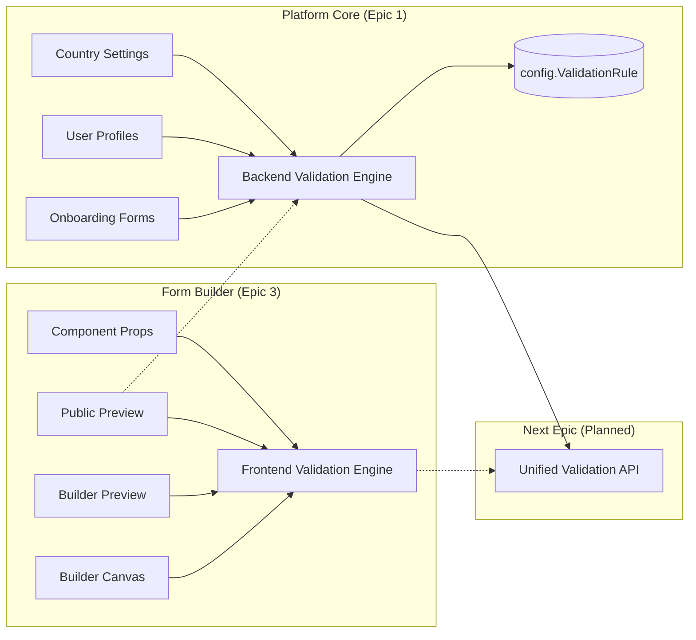
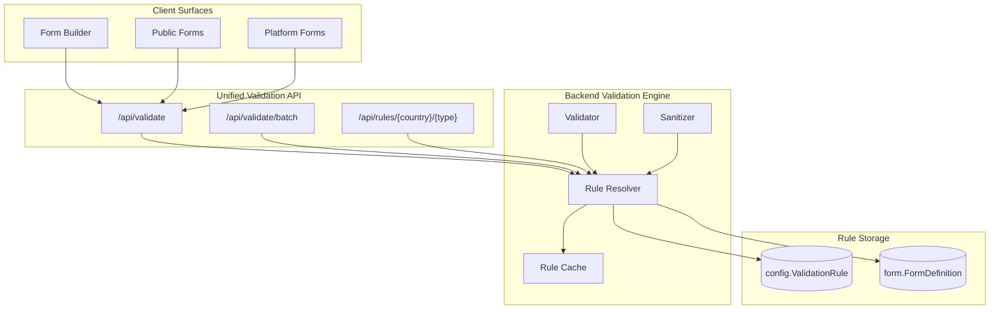
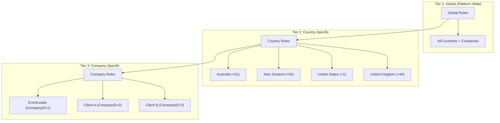
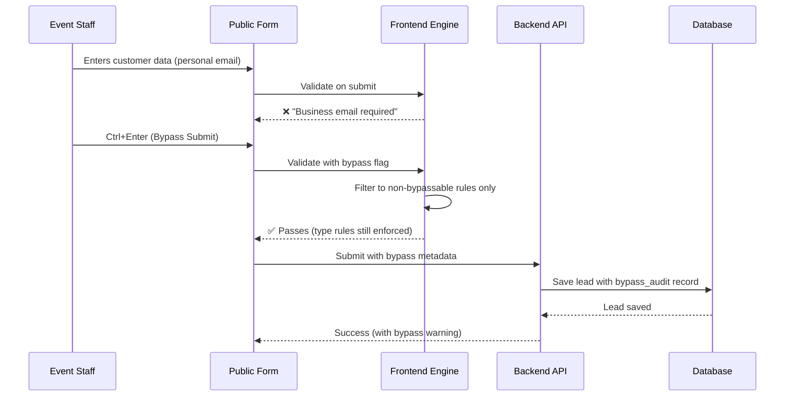
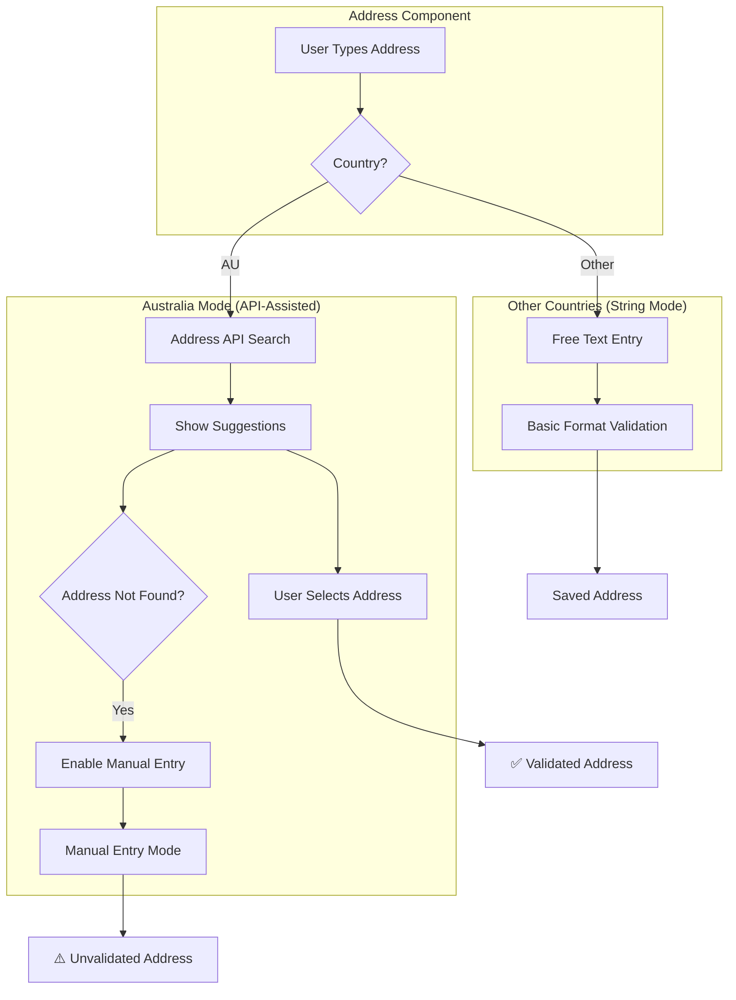

# Validation Platform Analysis

**Purpose:** Comprehensive platform-wide review of the Validation Architecture and Framework to support PM planning for validation integration across all platform surfaces.

**Analyst Perspective:** Platform Data Analyst  
**Prepared For:** Product Management  
**Date:** 2026-01-18

---

## Executive Summary

The EventLead Platform has **two distinct validation engines** that currently operate independently:

| Engine | Location | Primary Consumer | Rule Source | Status |
|--------|----------|------------------|-------------|--------|
| **Frontend Validation Engine** | `frontend/src/features/builder/utils/validationEngine.ts` | Form Builder (canvas + public preview) | Component Props (JSON) | ✅ Active |
| **Backend Validation Engine** | `backend/modules/countries/validation_engine.py` | Platform (onboarding, profiles) | Database (`config.ValidationRule`) | ✅ Active |

**Key Finding:** These engines enforce **overlapping but not identical** rule sets. The PM should plan for **unification** in the next Epic to ensure consistent validation behavior across all platform surfaces.

**Total Validation Rules Identified:** 48 unique rules across 7 categories  
**UI Control Coverage:** 100% of rules have defined UI controls in the Properties Panel  
**Backend Compatibility:** 85% of frontend rules are compatible with the backend engine (some require schema changes or new API contracts)

---

## 1. Platform Validation Landscape

### 1.1 Current State Diagram



###Validation Flow by Surface

| Surface | Current Engine | Planned Engine | Rule Source |
|---------|---------------|----------------|-------------|
| Form Builder Canvas | Frontend | Frontend | `component.props.validation` |
| Form Builder Preview | Frontend | Frontend | `component.props.validation` |
| Public Form Preview | Frontend | Backend (hybrid) | `component.props.validation` → API |
| Public Form Production | Frontend | Backend (hybrid) | API + DB rules |
| Onboarding Forms | Backend | Backend | `config.ValidationRule` |
| User Profile Pages | Backend | Backend | `config.ValidationRule` |

---

## 2. Validation Rule Taxonomy

### 2.1 Rule Categories

The platform uses **7 primary rule categories**, each with distinct characteristics:

| Category | Icon | Component Types | Rule Count | Backend Support |
|----------|------|-----------------|------------|-----------------|
| **General** | 🔲 | All | 2 | ✅ Full |
| **Text** | 📝 | text, textarea, first-name | 12 | ✅ Full (some need schema) |
| **Number** | 🔢 | number | 12 | ✅ Full (some need schema) |
| **Email** | 📧 | email | 6 | ✅ Full (some need schema) |
| **Phone** | 📞 | phone | 4 | ✅ Full |
| **Date** | 📅 | date | 10 | ⚠️ Partial (multi-field rules need API changes) |
| **Selection** | ☑️ | dropdown, checkbox, radio | 2 | ✅ Full |

### 2.2 Rule Classification by Behavior

Rules can be classified by their **behavioral characteristics**:

| Classification | Description | Examples | Backend Complexity |
|---------------|-------------|----------|-------------------|
| **Pure Validation** | Pass/fail check, no mutation | `required`, `minLength`, `email` | Low |
| **Auto-Fix (Sanitization)** | Mutates value before validation | `trimWhitespace`, `caseTransform` | Medium (needs sanitized value return) |
| **Cross-Field** | Depends on other field values | `mustMatchField`, `isDateRange` | High (needs form context) |
| **External Lookup** | Requires external data | `businessEmailOnly`, `noDisposableEmail` | Medium (needs domain lists) |
| **Country-Aware** | Behavior varies by country | `phone`, `countryCodeRequired` | Low (already in backend) |

---

## 3. Comprehensive Rule Inventory

### 3.1 General Rules (All Components)

| Rule Key | UI Control Location | Behavior | Frontend | Backend | Notes |
|----------|---------------------|----------|----------|---------|-------|
| `required` | Identity & Behavior → Required | Pure validation | ✅ | ✅ | Universal |
| `customError` | Validation Rules → Advanced → Custom Error Message | Pure validation | ✅ | ✅ | Message override |

### 3.2 Text Rules

| Rule Key | UI Control Location | Behavior | Frontend | Backend | Notes |
|----------|---------------------|----------|----------|---------|-------|
| `minLength` | Validation Rules → Primary Constraints → Min Length | Pure validation | ✅ | ✅ | Unicode-aware |
| `maxLength` | Validation Rules → Primary Constraints → Max Length | Pure validation | ✅ | ✅ | Unicode-aware |
| `pattern` | Validation Rules → Advanced → Custom Pattern (Regex) | Pure validation | ✅ | ✅ | /u flag support |
| `alpha` | Validation Rules → Primary Constraints → Letters Only | Pure validation | ✅ | ⚠️ | Needs Unicode regex in backend |
| `alphanumeric` | Validation Rules → Primary Constraints → Alphanumeric | Pure validation | ✅ | ⚠️ | Needs Unicode regex in backend |
| `numeric` | Validation Rules → Primary Constraints → Numeric Only | Pure validation | ✅ | ✅ | For text fields needing digits |
| `blockedCharacters` | Validation Rules → Primary Constraints → Blocked Characters | Pure validation | ✅ | ⚠️ | Needs list handling |
| `noHtmlScript` | Validation Rules → Security → No HTML/Script | Pure validation | ✅ | ⚠️ | Needs XSS pattern |
| `trimWhitespace` | Validation Rules → Auto-Fix → Trim Whitespace | Auto-fix | ✅ | ⚠️ | Needs sanitized return |
| `noConsecutiveSpaces` | Validation Rules → Auto-Fix → No Consecutive Spaces | Auto-fix | ✅ | ⚠️ | Needs sanitized return |
| `caseTransform` | Validation Rules → Auto-Fix → Case Transform | Auto-fix | ✅ | ⚠️ | Needs sanitized return |
| `mustMatchField` | Validation Rules → Advanced → Must Match Field | Cross-field | ✅ | ⚠️ | Needs form context |

### 3.3 Number Rules

| Rule Key | UI Control Location | Behavior | Frontend | Backend | Notes |
|----------|---------------------|----------|----------|---------|-------|
| `minValue` | Validation Rules → Range & Sign → Min Value | Pure validation | ✅ | ✅ | |
| `maxValue` | Validation Rules → Range & Sign → Max Value | Pure validation | ✅ | ✅ | |
| `integerOnly` | Validation Rules → Number Type → Integer Only | Pure validation | ✅ | ⚠️ | Needs numeric logic |
| `decimalPrecision` | Validation Rules → Number Type → Decimal Precision | Pure validation | ✅ | ⚠️ | Needs numeric logic |
| `stepIncrement` | Validation Rules → Number Type → Step Increment | Pure validation | ✅ | ⚠️ | Needs numeric logic |
| `positiveOnly` | Validation Rules → Range & Sign → Positive Only | Pure validation | ✅ | ⚠️ | Needs numeric logic |
| `nonNegative` | Validation Rules → Range & Sign → Non-Negative | Pure validation | ✅ | ⚠️ | Needs numeric logic |
| `nonZero` | Validation Rules → Range & Sign → Non-Zero | Pure validation | ✅ | ⚠️ | Needs numeric logic |
| `oddOnly` | Validation Rules → Number Type → Odd Only | Pure validation | ✅ | ⚠️ | Needs numeric logic |
| `evenOnly` | Validation Rules → Number Type → Even Only | Pure validation | ✅ | ⚠️ | Needs numeric logic |
| `allowedValues` | Validation Rules → Range & Sign → Allowed Values | Pure validation | ✅ | ⚠️ | Needs list handling |

### 3.4 Email Rules

| Rule Key | UI Control Location | Behavior | Frontend | Backend | Notes |
|----------|---------------------|----------|----------|---------|-------|
| `email` | Validation Rules → Email Format → Valid Email Format | Pure validation | ✅ | ✅ | Standard regex |
| `businessEmailOnly` | Validation Rules → Domain Rules → Business Email Only | External lookup | ✅ | ⚠️ | Needs free provider list |
| `domainWhitelist` | Validation Rules → Domain Rules → Allowed Domains | External lookup | ✅ | ⚠️ | Needs domain list handling |
| `domainBlacklist` | Validation Rules → Domain Rules → Blocked Domains | External lookup | ✅ | ⚠️ | Needs domain list handling |
| `noDisposableEmail` | Validation Rules → Domain Rules → No Disposable Emails | External lookup | ✅ | ⚠️ | Needs disposable domain list |
| `noPlusAddressing` | Validation Rules → Email Format → No Plus Addressing | Pure validation | ✅ | ⚠️ | Needs specific pattern |

### 3.5 Phone Rules

| Rule Key | UI Control Location | Behavior | Frontend | Backend | Notes |
|----------|---------------------|----------|----------|---------|-------|
| `phone` | Validation Rules → Phone Format → Valid Phone Format | Country-aware | ✅ | ✅ | Already in backend |
| `countryCodeRequired` | Validation Rules → Phone Format → Country Code Required | Country-aware | ✅ | ✅ | Already in backend |
| `allowedCountries` | Validation Rules → Restrictions → Allowed Countries | Country-aware | ✅ | ✅ | Already in backend |
| `mobileOnly` | Validation Rules → Restrictions → Mobile Numbers Only | Country-aware | ✅ | ✅ | Already in backend |

### 3.6 Date Rules

| Rule Key | UI Control Location | Behavior | Frontend | Backend | Notes |
|----------|---------------------|----------|----------|---------|-------|
| `minDate` | Validation Rules → Date Range → Earliest Date | Pure validation | ✅ | ⚠️ | Needs date logic |
| `maxDate` | Validation Rules → Date Range → Latest Date | Pure validation | ✅ | ⚠️ | Needs date logic |
| `futureOnly` | Validation Rules → Date Range → Future Dates Only | Pure validation | ✅ | ⚠️ | Needs date logic |
| `pastOnly` | Validation Rules → Date Range → Past Dates Only | Pure validation | ✅ | ⚠️ | Needs date logic |
| `minimumAge` | Validation Rules → Age Validation → Minimum Age | Pure validation | ✅ | ⚠️ | Needs age calculation |
| `maximumAge` | Validation Rules → Age Validation → Maximum Age | Pure validation | ✅ | ⚠️ | Needs age calculation |
| `weekdaysOnly` | Validation Rules → Day Restrictions → Weekdays Only | Pure validation | ✅ | ⚠️ | Needs day-of-week check |
| `isDateRange` | Validation Rules → Day Restrictions → Enable Date Range | Cross-field | ✅ | ⚠️ | Needs multi-field context |
| `minDateRangeSpan` | Validation Rules → Day Restrictions → Min Span | Cross-field | ✅ | ⚠️ | Needs multi-field context |
| `maxDateRangeSpan` | Validation Rules → Day Restrictions → Max Span | Cross-field | ✅ | ⚠️ | Needs multi-field context |

### 3.7 Selection Rules

| Rule Key | UI Control Location | Behavior | Frontend | Backend | Notes |
|----------|---------------------|----------|----------|---------|-------|
| `minSelections` | Validation Rules → Selection Limits → Min Selections | Pure validation | ✅ | ✅ | Count-based |
| `maxSelections` | Validation Rules → Selection Limits → Max Selections | Pure validation | ✅ | ✅ | Count-based |

---

## 4. Implementation Status Matrix

### 4.1 Frontend Engine Implementation

| Status | Count | Rules |
|--------|-------|-------|
| ✅ Implemented & Tested | 32 | `required`, `minLength`, `maxLength`, `email`, `phone`, `minValue`, `maxValue`, `futureOnly`, `weekdaysOnly`, `businessEmailOnly`, `domainBlacklist`, `noDisposableEmail`, `noPlusAddressing`, `countryCodeRequired`, `integerOnly`, `positiveOnly`, `minDate`, `maxDate`, `numeric` |
| ✅ Implemented (Checklist) | 16 | `pattern`, `alpha`, `alphanumeric`, `noHtmlScript`, `trimWhitespace`, `noConsecutiveSpaces`, `caseTransform`, `blockedCharacters`, `mustMatchField`, `decimalPrecision`, `stepIncrement`, `nonNegative`, `nonZero`, `oddOnly`, `evenOnly`, `allowedValues`, `domainWhitelist`, `pastOnly`, `minimumAge`, `maximumAge`, `isDateRange`, `minDateRangeSpan`, `maxDateRangeSpan`, `mobileOnly`, `allowedCountries`, `minSelections`, `maxSelections` |

### 4.2 Backend Engine Implementation

| Status | Count | Examples |
|--------|-------|----------|
| ✅ Fully Implemented | 8 | `phone`, `countryCodeRequired`, `allowedCountries`, `mobileOnly`, `required`, `minLength`, `maxLength`, `pattern` |
| ⚠️ Needs Schema Changes | 24 | All number rules, Unicode text rules, domain list rules |
| 🔴 Needs New API Contract | 6 | Auto-fix rules, cross-field rules |

---

## 5. Use Case Categorization

### 5.1 By Business Domain

| Domain | Primary Rules | Use Cases |
|--------|--------------|-----------|
| **Lead Capture** | `required`, `email`, `phone`, `businessEmailOnly` | Event registrations, contact forms |
| **Identity Verification** | `minLength`, `alpha`, `pattern` | Name fields, ID numbers |
| **Age Gating** | `minimumAge`, `maximumAge`, `pastOnly` | Age-restricted content, legal compliance |
| **Data Quality** | `trimWhitespace`, `noConsecutiveSpaces`, `caseTransform` | Clean data collection |
| **Security** | `noHtmlScript`, `blockedCharacters`, `noDisposableEmail` | XSS prevention, spam blocking |
| **Scheduling** | `futureOnly`, `weekdaysOnly`, `isDateRange` | Event bookings, appointments |
| **Quantity Control** | `minValue`, `maxValue`, `stepIncrement` | Order quantities, ticket counts |

### 5.2 By Form Type

| Form Type | Common Rules | Notes |
|-----------|-------------|-------|
| **Registration Forms** | `required`, `email`, `phone`, `businessEmailOnly`, `minimumAge` | Lead generation focus |
| **Contact Forms** | `required`, `email`, `phone`, `noHtmlScript` | Spam prevention focus |
| **Survey Forms** | `minSelections`, `maxSelections`, `required` | Response quality focus |
| **Booking Forms** | `futureOnly`, `weekdaysOnly`, `minDateRangeSpan` | Scheduling focus |
| **Profile Forms** | `alpha`, `pattern`, `trimWhitespace` | Data quality focus |

### 5.3 By Industry

| Industry | Priority Rules | Rationale |
|----------|---------------|-----------|
| **B2B Events** | `businessEmailOnly`, `countryCodeRequired` | Lead qualification |
| **Consumer Events** | `email`, `phone`, `minimumAge` | Accessibility + compliance |
| **Healthcare** | `minimumAge`, `pattern`, `required` | HIPAA-adjacent data |
| **Finance** | `numeric`, `pattern`, `required` | Data accuracy critical |
| **Education** | `minimumAge`, `maximumAge`, `email` | Student verification |

---

## 6. Integration Architecture Recommendation

### 6.1 Proposed Unified Validation API



### 6.2 API Contract Proposal

```typescript
// POST /api/validate
interface ValidateRequest {
    fieldType: 'text' | 'email' | 'phone' | 'number' | 'date' | 'selection';
    value: unknown;
    rules: Record<string, unknown>;  // From component.props.validation
    context?: {
        countryCode?: string;
        formId?: string;
        companyId?: number;
        otherFieldValues?: Record<string, unknown>;  // For cross-field validation
    };
}

interface ValidateResponse {
    isValid: boolean;
    errors: Array<{
        ruleKey: string;
        message: string;
        messageKey?: string;  // i18n key
    }>;
    sanitizedValue?: unknown;  // For auto-fix rules
    autoFixesApplied?: Array<{
        fixType: string;
        originalValue: string;
        fixedValue: string;
    }>;
}
```

### 6.3 Database Schema Additions

```sql
-- New columns for config.ValidationRule
ALTER TABLE [config].[ValidationRule] ADD
    RuleCategory NVARCHAR(50) NULL,  -- 'text', 'number', 'email', 'phone', 'date', 'selection'
    BehaviorType NVARCHAR(50) NULL,  -- 'pure', 'autofix', 'crossfield', 'lookup'
    AutoFixType NVARCHAR(50) NULL,   -- 'trim', 'lowercase', 'titlecase', etc.
    LookupTable NVARCHAR(128) NULL,  -- For external lookup rules
    IsBuiltIn BIT NOT NULL DEFAULT 0, -- System rules vs custom
    UIGroup NVARCHAR(100) NULL;      -- For Properties Panel organization

-- New table for domain lists (email validation)
CREATE TABLE [config].[EmailDomainList] (
    EmailDomainListID INT IDENTITY(1,1) PRIMARY KEY,
    ListType NVARCHAR(50) NOT NULL,  -- 'free_provider', 'disposable', 'company_whitelist', 'company_blacklist'
    Domain NVARCHAR(255) NOT NULL,
    CompanyID INT NULL,  -- NULL = global list
    IsActive BIT NOT NULL DEFAULT 1,
    CreatedAt DATETIME2 NOT NULL DEFAULT GETUTCDATE()
);

-- New table for cross-field validation context
CREATE TABLE [config].[CrossFieldRule] (
    CrossFieldRuleID INT IDENTITY(1,1) PRIMARY KEY,
    RuleKey NVARCHAR(100) NOT NULL,
    SourceFieldPattern NVARCHAR(255) NOT NULL,  -- e.g., 'email'
    TargetFieldPattern NVARCHAR(255) NOT NULL,  -- e.g., 'confirmEmail'
    ComparisonType NVARCHAR(50) NOT NULL,       -- 'equals', 'before', 'after', 'within'
    ValidationMessage NVARCHAR(500) NOT NULL,
    IsActive BIT NOT NULL DEFAULT 1
);
```

---

## 7. Gap Analysis

### 7.1 Coverage Gaps

| Gap | Current State | Impact | Priority |
|-----|--------------|--------|----------|
| **URL Validation** | Frontend only, no backend | Low (rare use case) | Low |
| **File Upload Validation** | Not implemented | Medium (future feature) | Medium |
| **Conditional Validation** | Frontend logic rules only | Medium (complex forms) | Medium |
| **Multi-Language Messages** | Hardcoded English | High (international events) | High |
| **Company-Specific Rules** | Backend only | Medium (B2B customization) | High |

### 7.2 Consistency Gaps

| Gap | Frontend | Backend | Resolution |
|-----|----------|---------|------------|
| **Unicode Handling** | ✅ Full support | ⚠️ Partial | Add /u flag to backend regex |
| **Auto-Fix Return** | ✅ Returns sanitized value | ❌ Not implemented | Add `sanitizedValue` to API response |
| **Cross-Field Context** | ✅ Via form state | ❌ No form context | Add `otherFieldValues` to API request |
| **Error Message Format** | ✅ Structured errors | ⚠️ Single string | Align response format |

---

## 8. Rule Scope Governance (Global/Country/Company)

### 8.1 Governance Hierarchy

The platform requires a **three-tier governance model** to control which validation rules are available and enforced:



### 8.2 Scope Types

| Scope | Description | Example Use Case | Override Behavior |
|-------|-------------|------------------|-------------------|
| **Global** | Platform-wide default availability | `required`, `email`, `maxLength` | Country or Company can disable |
| **Country** | Country-level gate (legal/compliance) | `businessEmailOnly` (GDPR), `phone` formats | **Acts as ceiling** - if disabled, rule is HIDDEN from all companies in that country |
| **Company** | Company-level preference | Custom domain whitelist, stricter rules | Can only control rules that country allows; if country blocks, company cannot enable |

### 8.3 Database Schema for Rule Governance

```sql
-- Existing table (from Story 1.20)
-- config.ValidationRule already has CountryID for country-specific rules

-- New: Company-level rule configuration
ALTER TABLE [config].[ValidationRule] ADD
    Scope NVARCHAR(20) NOT NULL DEFAULT 'global',  -- 'global', 'country', 'company'
    IsOverridable BIT NOT NULL DEFAULT 1,          -- Can lower tiers modify this rule?
    IsBypassable BIT NOT NULL DEFAULT 0;           -- Can staff bypass this rule?

-- New: Company rule overrides
CREATE TABLE [config].[CompanyValidationRuleOverride] (
    CompanyValidationRuleOverrideID INT IDENTITY(1,1) PRIMARY KEY,
    CompanyID INT NOT NULL REFERENCES company.Company(CompanyID),
    ValidationRuleID INT NOT NULL REFERENCES config.ValidationRule(ValidationRuleID),
    IsEnabled BIT NOT NULL DEFAULT 1,              -- Enable/disable for this company
    OverrideValue NVARCHAR(MAX) NULL,              -- Override rule parameters (JSON)
    IsBypassable BIT NULL,                         -- Override bypass setting
    CreatedAt DATETIME2 NOT NULL DEFAULT GETUTCDATE(),
    ModifiedAt DATETIME2 NULL,
    CONSTRAINT UQ_Company_Rule UNIQUE (CompanyID, ValidationRuleID)
);

-- New: Country rule availability
CREATE TABLE [config].[CountryValidationRuleAvailability] (
    CountryValidationRuleAvailabilityID INT IDENTITY(1,1) PRIMARY KEY,
    CountryID INT NOT NULL REFERENCES ref.Country(CountryID),
    ValidationRuleID INT NOT NULL REFERENCES config.ValidationRule(ValidationRuleID),
    IsEnabled BIT NOT NULL DEFAULT 1,
    CreatedAt DATETIME2 NOT NULL DEFAULT GETUTCDATE(),
    CONSTRAINT UQ_Country_Rule UNIQUE (CountryID, ValidationRuleID)
);
```

### 8.4 Rule Resolution Order

```
1. Check if rule exists at GLOBAL scope
       ↓
2. Check if rule is ENABLED for this COUNTRY
   (CountryValidationRuleAvailability.IsEnabled)
       ↓
3. Check if rule is ENABLED for this COMPANY
   (CompanyValidationRuleOverride.IsEnabled)
       ↓
4. Apply any COMPANY-level overrides
   (CompanyValidationRuleOverride.OverrideValue)
       ↓
5. Final Effective Rule
```

### 8.5 Rule Scope Matrix (Recommendation)

| Rule | Default Scope | Country Can Disable? | Company Can Disable? | Notes |
|------|---------------|---------------------|---------------------|-------|
| `required` | Global | ❌ No | ❌ No | Core data integrity |
| `email` | Global | ❌ No | ❌ No | Type validation |
| `phone` | Country | ✅ Yes | ✅ Yes | Format varies by country |
| `countryCodeRequired` | Country | ✅ Yes | ✅ Yes | Local conventions |
| `postalCode` | Country | ✅ Yes | ✅ Yes | Format varies significantly |
| `businessEmailOnly` | Global | ✅ Yes (GDPR etc.) | ✅ Yes | **Can be disabled at either level** |
| `domainWhitelist` | Global | ✅ Yes | ✅ Yes | Company-specific partners |
| `domainBlacklist` | Global | ✅ Yes | ✅ Yes | Company-specific blocks |
| `noDisposableEmail` | Global | ✅ Yes | ✅ Yes | May have legal restrictions |
| `minimumAge` | Country | ✅ Yes | ✅ Yes | Legal requirements vary |

### 8.6 Country vs Company Independence (CONFIRMED)

**YES - Country and Company controls are INDEPENDENT:**

```
┌─────────────────────────────────────────────────────────────────────────────┐
│ SCENARIO: businessEmailOnly rule                                             │
├─────────────────────────────────────────────────────────────────────────────┤
│                                                                              │
│ COUNTRY LEVEL (Platform Admin controls):                                     │
│ ┌─────────────────────────────────────────────────────────────────────────┐ │
│ │ Germany: ❌ DISABLED (GDPR/legal requirement)                            │ │
│ │ France:  ❌ DISABLED (similar legal requirement)                         │ │
│ │ Australia: ✅ ENABLED                                                    │ │
│ │ USA: ✅ ENABLED                                                          │ │
│ │ UK: ✅ ENABLED                                                           │ │
│ └─────────────────────────────────────────────────────────────────────────┘ │
│                                                                              │
│ COMPANY LEVEL (Company Admin controls):                                      │
│ ┌─────────────────────────────────────────────────────────────────────────┐ │
│ │ EventLeads (AU): ✅ Uses businessEmailOnly                               │ │
│ │ ClientCorp (AU): ❌ Chooses NOT to use it                                │ │
│ │ GermanClient (DE): ⛔ CANNOT use - country disabled                      │ │
│ │ FrenchClient (FR): ⛔ CANNOT use - country disabled                      │ │
│ │ USClient (US): ✅ Uses businessEmailOnly                                 │ │
│ └─────────────────────────────────────────────────────────────────────────┘ │
│                                                                              │
│ FRONTEND BEHAVIOR:                                                           │
│ • Germany users: businessEmailOnly NOT visible in Properties Panel           │
│ • Australia users: businessEmailOnly IS visible, company controls if active  │
│                                                                              │
└─────────────────────────────────────────────────────────────────────────────┘
```

**Resolution Logic (SQL pseudo-code):**

```sql
-- Determine if rule is available for a user's form
DECLARE @RuleKey NVARCHAR(100) = 'businessEmailOnly';
DECLARE @CountryID INT = @UserCountryID;
DECLARE @CompanyID INT = @UserCompanyID;

-- Step 1: Is rule globally available?
DECLARE @GlobalEnabled BIT = (SELECT IsActive FROM config.ValidationRule WHERE RuleKey = @RuleKey);

-- Step 2: Is rule enabled for this COUNTRY? (Country is a GATE)
DECLARE @CountryEnabled BIT = COALESCE(
    (SELECT IsEnabled FROM config.CountryValidationRuleAvailability 
     WHERE ValidationRuleID = @RuleID AND CountryID = @CountryID),
    1  -- Default: enabled if no country override
);

-- Step 3: Is rule enabled for this COMPANY? (Only matters if country allows)
DECLARE @CompanyEnabled BIT = COALESCE(
    (SELECT IsEnabled FROM config.CompanyValidationRuleOverride 
     WHERE ValidationRuleID = @RuleID AND CompanyID = @CompanyID),
    1  -- Default: enabled if no company override
);

-- FINAL: Rule is available only if ALL levels allow it
DECLARE @RuleAvailable BIT = @GlobalEnabled AND @CountryEnabled AND @CompanyEnabled;

-- For UI: Rule is VISIBLE only if Country allows it
DECLARE @RuleVisible BIT = @GlobalEnabled AND @CountryEnabled;
```

**Key Takeaway:**
- **Country can block a rule for ALL companies in that country** (legal/compliance use case)
- **Company can only disable rules that the country allows** (business preference use case)
- The two controls are **independent** - changing one doesn't affect the other
- Country restriction = Rule **not visible** in Form Builder
- Company disabled = Rule **visible but inactive** in Form Builder

---

## 9. Validation Bypass Mechanism (Staff Override)

### 9.1 Business Scenario

> A company has set the `businessEmailOnly` validation rule but finds 20% of customers at their event don't want to provide their business email. The staff needs to bypass this rule to save the lead.

### 9.2 Bypass Architecture



### 9.3 Bypass Trigger Methods

| Method | Action | Use Case |
|--------|--------|----------|
| **Ctrl+Enter** | Submit with bypass | Staff on keyboard |
| **Ctrl+Click Submit** | Submit with bypass | Staff on mouse |
| **Long-Press Submit (3s)** | Submit with bypass | Tablet/touch devices |
| **Bypass Toggle** | UI toggle (staff mode only) | Visible override option |

### 9.4 Rule Bypassability Classification

Rules are classified by **what actually prevents saving to the database**:

| Classification | Can Bypass? | Rules | Rationale |
|----------------|-------------|-------|-----------|
| **DB Type Mismatch** | No | `numeric` (if DB column is INT) | Database physically rejects non-numeric |
| **Security Rules** | No | `noHtmlScript`, `blockedCharacters` | XSS prevention is non-negotiable |
| **Format Validation** | Yes | `email`, `phone` | Field is VARCHAR - any string is storable |
| **Required** | Yes | `required` | DB allows NULL - partial leads are valid |
| **Range Rules** | Yes | `minLength`, `minValue`, `maxValue` | Soft limits - data still storable |
| **MaxLength** | Maybe | `maxLength` | Depends on DB column size |
| **Business Rules** | Yes | `businessEmailOnly`, `domainBlacklist` | Business preference only |
| **Country Rules** | Yes | `countryCodeRequired`, `mobileOnly` | Format preference only |
| **Date Rules** | Yes | `futureOnly`, `minimumAge`, `pastOnly` | Business logic, not DB constraint |

**Key Insight:** Only **DB type mismatches** and **security rules** truly cannot be bypassed. Everything else is storable (just flagged).

### 9.4.1 Example: 10 Required Fields, Submit Only 9

```
SCENARIO: Customer provides 9 of 10 required fields

Form Fields:
  [OK] First Name: "John"
  [OK] Last Name: "Smith" 
  [OK] Email: "john@company.com"
  [EMPTY] Phone: (empty) - Customer refuses to provide
  [OK] Company: "Acme Corp"
  [OK] ... 5 more fields filled

Normal Submit -> BLOCKED ("Phone is required")

Bypass Submit (Ctrl+Enter) -> SAVED
  - Phone stored as NULL (DB allows NULL)
  - Lead flagged as "Incomplete" for follow-up
  - Bypass audit: Staff123 bypassed "required" on Phone
```

### 9.4.2 Example: Invalid Email Format (Bypassable)

```
SCENARIO: Customer handwrites email, staff cannot read it clearly

Email entered: "john.smith@compny" (missing .com)

Normal Submit -> BLOCKED ("Please enter a valid email")

Bypass Submit (Ctrl+Enter) -> SAVED
  - Email stored as "john.smith@compny" (VARCHAR accepts any string)
  - Lead flagged for "Data Quality Review"
  - Bypass audit: Staff123 bypassed "email format"
```

### 9.5 Bypassability Matrix (CORRECTED)

| Rule Key | Bypassable? | Why? | Flag on Bypass |
|----------|-------------|------|----------------|
| `required` | Yes | DB allows NULL | "Incomplete Lead" |
| `email` (format) | Yes | VARCHAR accepts any string | "Data Quality Review" |
| `phone` (format) | Yes | VARCHAR accepts any string | "Data Quality Review" |
| `minLength` | Yes | Short strings are storable | "Below Minimum" |
| `maxLength` | Maybe | Depends on DB VARCHAR size | N/A if DB blocks |
| `alpha` | Yes | VARCHAR accepts any string | "Format Issue" |
| `alphanumeric` | Yes | VARCHAR accepts any string | "Format Issue" |
| `pattern` | Yes | VARCHAR accepts any string | "Format Issue" |
| `businessEmailOnly` | Yes | Just a business preference | "Business Rule Bypassed" |
| `domainWhitelist` | Yes | Just a business preference | "Business Rule Bypassed" |
| `domainBlacklist` | Yes | Just a business preference | "Business Rule Bypassed" |
| `noDisposableEmail` | Yes | Just a business preference | "Business Rule Bypassed" |
| `countryCodeRequired` | Yes | Format preference | "Format Issue" |
| `mobileOnly` | Yes | Business preference | "Business Rule Bypassed" |
| `minimumAge` | Yes | Business/legal rule | "Age Verification Needed" |
| `futureOnly` | Yes | Business rule | "Date Issue" |
| `weekdaysOnly` | Yes | Business rule | "Date Issue" |
| `numeric` (INT column) | No | DB rejects non-numeric | N/A |
| `noHtmlScript` | No | Security - never bypass | N/A |
| `blockedCharacters` | No | Security - never bypass | N/A |

### 9.5.1 The Only TRUE Non-Bypassable Rules

1. **Database Type Constraints**
   - Column is `INT` -> Cannot store "abc"
   - Column is `VARCHAR(50)` -> Cannot store 100+ characters

2. **Security Rules (Policy Decision)**
   - `noHtmlScript` - XSS prevention never bypassed
   - `blockedCharacters` - Security filtering never bypassed

### 9.6 Bypass Audit Trail

All bypasses must be logged for compliance:

```sql
CREATE TABLE [log].[ValidationBypass] (
    ValidationBypassID INT IDENTITY(1,1) PRIMARY KEY,
    LeadID INT NOT NULL REFERENCES lead.Lead(LeadID),
    FormID INT NOT NULL REFERENCES form.Form(FormID),
    FieldName NVARCHAR(100) NOT NULL,
    RuleKey NVARCHAR(100) NOT NULL,
    OriginalValue NVARCHAR(MAX) NULL,
    BypassedAt DATETIME2 NOT NULL DEFAULT GETUTCDATE(),
    BypassedBy INT NOT NULL REFERENCES dbo.UserProfile(UserProfileID),
    BypassMethod NVARCHAR(50) NOT NULL,  -- 'ctrl_enter', 'ctrl_click', 'long_press', 'toggle'
    BypassReason NVARCHAR(500) NULL,     -- Optional staff note
    EventID INT NULL REFERENCES event.Event(EventID)
);

CREATE INDEX IX_ValidationBypass_Lead ON [log].[ValidationBypass](LeadID);
CREATE INDEX IX_ValidationBypass_Event ON [log].[ValidationBypass](EventID);
```

### 9.7 UI Implementation (Frontend)

```typescript
// Form submission handler
const handleSubmit = async (e: React.FormEvent, bypassMode: boolean = false) => {
    e.preventDefault();
    
    // Check for bypass trigger
    const isBypass = bypassMode || e.ctrlKey || e.metaKey;
    
    // Get applicable rules (filter out bypassable if in bypass mode)
    const effectiveRules = isBypass 
        ? filterNonBypassableRules(validation)
        : validation;
    
    // Validate
    const result = validateField(value, effectiveRules, componentType, context);
    
    if (!result.isValid && !isBypass) {
        setErrors(result.errors);
        return;
    }
    
    // Submit with bypass metadata
    await submitLead({
        ...formData,
        _bypass: isBypass ? {
            bypassedRules: getBypassedRuleKeys(validation, effectiveRules),
            bypassMethod: e.ctrlKey ? 'ctrl_enter' : 'toggle',
        } : undefined,
    });
};

// Filter function - only keep rules that CANNOT be bypassed
const filterNonBypassableRules = (rules: ValidationRules): ValidationRules => {
    // Only security rules and DB type constraints are truly non-bypassable
    const nonBypassable = new Set([
        'noHtmlScript',      // Security - XSS prevention
        'blockedCharacters', // Security - injection prevention
        // Note: 'numeric' only non-bypassable if DB column is INT
    ]);
    
    return Object.fromEntries(
        Object.entries(rules).filter(([key]) => nonBypassable.has(key))
    ) as ValidationRules;
};

// Everything else (required, email format, phone format, etc.) CAN be bypassed
// because the DB columns are VARCHAR and accept any string
```

---

## 10. Rule Conflict & Cascade System

### 10.1 Existing System

The platform already has a rule conflict detection system in `frontend/src/features/builder/utils/validationConflicts.ts`. This system:

- **Detects conflicting rules** (e.g., `oddOnly` + `evenOnly`)
- **Identifies redundant rules** (e.g., `nonNegative` when `positiveOnly` is set)
- **Auto-disables UI controls** for conflicting rules
- **Shows inline explanations** for why a rule is disabled

### 10.2 Current Conflict Categories

| Category | Conflicts Detected | Example |
|----------|-------------------|---------|
| **Number** | Range vs Enum, Sign vs Range, Integer vs Decimal | `positiveOnly` disables `nonNegative` |
| **Text** | Alpha vs Alphanumeric, Character sets vs Blocked chars | `alpha` disables `blockedCharacters` |
| **Email** | Whitelist vs Blacklist, Whitelist vs Business-only | `domainWhitelist` disables `domainBlacklist` |
| **Date** | Future vs Past, Age vs Future | `futureOnly` disables `pastOnly` |
| **Phone** | Country filter vs Country code | `allowedCountries` requires `countryCodeRequired` |

### 10.3 Conflict UI Behavior

When a rule is disabled due to conflict:

```
┌─────────────────────────────────────────────────┐
│ ☑ Positive Only (> 0)                           │
│   Must be greater than zero                     │
├─────────────────────────────────────────────────┤
│ ☐ Non-Negative (>= 0)  [DISABLED - greyed out]  │
│   🔒 Disabled: "Positive Only" already excludes │
│      negative numbers and zero                  │
└─────────────────────────────────────────────────┘
```

### 10.4 Cascade Auto-Update Rules

Some rule changes automatically update related rules:

| Trigger | Auto-Update | Reason |
|---------|-------------|--------|
| Set `minValue > 0` | Clear `nonZero` | Already implied |
| Set `positiveOnly` | Clear `nonNegative` | Already implied |
| Set `integerOnly` | Clear `decimalPrecision` | Irrelevant |
| Set `futureOnly` | Set `minDate = 'today'` | Consistent constraint |
| Set `minimumAge` | Set `pastOnly = true` | Age needs past dates |

### 10.5 Proposed Enhancement: Backend Conflict Sync

The conflict system should be synchronized between frontend and backend:

```sql
-- New table for conflict definitions
CREATE TABLE [config].[ValidationRuleConflict] (
    ValidationRuleConflictID INT IDENTITY(1,1) PRIMARY KEY,
    RuleKey NVARCHAR(100) NOT NULL,
    ConflictingRuleKey NVARCHAR(100) NOT NULL,
    ComponentTypes NVARCHAR(500) NOT NULL,  -- JSON array: ["number", "text"]
    ConflictType NVARCHAR(50) NOT NULL,     -- 'disables', 'implies', 'requires'
    ConflictReason NVARCHAR(500) NOT NULL,
    IsActive BIT NOT NULL DEFAULT 1,
    CONSTRAINT UQ_RuleConflict UNIQUE (RuleKey, ConflictingRuleKey, ComponentTypes)
);

-- Seed with existing conflicts
INSERT INTO [config].[ValidationRuleConflict] (RuleKey, ConflictingRuleKey, ComponentTypes, ConflictType, ConflictReason)
VALUES
    ('positiveOnly', 'nonNegative', '["number"]', 'implies', '"Positive Only" already excludes negative numbers and zero'),
    ('integerOnly', 'decimalPrecision', '["number"]', 'disables', '"Integer Only" already prevents decimal values'),
    ('alpha', 'blockedCharacters', '["text", "textarea"]', 'disables', '"Letters Only" already restricts characters'),
    ('domainWhitelist', 'domainBlacklist', '["email"]', 'disables', 'Cannot use both whitelist and blacklist'),
    ('futureOnly', 'pastOnly', '["date"]', 'disables', 'Cannot require both past and future dates');
```

---

## 11. Address Validation with Fallback (Australia Example)

### 11.1 Business Scenario

> Australia has an API for address search and validation covering 95% of addresses. The remaining 5% (rural, new developments, unusual addresses) need a fallback to manual entry.

### 11.2 Address Validation Architecture



### 11.3 Address Validation Modes

| Mode | Trigger | Validation | Data Quality |
|------|---------|------------|--------------|
| **API-Assisted** | Country = AU | Full validation via API | ✅ High (95%) |
| **Manual Fallback** | API returns no results + user confirms | Basic format only | ⚠️ Medium |
| **Free Text** | Country ≠ AU | Pattern-based | 🔸 Basic |

### 11.4 Manual Fallback UX

When a user's address is not found in the API:

```
┌─────────────────────────────────────────────────────────────────┐
│ Address                                                          │
├─────────────────────────────────────────────────────────────────┤
│ 🔍 [  Lot 47 Outback Road, Woop Woop QLD           ] [Search]   │
├─────────────────────────────────────────────────────────────────┤
│ ⚠️ No matching addresses found                                   │
│                                                                  │
│ Can't find your address?                                         │
│ ┌─────────────────────────────────────────────────────────────┐ │
│ │ [✓] My address is correct but not in the database           │ │
│ └─────────────────────────────────────────────────────────────┘ │
│                                                                  │
│ ▼ Enter address manually                                         │
├─────────────────────────────────────────────────────────────────┤
│ Street:     [  Lot 47 Outback Road                            ] │
│ Suburb:     [  Woop Woop                                      ] │
│ State:      [  QLD  ▼                                         ] │
│ Postcode:   [  4xxx                                           ] │
└─────────────────────────────────────────────────────────────────┘
```

### 11.5 Data Model for Address Validation

```sql
-- Address validation result stored with lead
ALTER TABLE [lead].[LeadAddress] ADD
    ValidationSource NVARCHAR(50) NULL,       -- 'api', 'manual_fallback', 'freetext'
    ValidationConfidence INT NULL,            -- 0-100 score from API
    IsManuallyEntered BIT NOT NULL DEFAULT 0, -- User bypassed API
    APIMatchID NVARCHAR(100) NULL,            -- Reference to API result
    ManualEntryReason NVARCHAR(200) NULL;     -- Why user entered manually

-- Country-specific address service configuration
CREATE TABLE [config].[AddressValidationService] (
    AddressValidationServiceID INT IDENTITY(1,1) PRIMARY KEY,
    CountryID INT NOT NULL REFERENCES ref.Country(CountryID),
    ServiceType NVARCHAR(50) NOT NULL,        -- 'api', 'regex', 'none'
    ServiceProvider NVARCHAR(100) NULL,       -- e.g., 'Australia Post', 'Google Places'
    APIEndpoint NVARCHAR(500) NULL,
    APIKey NVARCHAR(500) NULL,                -- Encrypted
    CoveragePercent INT NULL,                 -- Estimated coverage
    FallbackEnabled BIT NOT NULL DEFAULT 1,   -- Allow manual entry
    IsActive BIT NOT NULL DEFAULT 1,
    CONSTRAINT UQ_Country_Address UNIQUE (CountryID)
);

-- Seed Australia
INSERT INTO [config].[AddressValidationService] 
    (CountryID, ServiceType, ServiceProvider, CoveragePercent, FallbackEnabled)
VALUES
    (1, 'api', 'Australia Post Address API', 95, 1);
```

### 11.6 Address Component Configuration

```typescript
interface AddressComponentProps {
    countryId: number;
    
    // Validation behavior
    validationMode: 'api' | 'freetext' | 'auto';  // 'auto' uses country config
    allowManualFallback: boolean;
    requireConfirmation: boolean;  // User must confirm manual entry
    
    // API settings (from config.AddressValidationService)
    apiEndpoint?: string;
    minSearchLength: number;  // Chars before API search triggers
    debounceMs: number;       // Delay before API call
    
    // Fields to capture
    fields: {
        street: boolean;
        unit: boolean;
        suburb: boolean;
        state: boolean;
        postcode: boolean;
        country: boolean;
    };
    
    // Validation rules per field
    validation: {
        postcode?: ValidationRules;  // e.g., pattern for AU: ^\d{4}$
        state?: ValidationRules;     // e.g., enum for AU states
    };
}
```

### 11.7 Rollout Plan

| Phase | Countries | Validation Mode | Fallback |
|-------|-----------|-----------------|----------|
| Phase 1 | Australia | API + Fallback | ✅ Yes |
| Phase 2 | New Zealand, UK | API (planned) | ✅ Yes |
| Phase 3 | US, Canada | API (planned) | ✅ Yes |
| Default | All others | Free text | N/A |

---

## 12. Recommendations for PM (Updated)

### 12.1 Immediate Actions (Current Sprint)

1. **Document Current Coverage** ✅ (This document)
2. **Validate UAT Results** - Ensure all 48 rules are testable in builder
3. **Prioritize Backend Compatibility** - Focus on "Pure Validation" rules first
4. **Define Bypassability Matrix** - Confirm which rules can be bypassed per company policy

### 12.2 Next Epic Planning (Updated)

| Priority | Task | Effort | Value | Section Ref |
|----------|------|--------|-------|-------------|
| P1 | Create Unified Validation API endpoint | 3 days | High | §6 |
| P1 | Implement Rule Scope Governance (Global/Country/Company) | 4 days | High | §8 |
| P1 | Add i18n message keys to all rules | 2 days | High | §3 |
| P2 | Implement Validation Bypass mechanism | 3 days | High | §9 |
| P2 | Create bypass audit log table | 1 day | High | §9.6 |
| P2 | Add auto-fix support to backend | 2 days | Medium | §6 |
| P2 | Create domain list tables (email rules) | 1 day | Medium | §3 |
| P3 | Sync conflict definitions to backend | 2 days | Medium | §10.5 |
| P3 | Add cross-field validation context | 3 days | Medium | §6 |
| P3 | Integrate Australia Address API | 3 days | Medium | §11 |
| P3 | Implement address manual fallback UX | 2 days | Medium | §11.4 |

### 12.3 Long-Term Roadmap (Updated)

1. **Phase 1 (Epic 4):** Unified API + Rule Scope Governance
2. **Phase 2 (Epic 5):** Validation Bypass + Audit Trail
3. **Phase 3 (Epic 6):** Auto-fix, sanitization, cross-field validation
4. **Phase 4 (Epic 7):** Address validation APIs (AU, NZ, UK)
5. **Phase 5 (Epic 8):** Company-specific rule governance + analytics dashboard

### 12.4 Key Design Decisions for PM

| Decision | Options | Recommendation | Rationale |
|----------|---------|----------------|-----------|
| Bypass activation | Ctrl+Enter vs Toggle vs Both | Both | Keyboard for speed, toggle for visibility |
| Bypass audit | Log only vs Log + Approval | Log only (v1) | Approval adds complexity |
| Rule scope | DB-driven vs Config file | DB-driven | Supports runtime changes |
| Address fallback | Always enabled vs Per-company | Per-company | Some companies may require verified addresses |
| Conflict sync | Frontend-only vs Synced | Synced to backend | Ensures API and UI consistency |

---

## 13. Source References

| Document | Path | Purpose |
|----------|------|---------|
| Frontend Validation Engine | `frontend/src/features/builder/utils/validationEngine.ts` | Core frontend validation logic |
| Validation Types | `frontend/src/features/builder/types/builder.types.ts` | `ValidationRules` interface |
| Validation Rule Types | `frontend/src/features/builder/types/validationRule.types.ts` | DB-aligned type definitions |
| Properties Panel UI | `frontend/src/features/builder/components/properties/ValidationSection.tsx` | UI control implementation |
| Backend Validation Engine | `backend/modules/countries/validation_engine.py` | Country-aware backend validation |
| Backend Architecture | `docs/VALIDATION-ARCHITECTURE-STORY-1.20.md` | Story 1.20 implementation guide |
| Component Framework | `docs/COMPONENT-FRAMEWORK-REFERENCE.md` | Component validation contracts |
| Current Architecture Ref | `docs/Validation-Architecture-Reference.md` | Consolidated architecture overview |
| UAT Test Guide | `docs/stories/STORY-3.8-3.9-UAT-TEST-GUIDE.md` | Validation rule testing checklist |
| Validation Conflicts | `frontend/src/features/builder/utils/validationConflicts.ts` | Rule conflict detection system |

---

## 14. Appendix: Rule Quick Reference Card

### By Component Type

```
┌─────────────────────────────────────────────────────────────────┐
│ TEXT / TEXTAREA / FIRST-NAME                                     │
├─────────────────────────────────────────────────────────────────┤
│ Primary: minLength, maxLength, alpha, alphanumeric, numeric      │
│ Auto-Fix: trimWhitespace, noConsecutiveSpaces, caseTransform     │
│ Security: noHtmlScript, blockedCharacters                        │
│ Advanced: pattern, mustMatchField, customError                   │
└─────────────────────────────────────────────────────────────────┘

┌─────────────────────────────────────────────────────────────────┐
│ NUMBER                                                           │
├─────────────────────────────────────────────────────────────────┤
│ Range: minValue, maxValue, positiveOnly, nonNegative, nonZero    │
│ Type: integerOnly, decimalPrecision, stepIncrement               │
│ Parity: oddOnly, evenOnly                                        │
│ Enum: allowedValues                                              │
└─────────────────────────────────────────────────────────────────┘

┌─────────────────────────────────────────────────────────────────┐
│ EMAIL                                                            │
├─────────────────────────────────────────────────────────────────┤
│ Format: email, noPlusAddressing                                  │
│ Domain: businessEmailOnly, noDisposableEmail                     │
│ Lists: domainWhitelist, domainBlacklist                          │
└─────────────────────────────────────────────────────────────────┘

┌─────────────────────────────────────────────────────────────────┐
│ PHONE                                                            │
├─────────────────────────────────────────────────────────────────┤
│ Format: phone, countryCodeRequired                               │
│ Restrictions: mobileOnly, allowedCountries                       │
└─────────────────────────────────────────────────────────────────┘

┌─────────────────────────────────────────────────────────────────┐
│ DATE                                                             │
├─────────────────────────────────────────────────────────────────┤
│ Range: minDate, maxDate, futureOnly, pastOnly                    │
│ Age: minimumAge, maximumAge                                      │
│ Day: weekdaysOnly                                                │
│ Multi: isDateRange, minDateRangeSpan, maxDateRangeSpan           │
└─────────────────────────────────────────────────────────────────┘

┌─────────────────────────────────────────────────────────────────┐
│ SELECTION (Dropdown / Checkbox / Radio)                          │
├─────────────────────────────────────────────────────────────────┤
│ Limits: minSelections, maxSelections                             │
└─────────────────────────────────────────────────────────────────┘
```

---

**Document Version:** 1.1  
**Last Updated:** 
**Prepared By:** Platform Data Analyst (AI-assisted)

---

## Revision History

| Version | Date | Changes |
|---------|------|---------|
| 1.0 | 2026-01-18 | Initial platform analysis |
| 1.1 | 2026-01-18 | Added Rule Scope Governance (§8), Validation Bypass (§9), Rule Conflicts (§10), Address Validation Fallback (§11) |
| 1.2 | 2026-01-18 | Clarified Country vs Company independence (§8.6) |
| 1.3 | 2026-01-18 | CORRECTED Bypassability Matrix (§9.4-9.5) - email/phone/required ARE bypassable |