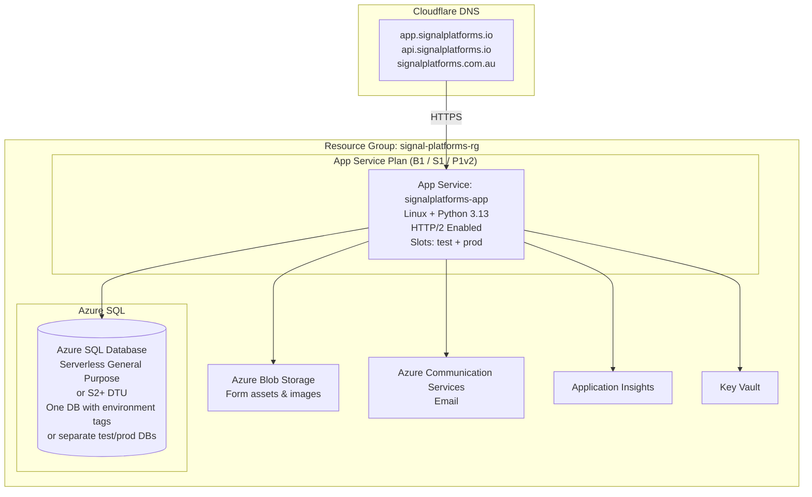
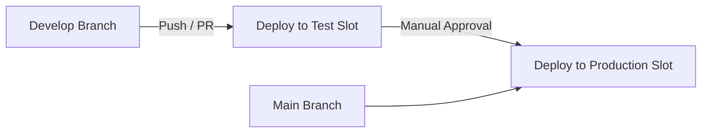

# Azure Infrastructure Architecture & Deployment Guide
**Signal Platforms (EventLeadPlatform)**

**Author:** Anthony Keevy + AI Assistant  
**Date:** 11 May 2026  
**Status:** Design Complete – Ready for Implementation Planning  
**Branch:** `cursor/azure-infrastructure-documentation`

---

## 1. Executive Summary

This document defines the production-grade Azure infrastructure for publishing the Signal Platforms customer engagement form builder.

**Core Design Principle**  
One App Service (Linux, Python) hosting both the React frontend and FastAPI backend, paired with a dedicated Azure SQL Database. This matches the requested “one machine + database” model while delivering HTTP/2 support, low operational overhead, and a clear, low-risk scaling path.

**Key Goals**
- Publish the completed platform (Epic 1–6 features) with minimal cost.
- Enable a test environment first for customer demos and feedback.
- Support future white-label and custom-domain capabilities without architecture changes.
- Keep all environment configurations (dev, test, production) fully isolated.

**Estimated Initial Monthly Cost (Test-First)**  
$20–80 AUD using B1/S1 App Service + Serverless SQL + pay-per-email ACS.

---

## 2. Target Architecture

### High-Level Diagram

### Why This Architecture

- **Single App Service** serves the built React application (static files) and the FastAPI backend on the same domain/port.  
- **Azure SQL** provides managed backups, point-in-time restore, and automatic scaling.  
- **HTTP/2** is enabled at the App Service level, removing the ~6-connection browser limit experienced in local development.  
- **Deployment Slots** (test + production) allow zero-downtime deployments and isolated configuration.  
- All existing Azure SDK integrations (`azure-storage-blob`, `azure-communication-email`, `opencensus-ext-azure`) are reused.

---

## 3. Core Azure Services

| Service | Purpose | Local Equivalent | Test Environment | Production |
|---------|---------|------------------|------------------|------------|
| **App Service (Linux)** | Hosts FastAPI + serves React build | uvicorn + Vite | Test slot | Production slot |
| **Azure SQL Database** | All relational data | Local SQL Server / Docker | Serverless (pauses when idle) | Standard / Premium tier |
| **Azure Blob Storage** | Background images, assets, uploads | Local filesystem | Same container with env prefix | Same container with env prefix |
| **Azure Communication Services (Email)** | Transactional email | MailHog Docker container | ACS + catch-all mailbox | ACS + verified customer domains |
| **Application Insights** | Structured logging, metrics, alerts | Local console | Enabled on test slot | Enabled on prod slot |
| **Key Vault** | Secrets and connection strings | `.env.local` | Slot settings or KV | Strict RBAC + KV |

---

## 4. Environment Strategy

### Deployment Slots on a Single App Service

- **Development**: Local machine (MailHog + local SQL or Docker).
- **Test Slot**: Isolated configuration for demos and customer feedback.
- **Production Slot**: Live customer traffic.

Each slot has its own **Application Settings** (environment variables). Code is identical; only configuration differs.

### Environment Variable Examples

| Variable | Development | Test Slot | Production Slot |
|----------|-------------|-----------|-----------------|
| `ENVIRONMENT` | `development` | `test` | `production` |
| `EMAIL_PROVIDER` | `mailhog` | `acs` | `acs` |
| `TEST_MODE` | — | `true` | `false` |
| `TEST_CATCHALL_EMAIL` | — | `test-inbox@signalplatforms.io` | — |
| `DATABASE_URL` | Local connection | Test DB connection | Production DB connection |
| `FRONTEND_URL` | `http://localhost:5173` | `https://app.signalplatforms.io` | `https://app.signalplatforms.io` |
| `ACS_CONNECTION_STRING` | — | From Key Vault or slot setting | From Key Vault |

This approach keeps configuration completely separate without any code changes.

---

## 5. Email Configuration & Isolation

The existing email abstraction (`backend/config/email.py` and `backend/common/email.py`) already supports switching providers via the `EMAIL_PROVIDER` variable.

### Planned Extension

- Add support for `EMAIL_PROVIDER=acs`.
- When `TEST_MODE=true`, override the recipient address with the catch-all mailbox while preserving the intended `From` address.
- Production uses real recipient addresses and verified sender domains.

**Dev** → MailHog container (http://localhost:8025)  
**Test** → ACS + single catch-all inbox (all test emails land in one place)  
**Production** → ACS with real verified domains and real recipients

---

## 6. Domain & DNS Strategy (Cloudflare)

- **signalplatforms.io** (registered) – Recommended for the application and API.  
  - `app.signalplatforms.io` – Primary SPA + backend endpoint.  
  - `api.signalplatforms.io` – Optional future split for API-only traffic.
- **signalplatforms.com.au** – Marketing site, landing page, or redirect.

**Benefits of .io for technical services**  
- Short, global, professional SaaS appearance.  
- .com.au can remain customer-facing marketing without conflicting with app infrastructure.

**Cloudflare Configuration**  
- CNAME records pointing to the App Service custom domain.  
- Free SSL certificates managed by Azure App Service.  
- Future options: CDN on static assets, WAF rules on API routes.

---

## 7. GitHub Actions CI/CD Pipeline (Single Repository)

**Recommended Flow (No Separate Test/Production Repositories)**

### Pipeline Outline

- Single workflow file: `.github/workflows/deploy.yml`
- Jobs:
  1. Build & Test (frontend `npm run build`, backend lint + pytest)
  2. Deploy to Test Slot (on push to `develop` or PR merge)
  3. Deploy to Production Slot (manual approval gate on `main`)
- Use GitHub Environments (`test` and `production`) with protected secrets.
- Run Alembic migrations automatically on each deployment.
- Update the Signal Platforms Company seed (CompanyID = 1) during the production deployment step if required.

**Why a single repository is preferred**  
Separate repositories create duplication, merge conflicts, and version skew. The current monorepo + deployment slots + environment-specific configuration provides clean isolation at far lower complexity.

---

## 8. Scalability & Capacity Planning

### Current Architecture Limits

- **100–200 users**: Easily supported on one or two instances (P1v2 or S1 tier). Form submissions are bursty and short-lived.
- **1,000+ users**: Still the same architecture. Add auto-scale rules (CPU > 70%) or increase instance size.
- **Architecture change threshold**: Only required at very high scale (multi-region, heavy background jobs, 10,000+ concurrent sessions, or microservices split). Not expected in the first 1–2 years at the target volume.

**HTTP/2** on the App Service removes the local development connection limit and supports far higher concurrency per session.

---

## 9. Advanced Capabilities (Future Extensions)

All three capabilities below are achievable on the current architecture without major refactoring.

### 9.1 Customer Custom Domains on Published Forms

- Customer registers a custom domain (e.g., `forms.customer.com.au`).
- Platform stores the mapping (new simple table or JSON field on Company/Form).
- Public form router inspects the `Host` header and serves the correct branded form.
- Customer adds a CNAME record pointing to `app.signalplatforms.io`.
- Azure App Service supports multiple custom domains (no extra cost).

### 9.2 White-Label / Branded Instance Offering

- Detect incoming domain or tenant header.
- Load company-specific branding (logo, colors, email from-name, footer) from the existing Company + Asset system.
- Apply branding dynamically in React (theme variables) and email templates (Jinja2).
- Single codebase and infrastructure; customer perceives a completely separate instance.

### 9.3 Customer-Sender Email via ACS

- Customer verifies their domain in ACS (DKIM + SPF + DMARC DNS records).
- Store verified sender address per company.
- When sending email, use the customer’s verified address as the `From` header via the ACS SDK.
- Test mode still routes to the catch-all mailbox.

---

## 10. Cost Estimates (AUD, approximate)

| Tier | App Service | Azure SQL | ACS (emails) | Monthly Total | Use Case |
|------|-------------|-----------|--------------|---------------|----------|
| Test-First | B1 / S1 (~$15–40) | Serverless (~$5–15) | Pay-per-email | **$20–80** | Demos & feedback |
| Early Production | S1 / P1v2 (~$50–120) | S2 / 2 vCore (~$30–80) | Pay-per-email | **$80–250** | 100–200 users |
| Scaled | P2v3+ or multiple instances | Provisioned vCore | Pay-per-email | $300+ | 1,000+ users |

Slots add negligible extra cost. Serverless SQL pauses automatically when idle.

---

## 11. Next Steps & Implementation Roadmap

1. **Documentation Review** – Confirm understanding of architecture, costs, and capabilities.
2. **Create Implementation Tasks** (one branch per task following workspace workflow):
   - Update Company seed data for Signal Platforms (CompanyID = 1).
   - Extend email service for ACS + test-mode catch-all.
   - Create GitHub Actions workflow with test/prod slots.
   - Add custom domain & Host-header routing support (future).
   - Add white-label branding resolver (future).
3. **Provision Azure Resources** (test environment first).
4. **Deploy to Test Slot** and begin customer demos.
5. **Production Cut-over** after validation.

---

## Appendix A – Key Files & Configuration Locations

- `backend/main.py` – CORS, routers, App Insights setup
- `backend/config/email.py` – Email provider switching
- `backend/common/email.py` – Email sending abstraction
- `database/scripts/create-database-azure.sql` – Azure SQL setup script
- `docs/development-setup-guide.md` – Local development reference
- `requirements.txt` – Already includes Azure SDKs

---

**Document Status**: Complete design. Ready to move to task-level implementation planning when requested.