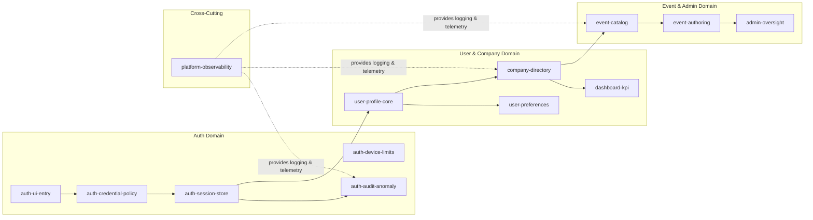

# Capsule Map – Current Implementation (≈20% Scope)

## Overview Diagram

Legend:
- **Solid arrows** show primary dependency flows across capsules.
- **Dashed arrows** from `platform-observability` indicate shared logging/middleware primitives available to all capsules under explicit contract.

## Capsule Summary Table

| Capsule | Vertical Scope | Status | Key Dependencies |
| --- | --- | --- | --- |
| auth-ui-entry | Login & password reset UI, AuthContext, CSRF tokens | Shipped | Relies on `auth-credential-policy`, `auth-session-store` contracts |
| auth-credential-policy | Password rules, lockout, verification, reset tokens | Shipped | Uses `common.password_validator`, `modules.auth.user_service` |
| auth-session-store | Access/refresh issuance, storage, rotation, logout | Shipped | Coordinates with `auth-device-limits`, `auth-audit-anomaly` |
| auth-device-limits | Device fingerprints, session counts, remembered devices | Partial | Hooks into `auth-session-store` (enforcement to extend) |
| auth-audit-anomaly | Auth event logging, rate limits, anomaly detection | Shipped | Uses `common.auth_event_decorator`, `log.AuthEvent` |
| user-profile-core | `/api/users/me`, onboarding status, core profile | Shipped | Depends on auth capsules for identity context |
| user-preferences | Theme/layout/industry preferences & references | Shipped | Uses reference modules (`modules.users.reference`, `modules.countries`) |
| company-directory | Smart company search, team roster, company summary | Shipped | Collaborates with `user-profile-core`, feeds dashboard |
| dashboard-kpi | KPI aggregation & hierarchy read models | Partial | Builds on `company-directory`, `event-catalog` data |
| event-catalog | Event discovery, search, reference data | Shipped | Supplies data to dashboard and admin views |
| event-authoring | Event create/edit/delete, smart inference | Shipped | Shares tables with `event-catalog`, publishes change events |
| admin-oversight | Admin dashboards & review queues | Partial | Consumes read-only projections from other capsules |
| platform-observability | Logging middleware, request context, diagnostics | Shipped | Shared utilities consumed across capsules |

## Capsule Details

### auth-ui-entry
- **Scope:** Client-side login/signup/reset experiences, AuthContext state machine, token persistence.
- **Frontend Files:**
  - `frontend/src/features/auth/pages/*.tsx` (Login, PasswordResetRequest, PasswordResetConfirm, EmailVerification)
  - `frontend/src/features/auth/components/AuthLayout.tsx`, `LoginForm.tsx`, `PasswordStrength.tsx`, `SignupForm.tsx`
  - `frontend/src/features/auth/context/AuthContext.tsx`
  - `frontend/src/features/auth/api/authApi.ts` (request orchestration)
  - Tests under `frontend/src/features/auth/__tests__/`
- **Backend Touchpoints:** None directly owned (relies on `auth-credential-policy` and `auth-session-store` endpoints).
- **Key Functions/Utilities:** `tokenStorage.ts` (token persistence, expiry handling), `useAuthRedirect.ts`.
- **Contracts:** Consumes `/api/auth/*` per `auth-credential-policy` / `auth-session-store` contracts.

### auth-credential-policy
- **Scope:** Credential verification, password hashing, lockout policy, email verification, password reset.
- **Backend Files/Modules:**
  - `backend/modules/auth/router.py` – signup, login, email verification, reset endpoints
  - `backend/modules/auth/user_service.py` – create user, invitation acceptance, profile retrieval
  - `common.password_validator.py`, `common.security.py` – password rules & hashing
  - `modules/auth/token_service.py` – verification/password reset tokens (shared with session-store)
  - `modules/auth/dependencies.py` – credential dependency injection
- **Database:** `dbo.User`, `dbo.UserEmailVerificationToken`, `dbo.UserPasswordResetToken`, `audit.User`.
- **Tests:** `backend/tests/test_story_0_2_auth_logging.py`, `frontend auth tests`.

### auth-session-store
- **Scope:** JWT creation, refresh, persistence, logout, `/api/auth/refresh`, `/api/auth/me`.
- **Backend Files:**
  - `modules/auth/jwt_service.py` – create/verify tokens
  - `modules/auth/token_service.py` – refresh token storage (`store_refresh_token`, `validate_refresh_token`)
  - `modules/auth/router.py` – `/login`, `/refresh`, `/me`, `/logout (future)`
  - `modules/auth/audit_service.py` – logging for session events
  - `common.request_context.py` – context injection for logs
- **Frontend Utilities:** `tokenStorage.ts`, `authApi.refreshAccessToken`, `AuthContext` refresh handling.
- **Database:** `dbo.UserRefreshToken`, `dbo.User` (`SessionToken` legacy), `log.AuthEvent`.

### auth-device-limits
- **Scope:** Managing per-device session limits and approvals (foundation laid, expansion planned).
- **Current Artifacts:**
  - Enforcement hooks in `modules/auth/token_service.store_refresh_token` (slots available for device enforcement)
  - Device tracking fields in `dbo.User` (e.g., `AccessTokenVersion`, `RefreshTokenVersion`)
  - TODO placeholders referenced in roadmap.
- **Next Iteration Assets:** new schema under `auth_device.*`, frontend remember-device toggles.

### auth-audit-anomaly
- **Scope:** Centralized auth event logging, rate limiting, anomaly detection building blocks.
- **Backend Files:**
  - `modules/auth/audit_service.py` – `log_auth_event`, `log_user_creation`, `log_email_verification`
  - `common.auth_event_decorator.py` – wraps signup/login for automatic logging
  - `middleware/enhanced_request_logger.py` – provides structured logs & request IDs
  - `middleware/exception_handler.py` – error capture to `log.ApplicationError`
- **Database:** `log.AuthEvent`, `log.ApplicationError`, `log.ApiRequest`.
- **Future Enhancements:** Rate limiting in `auth_event_decorator`, anomaly detection jobs.

### user-profile-core
- **Scope:** Authenticated user profile retrieval/update, onboarding completion, primary company selection.
- **Frontend Files:** `frontend/src/features/onboarding/**`, `frontend/src/features/profile/components/ProfileEditor.tsx`, `frontend/src/features/dashboard/components/UserMenu.tsx`.
- **Backend Modules:**
  - `modules/users/router.py` (`/api/users/me`, `/api/users/me/details`, `/api/users/me/switch-company`)
  - `modules/users/service.py`, `modules/users/switch_service.py`
  - `schemas/user.py` – request/response schemas
- **Database:** `dbo.User`, `dbo.UserCompany`, `audit.User`, `audit.ActivityLog`.
- **Tests:** `backend/tests/test_story_1_5_profile.py`, `test_multi_tenancy.py`, frontend onboarding tests.

### user-preferences
- **Scope:** UI/UX preference management (theme, font, layout), industry associations, reference data fetches.
- **Frontend Files:** `frontend/src/features/preferences/**`, `frontend/src/features/profile/components/IndustryManager.tsx`, `frontend/src/features/theme/**`.
- **Backend Modules:** `modules.users.reference_router` (theme options), `modules.users.router` industry endpoints, `modules.countries.router`, `modules.config.router`.
- **Database:** `ref.ThemePreference`, `ref.LayoutDensity`, `ref.FontSize`, `dbo.UserIndustry`, `ref.Industry`.

### company-directory
- **Scope:** Company search (ABR), user-company mappings, company switch, team roster.
- **Frontend Files:** `frontend/src/features/dashboard/components/CompanyContainer.tsx`, `CompanyList.tsx`, `TeamManagementPanel.tsx`; `frontend/src/features/companies/**`.
- **Backend Modules:** `modules.users.router` (`/me/companies`), `modules.companies.router` (`/smart-search`, `/companies/{id}/users`), `modules.dashboard.router` (company summary).
- **Database:** `dbo.Company`, `dbo.UserCompany`, `cache.ABRSearch`, `ref.UserCompanyRole`, `audit.Company`.
- **Logging:** Public smart-search whitelisted in JWT middleware but captured by enhanced request logger.

### dashboard-kpi
- **Scope:** Aggregated metrics for dashboard cards, company hierarchy presentation.
- **Frontend Files:** `frontend/src/features/dashboard/components/KPICard.tsx`, `KPISection.tsx`, `DashboardLayout.tsx`.
- **Backend Modules:** `modules.dashboard.router`, supporting services (aggregation helpers).
- **Database:** Derived metrics across `dbo.Event`, `dbo.Company`, `dbo.EventCompany`.
- **Status:** Core endpoints live; more KPIs planned.

### event-catalog
- **Scope:** Event list/search, filters, reference lookups, public search.
- **Frontend Files:** `frontend/src/features/events/components/EventCard.tsx`, `EventDetailView.tsx`, `EventSearchStep.tsx`, `EventTypeSelector.tsx`, `ReviewStatusBadge.tsx`.
- **Backend Modules:** `modules.events.router` (GET endpoints), `modules.events.reference_router`, inference endpoints (`/api/events/inference/*`), public search.
- **Database:** `dbo.Event`, `dbo.EventCompany`, `ref.EventType`, `ref.EventStatus`, `ref.PublicReviewStatus`.
- **Tests:** `backend/tests/test_events_search.py`, frontend event tests (planned).

### event-authoring
- **Scope:** Create/edit/delete events, participation management, inference helpers.
- **Frontend Files:** `frontend/src/features/events/components/CreateEventModal.tsx`, `EditEventModal.tsx`, `DeleteEventConfirmModal.tsx`, `ReviewFeedbackPanel.tsx`.
- **Backend Modules:** `modules.events.router` (POST/PUT/DELETE), `modules.events.service`, participation endpoints.
- **Database:** Same as event-catalog plus audit logs for modifications (`audit.ActivityLog`).
- **Observability:** Enhanced logger & audit trail ensure traceability of event changes.

### admin-oversight
- **Scope:** Admin dashboard, review queue, review history, auditing interfaces.
- **Frontend Files:** `frontend/src/features/admin/pages/AdminDashboard.tsx`, `components/AdminCompanyList.tsx`, `EventReviewModal.tsx`, `ReviewHistory.tsx`.
- **Backend Modules:** `modules.admin.router`, `modules.audit.router`, `modules.analytics.router`.
- **Database:** `audit.Company`, `audit.ActivityLog`, `log.AuthEvent`, `dbo.Company`, `dbo.Event`, `ref.UserRole`.
- **Status:** Partial (UI scaffolding, endpoints live for review).

### platform-observability
- **Scope:** Common middleware and services for logging, diagnostics, email delivery.
- **Files/Modules:**
  - Middleware: `backend/middleware/auth.py`, `middleware/enhanced_request_logger.py`, `middleware/request_logger.py`, `middleware/exception_handler.py`, `middleware/enhanced_diagnostic_logs.py`
  - Common services: `common.logger.py`, `common.request_context.py`, `common.constants.py`
  - Email: `services/email_service.py` + provider adapters
  - Diagnostics: `backend/diagnostic_logs.py`, `backend/enhanced_diagnostic_logs_v2.py`
- **Database:** `log.ApiRequest`, `log.ApplicationError`, `log.AuthEvent`, `log.PerformanceMetric`.
- **Contract:** Provides shared primitives (time, uuid, crypto, logging) under controlled interfaces; capsules consume via `platform/shared/*`.

---

## Progress Snapshot
- **Total Capsules Identified:** 12
- **Status Breakdown:** 9 shipped, 3 partial (auth-device-limits, dashboard-kpi, admin-oversight)
- **Coverage:** Captures the ~20% of functionality already implemented while ensuring each capsule stays within a manageable knowledge footprint (<200k tokens).
- **Next Actions:** Validate capsule docs, update BMAD guardrails to enforce single-capsule changes, and begin drafting per-capsule `CONTRACT.md` artifacts based on this map.

---

## Database Ownership Matrix

| Table | Capsule Ownership | Notes |
| --- | --- | --- |
| `dbo.User` | auth-credential-policy, auth-session-store, user-profile-core | Shared today; roadmap migrates auth-specific fields to dedicated schemas. |
| `audit.User` | user-profile-core | Tracks profile changes and onboarding updates. |
| `log.UserAction` | platform-observability | Generic log table for user interactions (non-auth). |
| `dbo.UserCompany` | company-directory, user-profile-core | Manages user-to-company relationships and primary company context. |
| `ref.UserCompanyRole` | company-directory | Drives role display in dashboard/team panels. |
| `ref.UserCompanyStatus` | company-directory | Determines active/inactive status for company memberships. |
| `dbo.UserEmailVerificationToken` | auth-credential-policy | Email verification workflow. |
| `dbo.UserIndustry` | user-preferences | Industry associations for profile/preferences UI. |
| `dbo.UserInvitation` | auth-credential-policy, company-directory | Invitation acceptance flow ties to team memberships. |
| `ref.UserInvitationStatus` | auth-credential-policy | Status of pending/accepted invitations. |
| `dbo.UserPasswordResetToken` | auth-credential-policy | Password reset lifecycle. |
| `dbo.UserRefreshToken` | auth-session-store | Refresh token persistence. |
| `ref.UserRole` | admin-oversight | System-level role assignments (admin, platform roles). |
| `ref.UserStatus` | user-profile-core | Controls login eligibility and status messaging. |
| `dbo.Company` | company-directory, admin-oversight | Company metadata across dashboard and admin views. |
| `audit.Company` | admin-oversight | Audit history for company changes. |
| `dbo.CompanyBillingDetails` | Unassigned (future Billing capsule) | Billing subsystem not yet implemented. |
| `dbo.CompanyCustomerDetails` | Unassigned | Customer success metrics (future analytics capsule). |
| `dbo.CompanyOrganizerDetails` | Unassigned | Organizer metadata (future event partnerships capsule). |
| `dbo.CompanyRelationship` | company-directory | Parent-child hierarchy for dashboard views. |
| `ref.CompanyRelationshipType` | company-directory | Relationship taxonomy for hierarchy. |
| `dbo.CompanySwitchRequest` | user-profile-core | Company switch workflow support. |
| `ref.CompanySwitchRequestStatus` | user-profile-core | Status of switch requests. |
| `ref.CompanySwitchRequestType` | user-profile-core | Type of switch request (e.g., transfer, merge). |
| `config.CompanyValidationRule` | Unassigned (future compliance capsule) | Not yet surfaced in UI. |
| `dbo.Event` | event-catalog, event-authoring | Core event data for browse & authoring flows. |
| `dbo.EventCompany` | event-catalog | Participant relationships per event. |
| `ref.EventCompanyRole` | event-catalog | Role codes for event participants. |
| `ref.EventStatus` | event-catalog | Status values for event lifecycle. |
| `ref.EventType` | event-catalog | Event classification for filters. |
| `ref.PublicReviewStatus` | event-authoring, admin-oversight | Review workflow status. |
| `ref.RecurrencePattern` | event-authoring | Recurring event scheduling. |
| `dbo.Form` | Unassigned (future forms capsule) | Forms functionality not yet integrated. |
| `dbo.FormAccessControl` | Unassigned | Will belong to forms access capsule later. |
| `ref.FormAccessControlAccessType` | Unassigned | Supporting reference data for forms. |
| `ref.FormApprovalStatus` | Unassigned | Forms approval pipeline (future). |
| `ref.FormStatus` | Unassigned | Forms lifecycle (future). |
| `ref.Country` | user-preferences, event-authoring | Used for profile location, event venue inference. |
| `ref.CustomerTier` | Unassigned (future billing/CRM capsule) | Tiering not yet surfaced. |
| `ref.FontSize` | user-preferences | UI preference settings. |
| `ref.Industry` | user-preferences | Industry pickers in profile settings. |
| `ref.JoinedVia` | company-directory | Tracks onboarding source for team members. |
| `ref.Language` | user-preferences | Preferred language selection. |
| `ref.LayoutDensity` | user-preferences | UI density settings. |
| `ref.RuleType` | Unassigned | Supports validation rules (future). |
| `ref.SettingCategory` | platform-observability | Config settings taxonomy. |
| `ref.SettingType` | platform-observability | Config validation metadata. |
| `ref.ThemePreference` | user-preferences | Theme switcher options. |
| `config.AppSetting` | platform-observability | Application configuration values. |
| `config.ValidationRule` | platform-observability | Validation metadata (used by password validator & others). |
| `audit.ActivityLog` | admin-oversight, auth-audit-anomaly | Central audit stream for admin & auth monitoring. |
| `audit.ApprovalAuditTrail` | admin-oversight | Approval histories (company switch, etc.). |
| `audit.Role` | admin-oversight | Role change tracking for events/companies. |
| `log.ApiRequest` | platform-observability | Request tracing across all capsules. |
| `log.ApplicationError` | platform-observability, auth-audit-anomaly | Error telemetry. |
| `log.AuthEvent` | auth-audit-anomaly | Auth event logging for anomaly detection. |
| `log.EmailDelivery` | platform-observability | Email provider tracking. |
| `log.IntegrationEvent` | platform-observability | Outbound integration logs. |
| `log.PerformanceMetric` | platform-observability | Performance telemetry. |
| `cache.ABRSearch` | company-directory | Cached ABR search results. |
| `dbo.alembic_version` | platform-observability | Migration state tracker. |
| `database` (remaining seeds/scripts) | Unassigned | Seed data for future domains. |

---

## Frontend File Ownership

| Path | Capsule(s) |
| --- | --- |
| `frontend/src/features/auth/pages/LoginForm.tsx` | auth-ui-entry |
| `frontend/src/features/auth/pages/PasswordResetRequest.tsx` | auth-ui-entry |
| `frontend/src/features/auth/pages/PasswordResetConfirm.tsx` | auth-ui-entry |
| `frontend/src/features/auth/pages/EmailVerificationPage.tsx` | auth-ui-entry |
| `frontend/src/features/auth/components/AuthLayout.tsx` | auth-ui-entry |
| `frontend/src/features/auth/components/LoginForm.tsx` | auth-ui-entry |
| `frontend/src/features/auth/components/PasswordStrength.tsx` | auth-ui-entry |
| `frontend/src/features/auth/components/SignupForm.tsx` | auth-ui-entry |
| `frontend/src/features/auth/context/AuthContext.tsx` | auth-ui-entry |
| `frontend/src/features/auth/api/authApi.ts` | auth-ui-entry, auth-session-store |
| `frontend/src/features/auth/api/passwordResetApi.ts` | auth-ui-entry, auth-credential-policy |
| `frontend/src/features/auth/utils/tokenStorage.ts` | auth-session-store |
| `frontend/src/features/auth/hooks/useAuthRedirect.ts` | auth-ui-entry |
| `frontend/src/features/auth/__tests__/*` | auth-ui-entry |
| `frontend/src/features/invitations/pages/InvitationAcceptancePage.tsx` | auth-credential-policy, company-directory |
| `frontend/src/features/invitations/api/invitationApi.ts` | auth-credential-policy |
| `frontend/src/features/dashboard/pages/DashboardPage.tsx` | dashboard-kpi, company-directory |
| `frontend/src/features/dashboard/components/Breadcrumbs.tsx` | dashboard-kpi |
| `frontend/src/features/dashboard/components/CompanyContainer.tsx` | company-directory |
| `frontend/src/features/dashboard/components/CompanyList.tsx` | company-directory |
| `frontend/src/features/dashboard/components/DashboardLayout.tsx` | dashboard-kpi |
| `frontend/src/features/dashboard/components/EditRoleModal.tsx` | company-directory |
| `frontend/src/features/dashboard/components/InviteUserModal.tsx` | company-directory |
| `frontend/src/features/dashboard/components/KPICard.tsx` | dashboard-kpi |
| `frontend/src/features/dashboard/components/KPISection.tsx` | dashboard-kpi |
| `frontend/src/features/dashboard/components/TeamManagementPanel.tsx` | company-directory |
| `frontend/src/features/dashboard/components/UserMenu.tsx` | user-profile-core |
| `frontend/src/features/dashboard/api/dashboardApi.ts` | dashboard-kpi |
| `frontend/src/features/dashboard/api/teamApi.ts` | company-directory |
| `frontend/src/features/dashboard/utils/hierarchyUtils.ts` | company-directory |
| `frontend/src/features/dashboard/types/*` | dashboard-kpi, company-directory |
| `frontend/src/features/dashboard/__tests__/*` | dashboard-kpi, company-directory |
| `frontend/src/features/companies/components/SmartCompanySearch.tsx` | company-directory |
| `frontend/src/features/companies/components/CompanySearchResults.tsx` | company-directory |
| `frontend/src/features/companies/api/companiesApi.ts` | company-directory |
| `frontend/src/features/companies/hooks/useCompanySearch.ts` | company-directory |
| `frontend/src/features/companies/__tests__/*` | company-directory |
| `frontend/src/features/events/pages/EventsPage.tsx` | event-catalog |
| `frontend/src/features/events/components/EventCard.tsx` | event-catalog |
| `frontend/src/features/events/components/EventDetailView.tsx` | event-catalog |
| `frontend/src/features/events/components/EventSearchStep.tsx` | event-catalog |
| `frontend/src/features/events/components/EventTypeSelector.tsx` | event-catalog |
| `frontend/src/features/events/components/EventVisibilitySelector.tsx` | event-authoring |
| `frontend/src/features/events/components/CreateEventModal.tsx` | event-authoring |
| `frontend/src/features/events/components/EditEventModal.tsx` | event-authoring |
| `frontend/src/features/events/components/DeleteEventConfirmModal.tsx` | event-authoring |
| `frontend/src/features/events/components/ReviewProcessInfoBanner.tsx` | event-catalog |
| `frontend/src/features/events/components/ReviewFeedbackPanel.tsx` | admin-oversight |
| `frontend/src/features/events/components/ReviewStatusBadge.tsx` | event-catalog |
| `frontend/src/features/events/api/eventsApi.ts` | event-catalog, event-authoring |
| `frontend/src/features/events/types/events.types.ts` | event-catalog, event-authoring |
| `frontend/src/features/events/__tests__/*` | event-catalog, event-authoring |
| `frontend/src/features/onboarding/components/OnboardingModal.tsx` | user-profile-core |
| `frontend/src/features/onboarding/components/OnboardingStep1.tsx` | user-profile-core |
| `frontend/src/features/onboarding/components/OnboardingStep2.tsx` | user-profile-core |
| `frontend/src/features/onboarding/components/ProgressIndicator.tsx` | user-profile-core |
| `frontend/src/features/onboarding/types/onboarding.types.ts` | user-profile-core |
| `frontend/src/features/profile/components/ProfileEditor.tsx` | user-profile-core |
| `frontend/src/features/profile/components/IndustryManager.tsx` | user-preferences |
| `frontend/src/features/profile/api/usersApi.ts` | user-profile-core |
| `frontend/src/features/profile/types/profile.types.ts` | user-profile-core |
| `frontend/src/features/preferences/components/AccountSettingsPopup.tsx` | user-preferences |
| `frontend/src/features/preferences/components/IndustryManager.tsx` | user-preferences |
| `frontend/src/features/preferences/components/IndustrySearch.tsx` | user-preferences |
| `frontend/src/features/preferences/index.ts` | user-preferences |
| `frontend/src/features/theme/context/ThemeContext.tsx` | user-preferences |
| `frontend/src/features/theme/components/*` | user-preferences |
| `frontend/src/features/admin/pages/AdminDashboard.tsx` | admin-oversight |
| `frontend/src/features/admin/components/AdminCompanyList.tsx` | admin-oversight |
| `frontend/src/features/admin/components/EventManagementTab.tsx` | admin-oversight |
| `frontend/src/features/admin/components/EventReviewModal.tsx` | admin-oversight |
| `frontend/src/features/admin/components/ReviewHistory.tsx` | admin-oversight |
| `frontend/src/features/admin/api/*` | admin-oversight |
| `frontend/src/features/invitations/index.ts` | auth-credential-policy |
| `frontend/src/lib/auth.ts` | auth-session-store |
| `frontend/src/lib/config.ts` | platform-observability |
| `frontend/src/components/common/DataTable.tsx` | Shared (platform-observability) |
| `frontend/src/examples/FormBuilderExample.tsx` | Unassigned (future forms capsule) |
| `frontend/src/utils/offlineQueue.ts` | platform-observability |
| `frontend/src/utils/unsavedWorkTracker.ts` | platform-observability |
| `frontend/src/store/*` | platform-observability |
| `frontend/src/pages/App.tsx` | Platform shell (aggregates capsules) |

*Frontend files not yet tied to a capsule remain marked as Unassigned or Platform.*

---

## Backend File Ownership

| Path | Capsule(s) |
| --- | --- |
| `backend/modules/auth/router.py` | auth-credential-policy, auth-session-store |
| `backend/modules/auth/user_service.py` | auth-credential-policy |
| `backend/modules/auth/token_service.py` | auth-credential-policy, auth-session-store |
| `backend/modules/auth/jwt_service.py` | auth-session-store |
| `backend/modules/auth/audit_service.py` | auth-audit-anomaly |
| `backend/modules/auth/dependencies.py` | auth-session-store |
| `backend/modules/auth/models.py` | auth-credential-policy |
| `backend/modules/auth/__init__.py` | auth-credential-policy |
| `backend/modules/invitations/router.py` | auth-credential-policy, company-directory |
| `backend/modules/invitations/service.py` | auth-credential-policy |
| `backend/modules/invitations/email_service.py` | auth-credential-policy |
| `backend/modules/users/router.py` | user-profile-core, company-directory, user-preferences |
| `backend/modules/users/service.py` | user-profile-core |
| `backend/modules/users/switch_service.py` | user-profile-core |
| `backend/modules/users/reference_router.py` | user-preferences |
| `backend/modules/users/__init__.py` | user-profile-core |
| `backend/modules/dashboard/router.py` | dashboard-kpi |
| `backend/modules/dashboard/service.py` | dashboard-kpi |
| `backend/modules/dashboard/__init__.py` | dashboard-kpi |
| `backend/modules/companies/router.py` | company-directory |
| `backend/modules/companies/service.py` | company-directory |
| `backend/modules/companies/abr_service.py` | company-directory |
| `backend/modules/companies/__init__.py` | company-directory |
| `backend/modules/events/router.py` | event-catalog, event-authoring |
| `backend/modules/events/reference_router.py` | event-catalog |
| `backend/modules/events/service.py` | event-authoring |
| `backend/modules/events/inference.py` | event-authoring |
| `backend/modules/events/__init__.py` | event-catalog |
| `backend/modules/admin/router.py` | admin-oversight |
| `backend/modules/admin/service.py` | admin-oversight |
| `backend/modules/admin/__init__.py` | admin-oversight |
| `backend/modules/analytics/router.py` | admin-oversight (future analytics capsule) |
| `backend/modules/analytics/service.py` | admin-oversight |
| `backend/modules/audit/router.py` | admin-oversight |
| `backend/modules/audit/service.py` | admin-oversight |
| `backend/modules/audit/__init__.py` | admin-oversight |
| `backend/common/password_validator.py` | auth-credential-policy |
| `backend/common/security.py` | auth-credential-policy |
| `backend/common/request_context.py` | platform-observability |
| `backend/common/logger.py` | platform-observability |
| `backend/common/auth_event_decorator.py` | auth-audit-anomaly |
| `backend/common/agent_db_helpers.py` | platform-observability |
| `backend/common/config_service.py` | platform-observability |
| `backend/common/database.py` | platform-observability |
| `backend/common/database_service.py` | platform-observability |
| `backend/common/multi_tenant.py` | company-directory, dashboard-kpi |
| `backend/common/rbac.py` | admin-oversight |
| `backend/common/validators.py` | platform-observability |
| `backend/middleware/auth.py` | platform-observability (shared) |
| `backend/middleware/enhanced_request_logger.py` | platform-observability |
| `backend/middleware/request_logger.py` | platform-observability |
| `backend/middleware/exception_handler.py` | platform-observability |
| `backend/middleware/enhanced_diagnostic_logs.py` | platform-observability |
| `backend/diagnostic_logs.py` | platform-observability |
| `backend/enhanced_diagnostic_logs.py` | platform-observability |
| `backend/enhanced_diagnostic_logs_v2.py` | platform-observability |
| `backend/services/email_service.py` | auth-credential-policy, admin-oversight |
| `backend/services/email_providers/*` | platform-observability |
| `backend/config/jwt.py` | auth-session-store |
| `backend/config/email.py` | auth-credential-policy |
| `backend/tests/test_story_0_2_auth_logging.py` | auth-audit-anomaly |
| `backend/tests/test_story_1_5_profile.py` | user-profile-core |
| `backend/tests/test_story_1_11_integration.py` | company-directory, dashboard-kpi |
| `backend/tests/test_events_search.py` | event-catalog |
| `backend/tests/test_multi_tenancy.py` | company-directory |
| `backend/tests/test_rbac.py` | admin-oversight |
| `backend/tests/test_performance.py` | platform-observability |
| `backend/tests/test_invitation_acceptance.py` | auth-credential-policy, company-directory |
| `backend/tests/test_auth_payload.py` | auth-credential-policy |
| `backend/tests/test_payload_capture.py` | platform-observability |
| `backend/tests/test_enhanced_logger.py` | platform-observability |
| `backend/tests/test_middleware_direct.py` | platform-observability |
| `backend/tests/test_models_standalone.py` | platform-observability |
| `backend/tests/test_payload_verification.py` | platform-observability |
| `backend/tests/test_simple_payload.py` | platform-observability |
| `backend/tests/test_bulletproof.py` | platform-observability |
| `backend/tests/test_centralized_db.py` | platform-observability |
| `backend/tests/test_enhanced_payload_capture.py` | platform-observability |
| `backend/tests/test_direct_payload.py` | platform-observability |
| `backend/modules/config/router.py` | user-preferences, platform-observability |
| `backend/modules/countries/router.py` | user-preferences |
| `backend/modules/config/__init__.py` | platform-observability |
| `backend/modules/countries/__init__.py` | user-preferences |
| `backend/modules/forms/*` | Unassigned (future forms capsule) |

*Backend files designated as platform belong to the shared observability capsule. Unassigned modules correspond to functionality not yet surfaced.*

---

### Logging Ownership
- **Shared Capsule:** `platform-observability` remains the single owner of logging/middleware primitives, covering:
  - Middleware stack (`middleware/auth.py`, `middleware/enhanced_request_logger.py`, etc.)
  - Common logging utilities (`common.logger`, `common.request_context`)
  - Logging databases (`log.ApiRequest`, `log.ApplicationError`, `log.AuthEvent`, etc.)
  - Email telemetry (`services/email_service.py`, `log.EmailDelivery`)
- Capsule-specific logging (e.g., auth event decorator) is noted in each capsule’s scope, but the underlying logging infrastructure is centralized to avoid duplication and keep context footprints small.

