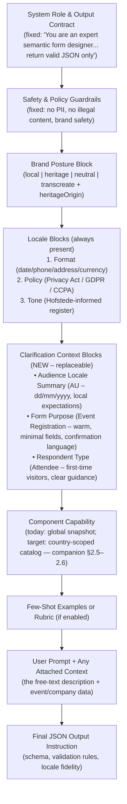

# Design Decision: 6.5a – Clarification Options Data Model (Form Purpose, Respondent Type & Locale Context)

**Owner:** Dimitri (Data Domain Architect)  
**Story:** 6.5a – Clarification Questions: Situational Awareness Dropdowns  
**Status:** Approved — Product decisions locked (Rev 8, §16)  
**Date:** 2026-05-09  
**Related:** Story 6.4.4.1 Locale Architecture ADR, `ref.Country`, `PromptTemplateLocaleBlock`, `FormAiGenerateRequest`, `GenerationRun`, `dbo.Company`, `dbo.Form`, `ref.AudienceLocale` (new)  
**Companion (prompt tree & registry):** [`prompt-assembly-registry-architecture.md`](prompt-assembly-registry-architecture.md) — full blocks A–I, `PromptAssemblyProfile*`, catalog resolver, toolbox alignment. **Post-registry per-block DB sources:** companion **§2.7** (authoritative after registry MVP).

---

## 1. Executive Summary & Recommendation (Updated for Enum Elimination)

**Core Principle (non-negotiable):** No enums or hardcoded lists will ever exist in the frontend. Every dropdown, selector, and locale value must be served dynamically from reference tables via API. This is the foundation for a truly international platform that can be extended by seeding data — not by shipping code.

**Recommended Model:** 
- Three narrow reference tables (`ref.AudienceLocale`, `ref.FormPurpose`, `ref.RespondentType`) plus the existing `ref.Country` and `PromptTemplateLocaleBlock`.
- **Three mandatory** AI Agent dropdowns (Audience Locale, Form Purpose, Respondent Type) are populated exclusively by the three new read-only reference APIs. A **fourth** dropdown is listed in `story-6.5a.md` as TBD (e.g. Industry) — **out of scope for 6.5a MVP** unless Tony confirms otherwise (§16).
- Selected values are resolved at request time and rendered into **replaceable** clarification prompt blocks.
- Company-level defaults + per-form persistence on `dbo.Form`.
- Short, locale-aware `DisplayName` (≤28 chars) for the narrow panel + rich `PromptHint` for the LLM.

**Remaining Hardcoded Enums That Must Be Eliminated:**
- `AudienceLocale` enum (currently 11 values in code) → replaced by `ref.AudienceLocale` registry table.
- `brandPosture` enum (`local | heritage | neutral | transcreate`) → will be moved to a lightweight `ref.BrandPosture` table in a follow-up (out of 6.5a scope but flagged).
- Any other magic strings or lists in the generation request or prompt assembly path.

**Launch & Expansion Strategy:** Australia-first seeding for the 11 locales. Once stable, new countries, regions, purposes, and respondent types are added purely by inserting rows into the reference tables — zero frontend or backend code changes. This is the international platform you described.

**Prompt Strategy:** Clarification selections become replaceable natural-language blocks (not JSON) that sit after the core locale blocks in the full prompt.

This design gives customers effortless, high-signal context injection while guaranteeing that the platform can scale to every market without redeploys.

---

## 2. Elimination of Hardcoded Enums – Detailed Audit & Plan

### 2.1 Current State (What Still Exists in Code)

From the 6.4.4.1 architecture the following are still defined as TypeScript/Python enums or constant lists:
- `AudienceLocale` – 11 values (`AU`, `NZ`, `UK`, `US`, `CA`, `IE`, `DE`, `INTL_ONLINE`, `APAC`, `EU`, `NEUTRAL`).
- `BrandPosture` – 4 values (`local`, `heritage`, `neutral`, `transcreate`).
- Minor lists inside prompt assembly (e.g., block order, fallback logic) that reference the above.

These are exactly the items the user has forbidden in the frontend.

### 2.2 Solution – `ref.AudienceLocale` Registry Table (New)

Create a lightweight reference table:

```sql
ref.AudienceLocale
- AudienceLocaleID (PK)
- Code (varchar(30), unique)          -- 'AU', 'INTL_ONLINE', 'APAC', etc.
- DisplayName (nvarchar(28))           -- panel label; max 28 chars for narrow AI Agent UI (see §16 if longer marketing names needed)
- FlagEmoji (nvarchar(10))             -- '🇦🇺', '🌐', '🌏'
- IsActive (bit)
- SortOrder (int)
- Description (nvarchar(200))          -- short help text for the dropdown (UI only)
- ClarificationSummary (nvarchar(500))  -- **Block E1** LLM bullet; one stored sentence per locale (Tony: Option B, §16)
- audit columns
```

- Every row has a corresponding set of `PromptTemplateLocaleBlock` rows (format/policy/tone) exactly as today.
- The existing resolution chain (`_resolve_audience_locale`) becomes a lookup against this table + company/event/user fallbacks.
- The API `GET /api/ref/audience-locales` returns the active rows sorted by SortOrder, with the resolved default highlighted.
- Adding a new market (e.g., JP, SG, LATAM) = insert one row here + three prompt blocks + seed the new purposes/respondent hints if needed. No code change.

This completely removes the `AudienceLocale` enum from the frontend and makes the entire locale system data-driven.

### 2.3 BrandPosture (Flagged for Future)

`brandPosture` is not in the 6.5a scope but is called out so the developer knows it must eventually follow the same pattern (`ref.BrandPosture` table with Code, DisplayName, PromptHint). For now it remains an enum in the generation request; we will convert it in the next story that touches brand posture UI.

---

## 3. Locale Storage, Detection, Override & Regional Handling

### 3.1 Current Database Storage (Authoritative Answer)

- **Sovereign countries & their locale blocks:** `ref.Country` (ISO2Code, name, etc.) joined to `config.PromptTemplateLocaleBlock` via `CountryID`. Each country can have up to three active blocks (format, policy, tone).
- **Non-country audience locales:** `INTL_ONLINE`, `APAC`, `EU`, `NEUTRAL` are **not** rows in `ref.Country`. They exist as first-class values in the `AudienceLocale` enum / resolution logic and have their own `PromptTemplateLocaleBlock` rows where `CountryID IS NULL` (or a dedicated sentinel). The 6.4.4.1 ADR explicitly made them first-class peers.
- **Computer / browser locale detection:** Not yet stored. Can be read from `navigator.language` or `Accept-Language` header and used as a *hint* in the resolution chain (new step before AppSetting fallback). It never overrides an explicit user choice.
- **User override for the form:** The AI Agent panel dropdown writes the chosen value into the generation request (`audienceLocale` / code). This value is authoritative for that generation and (when the form is saved) persisted on `dbo.Form.AudienceLocaleCode` (§12) so it is restored on next open.

**Recommendation:** Do **not** expand `ref.Country` with a `Region` or `Locale` column. That would blur the sovereign-country boundary and create maintenance pain (e.g., “Oceania” is not a country). Keep regions as dedicated audience-locale values with their own prompt blocks.

### 3.2 Online Event Targeting Oceania (or any region)

Use the single `APAC` audience locale (or `INTL_ONLINE` if truly global). The LLM receives the pre-written APAC policy/tone/format guidance in one block. We do **not** concatenate every country block in the region — that would explode token count and dilute the regional intent. If a specific country nuance is required later, the user can still override to that country.

---

## 4. Full Prompt Request Structure (Mermaid Diagram)

Here is the authoritative order in which blocks are assembled and sent to the LLM (derived from `_build_initial_messages` + locale assembly logic in Story 6.4.4.1 + the new clarification layer).



**Where Story 6.5a clarification sections live:** Block E (the three replaceable bullets). They sit after the core locale blocks (so they can reference or refine them) and before the component capability block (so they set cultural expectations without prescribing which components to use).

### 4.1 Data Source Breakdown – All Blocks Database-Driven

**Platform rule (Tony, approved):** Every prompt block **A–I** is **database-driven**. No block is permanently owned by Python string literals or frontend enums. Block **H** is the only exception: the user’s free text is runtime input (Event/Company context may still be loaded from `dbo.*`).

**How that is delivered:**

| Block | Name | DB source (authoritative) | 6.5a story tranche | Registry / companion |
|-------|------|---------------------------|--------------------|----------------------|
| **A** | Role & output contract | `PromptSectionVariant` (+ GENERATED catalog) | Interim: code until registry seed | [`prompt-assembly-registry-architecture.md`](prompt-assembly-registry-architecture.md) §2.7 |
| **B** | Safety | `PromptSectionVariant` | Interim: code | §2.7 |
| **C** | Brand posture | `PromptSectionVariant` + `Company` | Interim: code + enum | §2.7; `ref.BrandPosture` later |
| **D** | Locale format/policy/tone | `PromptTemplateLocaleBlock` + `ref.AudienceLocale` | **Yes** — enum → `ref.AudienceLocale` | §2.7 |
| **E** | Clarification E1–E3 | `ref.AudienceLocale` (**E1:** `ClarificationSummary`), `ref.FormPurpose`, `ref.RespondentType` | **Yes — core of 6.5a** | E1 = **stored** summary per locale (Option B); E2/E3 use `PromptHint` |
| **F** | Component capability | `FormBuilderComponent` (GENERATED) + variant prose | Interim: global snapshot | §2.5–2.7, catalog resolver |
| **G** | Few-shot / context pack | `PromptSectionVariant` | Interim: markdown file | §2.7 |
| **H** | User prompt | Runtime request (+ optional `Event`/`Company`) | Unchanged | Always runtime |
| **I** | JSON output tail | `PromptSectionVariant` + `ValidationRule` / GENERATED catalog | Interim: code | §2.7 |

**6.5a branch** implements the **clarification data plane** (Block **E**, three `ref.*` tables, APIs, persistence) and **`ref.AudienceLocale`** for **D** / **E1**. **Registry MVP** (companion doc) migrates interim blocks **A, B, C, F, G, I** into `PromptAssemblyProfile*` and aligns toolbox + capability — required for full compliance with the platform rule, sequenced immediately after 6.5a (companion §10).

**Per-block detail (STORED / REF / GENERATED):** companion **[§2.7](prompt-assembly-registry-architecture.md)**.

**UI vs persistence (Tony, approved):** Dropdowns show **`DisplayName`** from `ref.*` rows. **`Code`** is stored on `Company` / `Form` / `GenerationRun` and sent on generate requests (stable key). Review `DisplayName` length in UI before adding a separate long-label column.

---

## 5. Seed Data Review – Event Registration PromptHint Conflict Check

**Concern:** The current hint says “collect only essential attendee details (name, email, ticket type)”. This could collide with the Component Capability Snapshot or Rubric sections that authoritatively list which fields/components are allowed.

**Resolution:** All proposed `PromptHint` values have been revised to be **high-level and non-prescriptive**:

- Focus on tone, legal expectations, cultural register, and high-level goals (“warm and welcoming”, “minimise friction”, “precise and formal”).
- Never name specific fields, component types, or required lists.
- Any concrete field suggestions remain in the user’s natural-language prompt or are inferred by the model from the purpose + respondent combination.

Example revised Event Registration hint:
> “This is an event registration form. Use warm, welcoming language and minimise friction for first-time attendees. Emphasise clear confirmation and next-step guidance. Respect local privacy expectations.”

This eliminates any risk of the clarification block fighting the component-capability block.

---

## 6. `ref.FormPurposeLocale` / `ref.RespondentTypeLocale` – Purpose & Relationship to Country Table

These are **optional sidecar tables**, not a replacement for the country/locale architecture.

**Purpose:**
- Allow the *label* the user sees in the dropdown (“Event Registration”) and the *prompt hint* the LLM sees to be different per audience locale.
- Example: In German (DE) the purpose “Research Consent” might need stronger liability wording in its PromptHint, or the DisplayName might be “Einwilligung / Forschung”.
- They join on `(FormPurposeID, AudienceLocale)` or `(CountryID)` exactly like `PromptTemplateLocaleBlock`.

They sit **alongside** the existing country + locale-block model. The country table is untouched. We only add these if we decide the global English hints are insufficient for non-English markets (reasonable future-proofing, not mandatory for 6.5a MVP).

---

## 7. `FormAiGenerateRequest` – Persistence & Relationship to Full Prompt

- `FormAiGenerateRequest` is the **inbound Pydantic schema** for the `/form-ai/generate` endpoint. It is **not** a database table.
- The full assembled prompt (all blocks A–I above) is constructed in memory inside the service and logged via `log.ApiRequest` (with RequestID lineage) and the `GenerationRun` record.
- Selected clarification values (`audienceLocale`, `formPurposeCode`, `respondentTypeCode`) are stored as columns on `GenerationRun` at creation time — this is the durable “what the LLM actually saw” record.
- For UI restore: we will add the same three columns (or a JSON snapshot) to `dbo.Form` so the AI Agent panel can pre-populate the dropdowns when the user re-opens a form.

Thus `GenerationRun` + `Form` together give us both the exact prompt context used and the “last used defaults” for the next session.

---

## 8. API Enhancements – Serve Defaults + Dropdown Options

Yes. The three reference endpoints will be expanded:

- `GET /api/ref/audience-locales?context=company|form` → list + resolved default (`code`, `displayName`, `description`, `flagEmoji`; `clarificationSummary` optional in response — used by Form AI for Block E1, not shown in the narrow dropdown)
- `GET /api/ref/form-purposes?locale=XX&companyId=YY&formId=ZZ` → list + resolved default (company default first, then form snapshot, then locale sensible default)
- Same for respondent types (`promptHint` drives Block E2/E3).

The frontend calls these on panel load; the response includes both the full selectable list and the pre-selected value. Changing the dropdown triggers a new generation with the updated `code` — Form AI injects Block **E** using **`ClarificationSummary`** (E1), **`PromptHint`** (E2/E3).

---

## 9. Why This Model Wins (Updated)

- **Consistency with 6.4.4.1:** Same registry + resolution + block-rendering philosophy. Developers already understand the pattern.
- **Strong semantics & type safety:** `FormPurpose` and `RespondentType` are not interchangeable; separate tables prevent accidental misuse.
- **Extensible without schema churn:** New clarification dimension = new table + seed data + one renderer hook. The generic-table temptation is deferred until we have 5+ dimensions.
- **Locale-aware without explosion:** Only the 11 existing audience locales need seeding. Non-country values are handled identically to countries.
- **Audit & replay:** Every generation carries the exact clarification context that produced it.
- **Competitive differentiation:** Most tools either hardcode or let the LLM guess. We give explicit, curated, locale-sensitive guidance.
- **Zero frontend enums:** Guaranteed by `ref.AudienceLocale` + the three reference APIs.

---

## 10. Platform-Wide Locale Domain Analysis & Schema Enrichment

**Objective:** Step back from Story 6.5a and audit every data domain in the current EventLeadPlatform that references locale, country, or audience context. Ensure the new `ref.AudienceLocale` registry becomes the single, consistent source of truth for all audience-facing locale needs while `ref.Country` remains the sovereign-country authority. Show how this schema change enriches the *entire* platform, not just the current requirement.

### 10.1 Existing Data Domains That Reference Locale / Country

1. **ref.Country + PromptTemplateLocaleBlock** (core locale registry)
   - Already the source for format/policy/tone blocks.
   - Will now be joined to `ref.AudienceLocale` for audience-specific rendering (non-country rows remain).

2. **dbo.User** (User.CountryID)
   - Used in locale resolution chain (Event → Company → User).
   - Will gain a computed `AudienceLocale` view or FK reference to `ref.AudienceLocale` for consistency.

3. **dbo.Company** (Company.CountryID + `DefaultAudienceLocaleCode`, `DefaultFormPurposeCode`, `DefaultRespondentTypeCode` — §12)
   - Gains the three clarification default columns.
   - Resolution logic now centralised via `ref.AudienceLocale`.

4. **dbo.Event** (Event.CountryID)
   - Primary source for per-event locale in form generation.
   - Will reference `ref.AudienceLocale` for prompt block selection.

5. **dbo.Form** (per-form clarification codes — §12)
   - Persists the exact clarification choices for AI Agent panel restore and future multi-locale form editing.

6. **GenerationRun / log.ApiRequest** (trace metadata)
   - Already captures resolved locale and brand posture.
   - Will store the three clarification codes for full replayability.

7. **config.ValidationRule** (per-country patterns)
   - Regex and format rules tied to CountryID.
   - Remains on `ref.Country`; audience locale can inherit or override via `PromptTemplateLocaleBlock`.

8. **config.PromptTemplate / PromptAssemblyProfile / CapabilityPolicyVersion**
   - Locale blocks are already rendered from the registry.
   - New clarification blocks (E) become first-class citizens in the assembly pipeline.

9. **config.ComponentCapabilitySnapshot** / **dbo.FormBuilderComponent**
   - **6.5a:** No change — snapshot remains global for Block F.
   - **Post-registry (companion §2.6):** Allowed types come from `FormBuilderComponent` via `resolve_allowed_components`; snapshot deprecated as source of truth for allowed types; toolbox aligned to same resolver.

10. **Future domains (post-6.5a):** BrandPosture, Industry, TonePreference, DataSensitivity, EventCategory — all will follow the same narrow-table + `ref.AudienceLocale` sidecar pattern.

### 10.2 How the New Schema Enriches the Whole Platform

- **Single resolution engine:** One `_resolve_audience_locale` function (now backed by `ref.AudienceLocale`) used everywhere — User, Company, Event, Form, Generation, Analytics.
- **Consistent seeding & maintenance:** Adding a new market (Japan) means one row in `ref.AudienceLocale` + three prompt blocks + optional purpose/respondent overrides. No code changes in any domain.
- **Multi-locale forms (future 6.5b+):** A single form can store multiple `AudienceLocale` snapshots; the AI Agent panel can switch contexts without data model rework.
- **Analytics & reporting:** Every `GenerationRun` row now has a stable `AudienceLocaleID` FK → rich dashboards by locale, purpose, respondent type across all customers.
- **International readiness:** The platform is no longer “AU-first with bolted-on locales”. It is designed from day one as a locale-first system.
- **Reduced technical debt:** Eliminates the drift between the old enum and the registry that caused pain in Story 6.4.4.

This is not just a clarification dropdown feature — it is the moment the platform’s data foundation becomes genuinely global.

---

## 11. Complete Seed Data for All New Reference Tables

All seeds are scoped to the 11 existing audience locales for Story 6.5a. Production seeds will be clean, verified, and attributed.

### 11.1 `ref.AudienceLocale` (11 rows – mandatory for 6.5a)

`Description` = dropdown help in the UI. **`ClarificationSummary`** = exact Block **E1** text injected into the prompt (Option B — stored per locale, not composed in code).

| ID | Code | DisplayName | FlagEmoji | Sort | Active | Description (UI help) | ClarificationSummary (Block E1 — injected verbatim) |
|----|------|-------------|-----------|------|--------|-------------------------|------------------------------------------------------|
| 1 | AU | Australia | 🇦🇺 | 10 | 1 | dd/mm/yyyy, AUD, Privacy Act | Audience Locale: Australia (AU) – use dd/mm/yyyy dates, AUD currency, and Australian Privacy Act expectations. |
| 2 | NZ | New Zealand | 🇳🇿 | 20 | 1 | Similar to AU, minor legal differences | Audience Locale: New Zealand (NZ) – use dd/mm/yyyy dates, NZD, and local privacy expectations. |
| 3 | UK | United Kingdom | 🇬🇧 | 30 | 1 | GDPR, dd/mm/yyyy, £ | Audience Locale: United Kingdom (UK) – use dd/mm/yyyy dates, GBP, and GDPR-aligned wording. |
| 4 | US | United States | 🇺🇸 | 40 | 1 | mm/dd/yyyy, USD, CCPA | Audience Locale: United States (US) – use mm/dd/yyyy dates, USD, and CCPA-aware privacy language. |
| 5 | CA | Canada | 🇨🇦 | 50 | 1 | Bilingual potential, CAD | Audience Locale: Canada (CA) – use appropriate date format for Canadian respondents, CAD, and bilingual-friendly tone where relevant. |
| 6 | IE | Ireland | 🇮🇪 | 60 | 1 | GDPR, dd/mm/yyyy, € | Audience Locale: Ireland (IE) – use dd/mm/yyyy dates, EUR, and GDPR-aligned wording. |
| 7 | DE | Germany | 🇩🇪 | 70 | 1 | GDPR, formal tone | Audience Locale: Germany (DE) – use formal register, GDPR-aligned consent language, and European date conventions. |
| 8 | INTL_ONLINE | International (Online) | 🌐 | 80 | 1 | Neutral formats, English default | Audience Locale: International (Online) – use neutral formats and globally understandable English. |
| 9 | APAC | Asia-Pacific | 🌏 | 90 | 1 | Regional online events | Audience Locale: Asia-Pacific (APAC) – use region-appropriate tone and neutral international formats for online events. |
| 10 | EU | European Union | 🇪🇺 | 100 | 1 | GDPR emphasis | Audience Locale: European Union (EU) – emphasise GDPR rights, consent, and data minimisation. |
| 11 | NEUTRAL | Neutral / Global | 🌍 | 110 | 1 | Fallback locale | Audience Locale: Neutral / Global – use clear, globally neutral language and widely understood formats. |

### 11.2 `ref.FormPurpose` (10 rows – global defaults + locale PromptHint overrides seeded separately)

| FormPurposeID | Code                  | DisplayName            | PromptHint (global default – high-level, non-prescriptive) | SortOrder | IsActive |
|---------------|-----------------------|------------------------|------------------------------------------------------------|-----------|----------|
| 1             | EVENT_REGISTRATION    | Event Registration     | This is an event registration form. Use warm, welcoming language and minimise friction for first-time attendees. Emphasise clear confirmation and next-step guidance. Respect local privacy expectations. | 10        | 1        |
| 2             | FEEDBACK_SURVEY       | Feedback Survey        | This is a feedback survey. Keep questions short and balanced. Use a friendly but professional tone. Include an NPS or star-rating question where appropriate. | 20        | 1        |
| 3             | WAIVER_CONSENT        | Waiver / Consent       | This is a legal waiver or consent form. Use precise, formal language. Include clear liability statements and signature fields. Comply with local consent age rules. | 30        | 1        |
| 4             | LEAD_CAPTURE          | Lead Capture           | This is a lead-capture form. Minimise friction. Ask only for name, email, company and one qualification question. End with a clear next-step CTA. | 40        | 1        |
| 5             | TRAINING_PROFESSIONAL | Training / Workshop    | This is a professional training or workshop registration form. Use clear, instructional language. Collect role, experience level and dietary requirements if relevant. | 50        | 1        |
| 6             | RESEARCH_CONSENT      | Research / Study Consent | This is a research consent form. Be precise and neutral. Include purpose of study, data usage, withdrawal rights and contact details for questions. | 60        | 1        |
| 7             | WEBINAR_ONLINE        | Webinar / Online Event | This is an online webinar registration form. Emphasise timezone handling, recording access and minimal required fields. Use inclusive, global-friendly language. | 70        | 1        |
| 8             | MEMBER_ONBOARDING     | Member Onboarding      | This is a member onboarding form. Warm and community-oriented. Collect contact details plus one or two interest/preference questions. | 80        | 1        |
| 9             | CUSTOMER_SUPPORT      | Support / Service Request | This is a customer support or service request form. Be empathetic and efficient. Collect issue category, description and urgency level. | 90        | 1        |
| 10            | GENERAL_INQUIRY       | General Inquiry        | This is a general inquiry or contact form. Keep it simple and friendly. Ask for name, email, subject and message only. | 100       | 1        |

### 11.3 `ref.RespondentType` (9 rows)

| RespondentTypeID | Code            | DisplayName           | PromptHint (global default) | SortOrder | IsActive |
|------------------|-----------------|-----------------------|-----------------------------|-----------|----------|
| 1                | ATTENDEE        | Attendee / Visitor    | The primary respondent is an event attendee or first-time visitor. Assume limited prior knowledge. Provide clear directions and reassurance. | 10        | 1        |
| 2                | MEMBER          | Member / Subscriber   | The respondent is an existing or prospective member. Use warm, community language and reference membership benefits. | 20        | 1        |
| 3                | PARENT_GUARDIAN | Parent / Guardian     | The respondent is a parent or guardian acting on behalf of a child. Use reassuring, family-friendly language and include consent/medical fields where appropriate. | 30        | 1        |
| 4                | EMPLOYEE        | Employee / Staff      | The respondent is an employee. Use professional, concise language. Reference company policy or compliance where relevant. | 40        | 1        |
| 5                | DONOR           | Donor / Supporter     | The respondent is a donor or supporter. Use appreciative, mission-driven language. Minimise friction for gift or pledge details. | 50        | 1        |
| 6                | PARTICIPANT     | Participant / Subject | The respondent is a research or study participant. Use neutral, respectful language and emphasise voluntary nature and data privacy. | 60        | 1        |
| 7                | CUSTOMER        | Customer / Client     | The respondent is a customer or client. Use helpful, solution-oriented language and focus on their needs. | 70        | 1        |
| 8                | STUDENT         | Student / Learner     | The respondent is a student or learner. Use encouraging, accessible language and avoid corporate jargon. | 80        | 1        |
| 9                | PROFESSIONAL    | Professional / Executive | The respondent is a busy professional or decision-maker. Keep questions short, respect time, and highlight business value. | 90        | 1        |

**Locale-specific PromptHint overrides** (`ref.FormPurposeLocale` / `ref.RespondentTypeLocale`) are **post-MVP** (§16). MVP uses English-only hints on the base tables.

### 11.4 Example Company & Form Default Seeding (illustrative)

- Company (ID 1, AU-based): `DefaultFormPurposeCode` = `EVENT_REGISTRATION`, `DefaultRespondentTypeCode` = `ATTENDEE`, `DefaultAudienceLocaleCode` = `AU`
- Form (new form for Company 1): inherits the above on creation; user can change and save.

---

## 12. Company Defaults + Per-Form Persistence

**`dbo.Company`** (new nullable columns, codes reference `ref.*`):

| Column | Type | Purpose |
|--------|------|---------|
| `DefaultAudienceLocaleCode` | `varchar(30)` | FK-by-code to `ref.AudienceLocale.Code` |
| `DefaultFormPurposeCode` | `varchar(50)` | FK-by-code to `ref.FormPurpose.Code` |
| `DefaultRespondentTypeCode` | `varchar(50)` | FK-by-code to `ref.RespondentType.Code` |

**`dbo.Form`** (persist panel choices for restore + replay — store **`Code`**, display **`DisplayName`** in UI via API):

| Column | Type | Purpose |
|--------|------|---------|
| `AudienceLocaleCode` | `varchar(30)` | Last selected locale (`ref.AudienceLocale.Code`) |
| `FormPurposeCode` | `varchar(50)` | Last selected purpose |
| `RespondentTypeCode` | `varchar(50)` | Last selected respondent type |

APIs return both `code` and `displayName` per row so the panel never hardcodes labels.

Resolution order for defaults: **Form snapshot → Company defaults → locale-aware sensible default** (API returns resolved `code` + `displayName` + full list — §8).

**`GenerationRun`** (audit): store the three codes (or `AudienceLocaleID` FK) at generation time alongside existing locale/brand trace fields (§7).

---

## 13. Strategic Differentiation & International Readiness

Because every value flows from the database:
- A new country or region can be launched by a data seeding script.
- Purpose and respondent lists can be extended or localized without touching the UI.
- The AI Agent panel always shows the current, relevant options for the customer’s context.

This is the exact opposite of the competitors’ approach (hardcoded or LLM-guessed). It is the foundation for a genuinely global, low-friction form builder.

---

## 14. Constraints for Story 6.5a Implementation (Strengthened)

- **Zero enums or hardcoded lists** in any frontend component or TypeScript file for Audience Locale, Form Purpose, or Respondent Type.
- All **three** dropdown data sets must come from the reference APIs (including resolved defaults).
- The `ref.AudienceLocale` table must be created and seeded with the 11 existing values before the AI Agent panel is updated.
- Prompt injection uses **replaceable** Block E sections (rebuild on dropdown change).
- Seeding limited to the 11 existing audience locales for this story.
- No changes to existing `ref.Country` or `PromptTemplateLocaleBlock` **structures** (only join key / resolution changes).
- Review locale-referencing code paths for consistency with `ref.AudienceLocale` (User, Company, Event, Form, generation service).
- **6.5a sign-off** does not require registry migration of blocks A/B/C/F/G/I or toolbox cutover (§15) — those complete in **Registry MVP** immediately after, per platform rule §4.1.

---

## 15. Story 6.5a Scope Boundary (In / Out / Follow-On)

### In scope (must ship for 6.5a)

| Item | Deliverable |
|------|-------------|
| Reference data | `ref.AudienceLocale`, `ref.FormPurpose`, `ref.RespondentType` + seeds (§11) |
| APIs | `GET /api/ref/audience-locales`, `form-purposes`, `respondent-types` with list + resolved default (§8) |
| Persistence | `Company` / `Form` / `GenerationRun` columns (§12) |
| Frontend | Three dropdowns; no TS enums for those dimensions |
| Prompt | Block **E** (E1–E3) injected via existing `_build_initial_messages` path |
| Locale key | Replace `AudienceLocale` enum with DB lookup for **D** and **E1** |
| Quality | Non-prescriptive `PromptHint` text (§5); UAT prompts in `story-6.5a.md` |

### Explicitly out of scope (separate stories)

| Item | Owned by |
|------|----------|
| `PromptAssemblyProfile` / `PromptSection*` registry | Companion doc — registry MVP |
| Migrating Blocks A, B, G, I out of code | Registry MVP |
| `ref.BrandPosture` + Block C registry variants | Follow-up (flagged §2.3) |
| `resolve_allowed_components` as authoritative for prompt + toolbox | Registry MVP (§2.5–2.6) |
| `ref.CountryDataType` / `CountryDataTypeValue` | Registry / post-MVP (companion §9) |
| `ref.FormPurposeLocale` / `ref.RespondentTypeLocale` | Optional; **not required for 6.5a sign-off** (§6) |
| Browser / `Accept-Language` auto-detection step | Optional enhancement; not in §14 constraints |
| Fourth clarification dropdown (Industry, etc.) | **Post-MVP** (Tony, §16 — parked) |
| `ref.FormPurposeLocale` / `ref.RespondentTypeLocale` | **Post-MVP** — English-only `PromptHint` on base tables for MVP |

### Implementation order (aligned with companion §10)

1. **6.5a** (this doc) — clarification tables, APIs, Block E, enum removal.  
2. **Registry MVP** — [`prompt-assembly-registry-architecture.md`](prompt-assembly-registry-architecture.md).  
3. **Catalog alignment** — toolbox + validator + Blocks A/F/I on one resolver.

---

## 16. Product Decisions (Tony — Approved)

| # | Topic | Decision |
|---|--------|----------|
| 1 | **Fourth dropdown** (e.g. Industry) | **Parked until after MVP** — three dropdowns only for 6.5a / MVP |
| 2 | **Localized hint sidecars** | **English-only** `PromptHint` on `ref.FormPurpose` / `ref.RespondentType` for MVP; no `*Locale` seeding required for sign-off |
| 3 | **`DisplayName` column** | **Keep as-is** (`nvarchar(28)`); review in UI before any long-label column |
| 4 | **E1 audience summary line** | **Option B** — one **`ClarificationSummary`** stored per locale on `ref.AudienceLocale` (§11.1); injected verbatim into Block E1 |
| 5 | **Panel labels vs persistence** | UI shows **`DisplayName`**; DB/API persistence uses stable **`Code`** (§12) |
| 6 | **All blocks DB-driven** | **Yes** — platform rule (§4.1). 6.5a delivers E + locale ref; registry MVP completes A–I in `PromptAssemblyProfile*` |

### E1 explained (item 4)

Block **E1** is the clarification bullet the LLM sees for audience locale, e.g. *“Audience Locale: Australia (AU) – dd/mm/yyyy, local privacy expectations.”*

**Approved — Option B (stored prose):** Each locale has a dedicated **`ClarificationSummary`** column on `ref.AudienceLocale` (seeded in §11.1). The prompt renderer injects that string **verbatim** for the selected `Code` — no runtime composition from `DisplayName` + `Description`. Editors can change E1 copy by updating the row (or a future registry `PromptSectionVariant` per locale for A/B tests).

**Not used for E1:** `Description` remains dropdown help text only; `DisplayName` remains the short panel label only.

---

**Rev 9** — Approved (E1 Option B locked). Single source of truth for **Story 6.5a clarification data model**. Full prompt tree: companion [`prompt-assembly-registry-architecture.md`](prompt-assembly-registry-architecture.md) (§2.7).

— Dimitri, Data Domain Architect