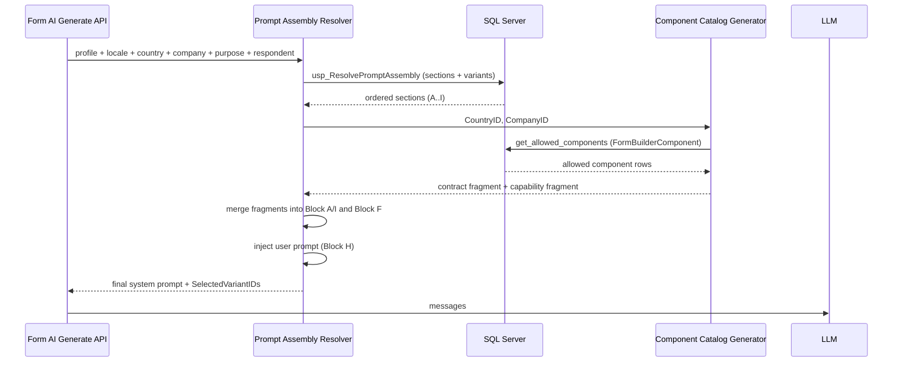
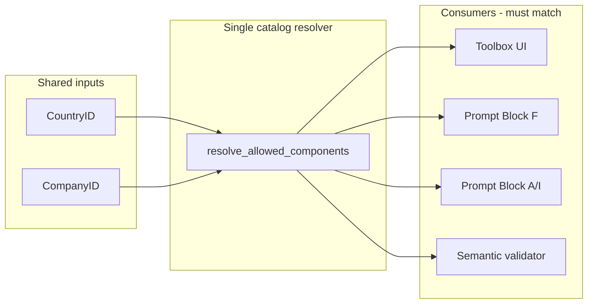
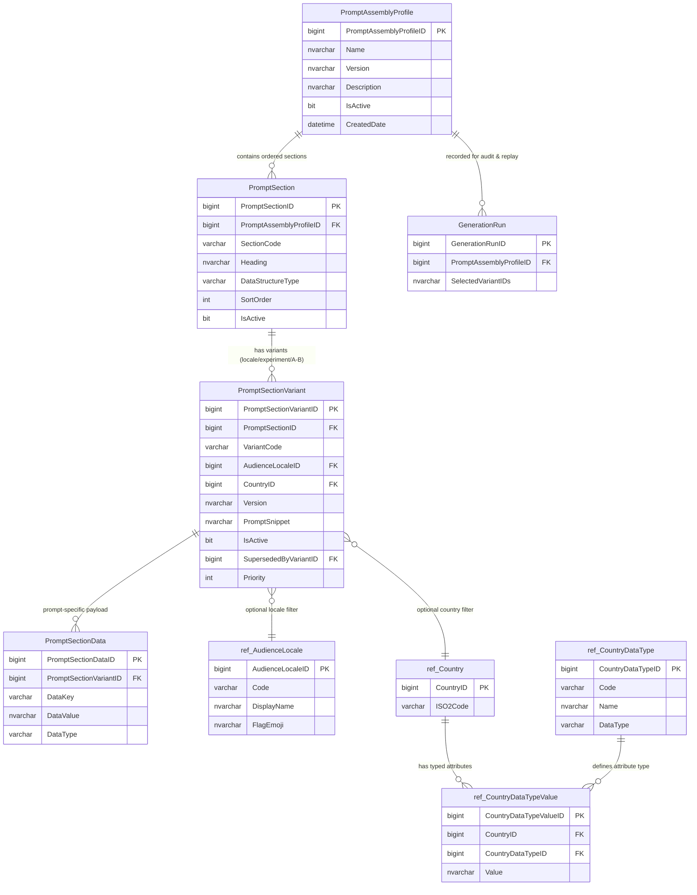

# Prompt Assembly Registry Architecture – Database-Driven Prompt Tree with Versioning, Reordering & A/B Testing

**Owner:** Dimitri (Data Domain Architect)  
**Related Stories:** 6.4.4.1 (Locale Blocks), 6.5a (Clarification Options), future 6.5b+ (Style Intent, richer context)  
**Status:** Draft for Review – Foundational schema proposal  
**Date:** 2026-05-09  
**Companion doc:** [`decision-6.5a-clarification-options-data-model.md`](decision-6.5a-clarification-options-data-model.md) (clarification `ref.*` tables, APIs, Block E — *today’s* data sources in §4.1)

### How to read this document

| If you need… | Go to… |
|--------------|--------|
| What each prompt block does and **target** data sources | **§2** (summary table) + **§2.7** (authoritative post-implementation matrix) |
| Why Block A ≠ Block F, and country-scoped components | **§2.1–2.3** |
| Toolbox must match prompt and validator (non-negotiable) | **§2.5** |
| End of global `ComponentCapabilitySnapshot` as allowed-type source | **§2.6** |
| Table DDL, ERD, seed examples | **§3** |
| Resolver SP vs Python split | **§5** |
| Per-block version rollback | **§8** |
| Country facts vs prompt prose | **§3** / **§9** |

**One-line thesis:** One registry orders and versions prompt prose; one catalog resolver (`resolve_allowed_components`) defines which component types exist per request; Block **H** alone stays runtime-only.

---

## 1. Purpose & Strategic Intent

The current prompt assembly in EventLeadPlatform mixes hardcoded strings, registry-driven locale blocks, and runtime resolution logic. This works for the initial AU launch but creates technical debt for international expansion, A/B testing, and adding new situational-awareness dimensions.

This document defines a **Prompt Assembly Registry** — a versioned, database-driven structure that:
- Stores every section of the prompt as data (heading + snippet), **except Block H** (user text — runtime only; see §2.7).
- Allows reordering, enabling/disabling, and inserting new sections purely by updating rows.
- Supports A/B testing and gradual rollout via variants and activation flags.
- Accommodates sections with different data structures (some locale-only, some country-specific, some global, some experiment-driven).
- Provides a single source of truth so the LLM always receives a deterministic, auditable, and evolvable prompt.

This is the natural next step after the clarification-options work in 6.5a. We now have enough clarity on the prompt tree (blocks A–I) to design a schema that will not need redesign.

---

## 2. Prompt Assembly Breakdown (Blocks A–I)

From the 6.5a decision document, the prompt is assembled in this order. **§2.7** is the authoritative **post-implementation** data-source matrix (what comes from the database vs runtime). The table below is a **target-state summary** after the Prompt Assembly Registry is implemented.

| Block | Name | Target state (post-implementation) | Locale / country driven? | Versioning | Notes |
|-------|------|-----------------------------------|--------------------------|------------|-------|
| A | System Role & Output Contract | Registry prose + **generated** allowed-type list from catalog | Country + company (catalog) | Variant-level | Static contract in `PromptSectionVariant`; dynamic list from `FormBuilderComponent` (§2.3) |
| B | Safety & Policy Guardrails | Registry (`PromptSectionVariant`) | No | Variant-level | Moves out of Python literals |
| C | Brand Posture Block | Registry variants + **resolved** `Company` values | Heritage origin → country | Variant-level | Four posture variants; selection from `dbo.Company` |
| D | Locale Blocks (Format / Policy / Tone) | `PromptTemplateLocaleBlock` (+ country facts) | **Yes** (`ref.AudienceLocale`) | Variant-level | Mature 6.4.4.1 path; referenced by registry section rows |
| E | Clarification Context (E1–E3) | `ref.*` tables + registry section wrappers | **Yes** | Variant-level | Replaceable when user changes dropdowns (6.5a) |
| F | Component Capability | **Runtime-derived** from catalog + width tiers | **Yes** (country + company) | Variant-level prose shell | Snapshot table deprecated as allowed-type source (§2.6) |
| G | Few-Shot / Rubric / Context pack | Registry variants (+ optional `PromptSectionData`) | Per-locale variants possible | Variant-level | Migrate off `STORY-6.2-AI-CONTEXT-PACK.md` file read |
| H | User Prompt + Attached Context | **Runtime only** | Event/company context | N/A | Not stored in prompt registry |
| I | Final JSON Output Instruction | Registry prose + **generated** catalog + validation refs | Country (patterns) | Variant-level | Shares catalog generator with A; patterns from `ValidationRule` / `CountryDataTypeValue` |

**Key insight (target):** Every block except **H** is assembled from database rows and/or a database query executed at request time. Block **H** is the only block with no registry storage. Blocks **A**, **F**, and **I** share one catalog resolver (`resolve_allowed_components`) so toolbox, prompt, and validator stay aligned (§2.5).

---

## 2.1 Block A vs Block F — Do Not Merge (Refined Model)

These blocks look similar because both mention “components”, but they serve **different jobs** in the prompt.

| Aspect | Block A (`ROLE_CONTRACT`) + Block I (`JSON_OUTPUT`) | Block F (`COMPONENT_CAPABILITY`) |
|--------|-----------------------------------------------------|----------------------------------|
| **Job** | **Output contract** — what shape of JSON the model must return | **Capability context** — which component types exist and how to use them |
| **Audience** | Strict validator / compiler downstream | The LLM at generation time |
| **Content today** | Hardcoded `FormSemanticPlan` instructions in `_build_initial_messages` (root keys, per-component fields, `widthIntent`, `validationIntent`) | `_build_capability_prompt_block()` renders “ALLOWED COMPONENT TYPES” from `config.ComponentCapabilitySnapshot` |
| **Country-aware today?** | **No** — same catalog text for all countries | **No** — snapshot is global (`IsActive = 1`, no `CountryID` filter) |
| **Target end state** | Static role/contract prose in registry + **dynamically generated** allowed-type list from country-scoped catalog | Same catalog query + width tiers → human-readable capability rules (§2.5–2.6) |

**Recommendation: keep two prompt sections, one shared data source.**

- **Single source of truth for “what components exist”:** `dbo.FormBuilderComponent` (+ `ref.ComponentType`, `ref.ComponentScope`) — already supports country scoping (see §2.2).
- **Block F** continues to explain capabilities in natural language (widthIntent vocabulary, fallback rules).
- **Block A / I** holds stable contract prose; a **Component Catalog Generator** (see §2.3) injects the country-filtered list of allowed `componentType` values into the contract at render time.

Merging A and F into one blob would mix **contract law** with **tooling instructions**, make variant versioning harder, and prevent independent A/B tests (“tighter contract” vs “richer capability hints”).

### 2.2 Country-Scoped Components — Confirmed in Database (Not in Frontend Registry)

**Your assumption is correct for the database catalog, with one important clarification:**

| Layer | Country scoping? | Details |
|-------|------------------|---------|
| **`dbo.FormBuilderComponent`** | **Yes** | `CountryID` (nullable) + `ComponentScopeID` (`Global` \| `Country` \| `Company`). Migration `039_form_defaults_component_catalog.py`. |
| **Global components** | `ScopeCode = 'Global'`, `CountryID IS NULL`, `CompanyID IS NULL` | Available to every country (e.g. `text`, `email`). |
| **Country components** | `ScopeCode = 'Country'`, `CountryID = <id>` | Only when resolver passes that country (e.g. future `address-au`). |
| **`get_allowed_components()`** | **Yes** | `backend/modules/form_builder/service.py` — `Global ∪ Country(country_id) ∪ Company(company_id)`. |
| **`frontend/.../ComponentRegistry.tsx`** | **No** | Still a static TypeScript registry; toolbox is not yet driven by `/api/form-builder/components`. |
| **`config.ComponentCapabilitySnapshot`** | **No (today)** | Platform-wide JSON blob; **to be replaced** by runtime-derived capability from catalog (§2.6). |

**Implication for prompt assembly:** country-specific components (e.g. Australia address lookup) must be filtered using the **same resolver as the form builder** (`CompanyID` + `CountryID`), not by reading the frontend `ComponentRegistry` file.

### 2.3 Component Catalog Generator (Dynamic Block A / I Content)

**Today we do not auto-generate a JSON Schema `oneOf` list.** Form AI instructs the model to return **`FormSemanticPlan`** JSON via prose in `service.py` (required root keys, per-component fields). The capability block lists allowed types separately. There is no hand-maintained JSON Schema `definitions` block in production — that was a forward-looking registry design.

**Target behaviour:**

1. At prompt assembly time, resolve `CountryID` (and optionally `CompanyID`) from the generation context.
2. Call the same component resolution as the builder: `get_allowed_components(db, company_id, country_id)`.
3. For each allowed row, read `ComponentCode`, `DisplayName`, `PropertiesSchemaJSON`, `StructureJSON`, `ValidationConfigJSON`.
4. **Generator output** (injected into Block A or I, or stored in `PromptSectionData` with `DataKey = 'ALLOWED_COMPONENT_TYPES_JSON'`):
   - Minimal: list of allowed `componentType` strings (matches today’s capability block + FormSemanticPlan).
   - Rich (future): per-type property hints derived from `PropertiesSchemaJSON` for the LLM.
5. **Block F** renderer uses the **same query** and formats “ALLOWED COMPONENT TYPES” prose from **runtime-derived capability JSON** (see §2.6), not from a global `ComponentCapabilitySnapshot` row.

**Registry hook:**

| PromptSection | DataStructureType | Generator |
|---------------|-------------------|-----------|
| `ROLE_CONTRACT` | `SimpleText` | None — static role prose from `PromptSnippet` |
| `OUTPUT_CONTRACT` or `JSON_OUTPUT` | `DynamicComponentCatalog` | `usp_ResolveAllowedComponents` or Python `build_allowed_components_prompt_fragment(country_id, company_id)` |
| `COMPONENT_CAPABILITY` | `ComponentCapability` | Same catalog query → **runtime-derived** capability JSON (§2.6); no merge with global snapshot for allowed types |

Add to `PromptSectionData` only when the generator emits **extra** key/value pairs (e.g. split role vs contract). The allowed-type list itself comes from the catalog query, not duplicated per variant row.

### 2.4 Resolver Integration (Where the Generator Runs)



**Net design areas (all in scope for this architecture — no “later” on toolbox alignment):**

| Area | Deliverable |
|------|-------------|
| **Schema** | `PromptAssemblyProfile`, `PromptSection`, `PromptSectionVariant` (with versioning), `PromptSectionData`, `ref.CountryDataType*`, link to existing `FormBuilderComponent` |
| **Resolver** | `usp_ResolvePromptAssembly` + Python orchestration |
| **Component catalog service** | Single function `resolve_allowed_components(db, company_id, country_id)` — **only** authoritative list of codes |
| **Wire Form AI** | Replace hardcoded `_build_initial_messages` body with resolver output; Block F + A/I use catalog service |
| **Align toolbox (mandatory)** | Form Builder toolbox driven **only** by `POST /api/form-builder/init` → `components[]` from same catalog service (see §2.5) |
| **Country-scoped capability** | Runtime-derived capability JSON from catalog + width tiers (see §2.6); retire global-only snapshot as source of truth for allowed types |

### 2.5 Toolbox–Prompt Alignment (Mandatory — Same Story)

**Why this cannot be deferred:** If the toolbox still shows components from `ComponentRegistry.tsx` while the LLM prompt lists components from `FormBuilderComponent`, the user can drag types the model is forbidden to emit (or the model invents types that are not in the toolbox). That breaks the product promise of “what you see is what the AI can build.”

**Design rule:** One resolver, **four** consumers — same `CompanyID` + `CountryID` inputs, same output set of `ComponentCode` values (toolbox, Block F, Blocks A/I, semantic validator).

| Consumer | Today | Target |
|----------|-------|--------|
| **Form Builder toolbox** | Static `ComponentRegistry.tsx` (all types hardcoded) | Render only `components[]` from `POST /api/form-builder/init` (`build_init_payload` → `get_allowed_components`) |
| **Form AI Block F** | Global `ComponentCapabilitySnapshot.SnapshotJson` | Generated from **same** `resolve_allowed_components` + width-class metadata |
| **Form AI Block A/I** | Hardcoded FormSemanticPlan prose | Contract fragment listing **same** allowed `componentType` codes |
| **Semantic validator** | Rejects `unknown-component-type` against snapshot JSON | Validates against **same** resolved set (not a third list) |

**API contract (already exists — must become authoritative):**

- `POST /api/form-builder/init` with `{ companyId, eventId }`
- Response includes `components: FormBuilderComponentItem[]` with `componentCode`, `displayName`, `structure`, `propertiesSchema`, etc.
- Country resolved inside `build_init_payload` via `resolve_country_id(company_id, event_id)`.

**Frontend changes required (in scope):**

1. On builder load, call `/api/form-builder/init` (or equivalent context endpoint).
2. Build toolbox palette **only** from `response.components` (map `componentCode` → registry renderer entry; hide codes not returned).
3. Do not show country-specific types (e.g. `address-lookup-au`) unless the API returned them.
4. When user changes event/company context, re-fetch init and refresh toolbox + AI panel defaults.

**Form AI changes required (in scope):**

1. Before generation, resolve `country_id` / `company_id` the same way as init.
2. Call `resolve_allowed_components` — **identical query** to init.
3. Pass result into prompt assembly and into semantic validation.

**Acceptance check:** For AU company/event, toolbox codes = prompt “ALLOWED COMPONENT TYPES” list = validator allowed set. Adding a `Country`-scoped row for AU-only component appears in all three after seed — no migration to a global snapshot JSON blob.



### 2.6 Country-Scoped Capability — What It Means (Elaboration)

Today **`config.ComponentCapabilitySnapshot`** is a **platform-global** governance artifact:

| Property | Behaviour today |
|----------|-----------------|
| **Shape** | One table row with `IsActive = 1` (all others deactivated). `SnapshotJson` is a JSON array: `{ "type": "email", "widthClasses": ["compact","half","full"] }, ...` |
| **Who uses it** | (1) Form AI prompt — `_build_capability_prompt_block()` lists types and widthIntent hints. (2) Semantic validator — rejects `componentType` not in snapshot (`unknown-component-type`). (3) GenerationRun audit — stores which snapshot ID was used. |
| **Country** | **No `CountryID` column.** Every country sees the same list (e.g. `address` is in the global snapshot even if only AU should have address lookup). |
| **How it changes** | Developers edit migration SQL / insert new snapshot version (e.g. `cf-6.3.1-v3` in migration 056 when `first-name` was added). Easy to **drift** from `FormBuilderComponent` and from the toolbox. |

**The problem you are solving:** Australia gets `address-lookup-au` in the catalog, but the global snapshot still says every country may use `address`, or the LLM is told it can use a type the toolbox does not offer — or vice versa.

**“Country-scoped capability” does not necessarily mean** a new physical table with 200 country rows duplicated by hand. It means: **the effective capability set for a request is the intersection of catalog + rules for that country**, not one global JSON file.

#### Recommended approach (aligns with toolbox + prompt)

**Phase A — Runtime-derived capability (preferred for MVP of this design)**

1. **Source of allowed types:** `resolve_allowed_components(company_id, country_id)` → list of `ComponentCode` values.
2. **Source of width classes:** Existing compiler tier table (`COMPONENT_WIDTH_TIERS` in `form_ai/compiler.py`) or a small `ref.ComponentWidthClass` table keyed by `ComponentTypeCode`.
3. **At generation time**, build capability JSON in memory:

```json
{
  "components": [
    { "type": "text", "widthClasses": ["compact", "half", "full"] },
    { "type": "address-lookup-au", "widthClasses": ["full"] }
  ],
  "resolvedCountryId": 1,
  "resolvedCompanyId": 42,
  "catalogVersion": "FormBuilderComponent-active-rows"
}
```

4. Use that object for Block F prose, semantic validation, and audit log on `GenerationRun` (store hash or serialized JSON — not necessarily a new snapshot row per request).
5. **`ComponentCapabilitySnapshot` table:** Deprecate as **manual source of truth** for allowed types; keep only for backward compatibility during cutover, or use for platform-wide width defaults until tiers are fully in DB.

**Phase B — Optional persistence (if audit/compliance needs frozen artifacts)**

Add nullable scope to snapshot table (only if you need to freeze “what the platform allowed on date X”):

```sql
-- Optional extension; not required if GenerationRun stores resolved JSON
ALTER TABLE config.ComponentCapabilitySnapshot
  ADD CountryID BIGINT NULL,
      CompanyID BIGINT NULL;
-- NULL,NULL = global fallback (legacy)
-- CountryID set = country-specific frozen snapshot for compliance exports
```

Or a child table `ComponentCapabilitySnapshotComponent` (SnapshotID, ComponentTypeCode, WidthClassesJSON) populated by a **build job** from `FormBuilderComponent` — not hand-edited.

#### What we are explicitly avoiding

| Anti-pattern | Why |
|--------------|-----|
| Maintaining **two** lists (snapshot JSON + FormBuilderComponent) | Caused UAT failures when `first-name` was in compiler but not snapshot |
| Global snapshot + country catalog | AU-only components leak to US prompts or get blocked incorrectly |
| Toolbox from TS registry + prompt from DB | User drags components AI cannot output |

#### Semantic validator alignment

The validator today calls `_capability_snapshot()` from tests and loads DB active row in production. **Change:** pass `resolved_capability_json` built from the same `resolve_allowed_components` call used for the prompt. Validator and prompt always agree because they are the **same object in the same request**.

#### Summary table

| Term | Meaning in this design |
|------|------------------------|
| **Country-scoped catalog** | `FormBuilderComponent` rows filtered by Global ∪ Country(country_id) ∪ Company(company_id) |
| **Country-scoped capability** | Capability JSON **derived at runtime** from that catalog (+ width tiers), not read from one global snapshot row |
| **Country-scoped snapshot (optional)** | Persisted frozen copy per country for audit; **not** the primary mechanism for MVP |

### 2.7 Post-Implementation: Database Sources by Block (A–I)

This section answers: **after the registry is implemented, what exactly comes from the database for each block?** Use it as the developer handoff contract alongside `decision-6.5a-clarification-options-data-model.md` §4.1 (which describes *today’s* mix of hardcoded vs DB).

#### Legend

| Symbol | Meaning |
|--------|---------|
| **STORED** | Prose or JSON seeded in `config.PromptSectionVariant` / `PromptSectionData` |
| **REF** | Row looked up from a `ref.*` or `dbo.*` table at render time |
| **GENERATED** | Built in Python (or SP) from a DB query — not duplicated as static text per country |
| **RUNTIME** | Supplied on the request; not part of the registry |
| **TRACE** | Written to audit tables (`GenerationRun`, governance version IDs) but not injected as prompt prose |

**Shared resolver inputs (most blocks):** `PromptAssemblyProfileID`, resolved `AudienceLocaleID`, `CountryID`, `CompanyID`, `FormPurposeCode`, `RespondentTypeCode`, optional `ExperimentFlag` / rollout. The resolver (`usp_ResolvePromptAssembly` + Python orchestration) returns ordered sections and winning variants; the renderer hydrates each `DataStructureType`.

---

#### Block A — `ROLE_CONTRACT` (System role & output contract)

| Content in the assembled prompt | Source type | Database object(s) |
|---------------------------------|-------------|-------------------|
| System role prose (“You are an expert semantic form designer…”) | **STORED** | `config.PromptSectionVariant` where `PromptSection.SectionCode = 'ROLE_CONTRACT'` |
| `FormSemanticPlan` root keys, per-component field rules, `widthIntent` / `validationIntent` instructions | **STORED** | Same variant `PromptSnippet` (or `PromptSectionData` keys if split) |
| Allowed `componentType` list (contract fragment) | **GENERATED** | `dbo.FormBuilderComponent` via `resolve_allowed_components(company_id, country_id)` — same query as toolbox (§2.5) |
| Consent / layout nudges (if still required) | **STORED** or **RUNTIME** | Prefer registry variant; today some lines are code constants — migrate to `PromptSectionData` or a dedicated micro-section |

**Not from DB:** User text (Block H).  
**TRACE:** `PromptSectionVariantID`(s) for A, hash of generated catalog fragment.

---

#### Block B — `SAFETY` (Safety & policy guardrails)

| Content | Source type | Database object(s) |
|---------|-------------|-------------------|
| Full safety / PII / brand-safety prose | **STORED** | `config.PromptSectionVariant` (`SectionCode = 'SAFETY'`, `VariantCode = 'DEFAULT'`) |
| Optional structured rule list | **STORED** | `config.PromptSectionData` (`DataKey` e.g. `PROHIBITED_TOPICS`) if split from prose |

**Not from DB:** Nothing dynamic per request (global block).

---

#### Block C — `BRAND_POSTURE` (Brand posture)

| Content | Source type | Database object(s) |
|---------|-------------|-------------------|
| Which posture applies (`local` \| `heritage` \| `neutral` \| `transcreate`) | **REF** | `dbo.Company.BrandPosture` (+ request override if present) |
| Heritage origin country label | **REF** | `dbo.Company` heritage field → `ref.Country` for display name |
| Posture prompt prose | **STORED** | `config.PromptSectionVariant` — one active variant per `VariantCode` matching resolved posture (`local`, `heritage`, …) |
| Placeholder substitution (`{heritageOrigin}`) | **GENERATED** | Renderer merges REF values into STORED snippet |

**Future:** `ref.BrandPosture` can replace enum + four hard-coded variant codes.  
**Not from DB:** —

---

#### Block D — Locale blocks (Format, Policy, Tone)

Three registry sections; hydration is identical per sub-block, keyed by block type.

| Sub-block | SectionCode | Content | Source type | Database object(s) |
|-----------|-------------|---------|-------------|-------------------|
| **D1** | `LOCALE_FORMAT` | Date/phone/address/currency format guidance | **STORED** | `config.PromptTemplateLocaleBlock` (`BlockType = 'format'`) via active `config.PromptTemplateVersion` |
| **D2** | `LOCALE_POLICY` | Privacy / legal register (Privacy Act, GDPR, …) | **STORED** | `PromptTemplateLocaleBlock` (`BlockType = 'policy'`) |
| **D3** | `LOCALE_TONE` | Hofstede-informed tone guidance | **STORED** | `PromptTemplateLocaleBlock` (`BlockType = 'tone'`) |
| All D* | — | Locale key for row selection | **REF** | `ref.AudienceLocale` (resolved from Event → Company → User → Form chain; 6.5a) |
| All D* | — | Raw country facts (if template uses placeholders) | **REF** | `ref.CountryDataType` + `ref.CountryDataTypeValue` (e.g. `DATE_FORMAT`, `PHONE_PATTERN`) — not duplicated in `PromptSectionData` |

**Registry role:** `PromptSection` rows point renderer at `DataStructureType = 'LocaleBlock'`; variants may override or fall back to `DEFAULT` + `AudienceLocaleID`.  
**Not from DB:** —

---

#### Block E — Clarification context (E1–E3)

| Sub-block | SectionCode | Content | Source type | Database object(s) |
|-----------|-------------|---------|-------------|-------------------|
| **E1** | `CLARIFICATION_LOCALE` | Section heading | **STORED** | `config.PromptSection.Heading` |
| **E1** | — | Summary line (“Audience Locale: Australia (AU) – …”) | **STORED** | **`ref.AudienceLocale.ClarificationSummary`** (6.5a — Option B); optional override via `PromptSectionVariant` per `AudienceLocaleID` for registry A/B |
| **E2** | `CLARIFICATION_PURPOSE` | Heading | **STORED** | `PromptSection.Heading` |
| **E2** | — | Purpose `PromptHint` prose | **REF** | `ref.FormPurpose.PromptHint` for selected `PurposeCode` |
| **E2** | — | Localized hint override (optional) | **REF** | `ref.FormPurposeLocale` if seeded |
| **E3** | `CLARIFICATION_RESPONDENT` | Heading | **STORED** | `PromptSection.Heading` |
| **E3** | — | Respondent `PromptHint` prose | **REF** | `ref.RespondentType.PromptHint` for selected `RespondentTypeCode` |
| **E3** | — | Localized hint override (optional) | **REF** | `ref.RespondentTypeLocale` if seeded |
| All E* | — | Selected codes (what user chose) | **REF** | Request payload; persisted on `dbo.Form` + `GenerationRun` for replay |
| All E* | — | Dropdown labels (UI only, not prompt) | **REF** | Same `ref.*` tables via `/api/ref/audience-locales`, `form-purposes`, `respondent-types` |
| All E* | — | Company/form defaults | **REF** | `dbo.Company` default columns; `dbo.Form` snapshot columns |

**Replace semantics:** Changing a dropdown triggers re-generation; resolver selects new E2/E3 REF rows (and E1 if locale changes). No frontend enums.  
**Not from DB:** —

---

#### Block F — `COMPONENT_CAPABILITY` (Capability guidance)

| Content | Source type | Database object(s) |
|---------|-------------|-------------------|
| Intro / widthIntent vocabulary / fallback rules (prose shell) | **STORED** | `config.PromptSectionVariant` (`SectionCode = 'COMPONENT_CAPABILITY'`) |
| “ALLOWED COMPONENT TYPES” list and per-type width classes | **GENERATED** | `dbo.FormBuilderComponent` (+ `ref.ComponentType`, `ref.ComponentScope`) via `resolve_allowed_components`; width tiers from compiler constants or future `ref.ComponentWidthClass` |
| Legacy snapshot JSON | **Deprecated** | `config.ComponentCapabilitySnapshot` — **not** authoritative after cutover; optional **TRACE** only during migration |

**Critical rule:** F and A/I must use the **same GENERATED** component set in the same request (§2.5).  
**TRACE:** Serialized resolved capability JSON (or hash) on `GenerationRun`.

---

#### Block G — `FEW_SHOT` (Examples, rubric, context pack)

| Content | Source type | Database object(s) |
|---------|-------------|-------------------|
| Few-shot example pairs | **STORED** | `PromptSectionVariant.PromptSnippet` or `PromptSectionData` (`DataType = 'JSON'`) |
| Rubric weights / scoring guidance | **STORED** | `PromptSectionData` or dedicated variant |
| Context-pack-style domain rules (today: markdown file) | **STORED** (target) | Migrate `docs/stories/STORY-6.2-AI-CONTEXT-PACK.md` body into registry variant(s); per-locale variants via `AudienceLocaleID` on variant row |
| Trimmed context pack (if still needed) | **GENERATED** | Renderer may strip sections by marker — logic stays in Python |

**Today vs target:** `_load_context_pack()` reads a file; **after implementation** this block is **STORED** in DB like other sections.  
**Not from DB:** —

---

#### Block H — `USER_PROMPT` (User prompt + attached context)

| Content | Source type | Database object(s) |
|---------|-------------|-------------------|
| User natural-language prompt | **RUNTIME** | `FormAiGenerateRequest` (Pydantic — not a table) |
| Event name, dates, venue, etc. | **RUNTIME** + **REF** | Fetched from `dbo.Event` (and related) when `eventId` present |
| Company name, industry, etc. | **RUNTIME** + **REF** | Fetched from `dbo.Company` |
| Filtered runtime palette / footprints | **GENERATED** | Built from request + **GENERATED** capability set (intersection with allowed types) |
| Instruction addendum | **RUNTIME** | Request field if supplied |

**Registry role:** `PromptSection` with `DataStructureType = 'UserPrompt'` defines **sort position only** — no `PromptSnippet`.  
**Not from DB:** Free-text prompt itself.

---

#### Block I — `JSON_OUTPUT` (Final JSON / validation tail)

| Content | Source type | Database object(s) |
|---------|-------------|-------------------|
| “Return a single valid JSON object…” / schema tail prose | **STORED** | `config.PromptSectionVariant` (`SectionCode = 'JSON_OUTPUT'`) |
| Allowed `componentType` list (if repeated at tail) | **GENERATED** | Same `resolve_allowed_components` as Block A |
| Phone/date/postcode validation pattern references | **REF** | `config.ValidationRule` (by `CountryID`) and/or `ref.CountryDataTypeValue` |
| Component validation contracts (if referenced in tail) | **REF** | `config.ComponentValidationContract` (active version) |

**Not from DB:** —  
**TRACE:** `validationContractVersion`, `widthClassPolicyVersionId`, etc. via `_resolve_runtime_governance_versions`.

---

#### Cross-block tables (always involved, not a single letter block)

| Role | Database object(s) | Used by |
|------|-------------------|---------|
| Assembly definition & order | `config.PromptAssemblyProfile`, `PromptSection`, `PromptSectionVariant`, `PromptSectionData` | Resolver — all blocks except H body |
| Active prompt template lineage | `config.PromptTemplate`, `config.PromptTemplateVersion` | D blocks (locale block join) |
| Component catalog (authoritative types) | `dbo.FormBuilderComponent`, `ref.ComponentType`, `ref.ComponentScope`, `ref.Country` | A, F, I (GENERATED); toolbox via `/api/form-builder/init` |
| Clarification reference data | `ref.AudienceLocale`, `ref.FormPurpose`, `ref.RespondentType` (+ optional locale sidecars) | E blocks; APIs; defaults on `Company` / `Form` |
| Country facts | `ref.CountryDataType`, `ref.CountryDataTypeValue` | D, E1, I (placeholders / patterns) |
| Governance / audit | `GenerationRun`, `config.CapabilityPolicyVersion`, `config.WidthClassPolicyVersion` | **TRACE** — replay and compliance, not prompt prose |
| Persistence of user choices | `dbo.Form`, `dbo.Company` | E defaults; panel restore |

---

#### Post-implementation summary matrix

| Block | STORED (registry) | REF (lookup) | GENERATED (query) | RUNTIME only |
|-------|-------------------|--------------|-------------------|--------------|
| **A** | Role + contract prose | — | Allowed component types | — |
| **B** | Safety prose | — | — | — |
| **C** | Posture prose (per variant) | `Company`, `Country` | Placeholder merge | — |
| **D1–D3** | Via locale-block join | `AudienceLocale`, `CountryDataTypeValue` | Optional placeholder merge | — |
| **E1** | Heading (registry) + summary | `AudienceLocale.ClarificationSummary` | — | — |
| **E2** | Heading | `FormPurpose` (+ locale sidecar) | — | Selected code from request |
| **E3** | Heading | `RespondentType` (+ locale sidecar) | — | Selected code from request |
| **F** | Capability prose shell | — | Allowed types + width classes | — |
| **G** | Examples / rubric / context pack | Optional per-locale variant | Trim logic | — |
| **H** | Sort slot only | `Event`, `Company` | Filtered runtime context | User prompt, addendum |
| **I** | JSON tail prose | `ValidationRule`, `CountryDataTypeValue`, `ComponentValidationContract` | Allowed component types | — |

**Acceptance:** For a given `CompanyID` + `CountryID` + clarification codes, a developer can trace every sentence in blocks A–G and I to either a `PromptSectionVariant` row, a `ref.*`/`dbo.*` lookup, or the catalog generator — and block H to the request plus optional Event/Company fetches.

---

## 3. Proposed Schema – Prompt Assembly Registry

The schema is designed around these principles:
- A **PromptAssemblyProfile** defines a named, versioned assembly (e.g., `FORM_AI_V1`, `FORM_AI_V2_EXPERIMENT`).
- Each profile contains an ordered list of **PromptSection** entries.
- Each section can have multiple **PromptSectionVariant** rows (for A/B testing or locale-specific overrides).
- Sections declare a **DataStructureType** so the renderer knows how to hydrate the snippet (simple text, locale block, clarification block, JSON schema reference, etc.).
- Ordering is explicit via `SortOrder` and can be changed without code.
- Activation is controlled by `IsActive` + optional `ExperimentFlag` / rollout percentage.
- All prose lives in `nvarchar(max)` so it is fully localizable and versionable.

### Core Tables

```sql
-- Top-level named assembly with versioning
config.PromptAssemblyProfile
- PromptAssemblyProfileID (PK)
- Name (NVARCHAR(100), unique)          -- e.g. 'FORM_AI_BASE', 'FORM_AI_V2_CLARIFICATION'
- Version (NVARCHAR(20))                 -- '1.0', '1.1-experiment'
- Description (nvarchar(500))
- IsActive (bit)
- CreatedDate, CreatedBy, UpdatedDate, UpdatedBy, IsDeleted
- Unique constraint on (Name, Version) where IsActive = 1

-- Ordered sections within an assembly
config.PromptSection
- PromptSectionID (PK)
- PromptAssemblyProfileID (FK)
- SectionCode (varchar(50))             -- stable identifier e.g. 'ROLE', 'LOCALE_FORMAT', 'CLARIFICATION_PURPOSE'
- Heading (nvarchar(200))               -- optional human-readable header injected before the snippet
- DataStructureType (varchar(30))       -- 'SimpleText', 'LocaleBlock', 'ClarificationBlock', 'ComponentCapability', 'DynamicComponentCatalog', 'FewShotExample', 'JSONSchemaReference', 'SafetyRules'
- SortOrder (int)
- IsActive (bit)
- ExperimentFlag (varchar(50), nullable) -- e.g. 'V2_CLARIFICATION', 'BRAND_POSTURE_HERITAGE'
- RolloutPercentage (tinyint, nullable)  -- for gradual rollout
- audit columns

-- Variants / overrides for a section (locale, experiment, A/B)
-- Versioning is at the Variant level so each block can evolve independently
config.PromptSectionVariant
- PromptSectionVariantID (PK)
- PromptSectionID (FK)
- VariantCode (varchar(50))             -- 'DEFAULT', 'DE', 'APAC', 'EXPERIMENT_A', 'HERITAGE_US'
- AudienceLocaleID (FK to ref.AudienceLocale, nullable)
- CountryID (FK to ref.Country, nullable)
- Version (nvarchar(20))                -- '1.0', '1.1', '2.0-experiment' – enables per-block versioning
- PromptSnippet (nvarchar(max))         -- the actual text injected into the LLM
- IsActive (bit)                        -- only one active version per (Section + filters) combination
- SupersededByVariantID (bigint, nullable, self FK) -- supports clean rollback
- EffectiveFrom (datetime2, nullable)
- EffectiveTo (datetime2, nullable)
- ChangeReason (nvarchar(500), nullable) -- why this version was created
- Priority (int)                        -- higher priority wins when multiple variants match
- audit columns
- Unique constraint on (PromptSectionID, VariantCode, AudienceLocaleID, CountryID, Version) where IsActive=1

-- Optional structured data payload for complex sections
config.PromptSectionData
- PromptSectionDataID (PK)
- PromptSectionVariantID (FK)
- DataKey (varchar(100))                -- e.g. 'AllowedComponents', 'ValidationPatterns', 'ClarificationCodes'
- DataValue (nvarchar(max))             -- JSON or structured text
- DataType (varchar(30))                -- 'JSON', 'CSV', 'ReferenceList'
- audit columns

-- Country Reference Data (governed attribute store)
ref.CountryDataType
- CountryDataTypeID (PK)
- Code (varchar(50), unique)          -- 'DATE_FORMAT', 'PHONE_PATTERN', 'PHONE_PREFIX', 'CURRENCY_CODE', 'TAX_RATE', ...
- Name (nvarchar(100))                 -- 'Date Format', 'Phone Number Pattern', ...
- Description (nvarchar(500))
- DataType (varchar(30))               -- 'STRING', 'DECIMAL', 'JSON', 'REGEX'
- IsActive (bit)
- SortOrder (int)
- audit columns

ref.CountryDataTypeValue
- CountryDataTypeValueID (PK)
- CountryID (FK → ref.Country)
- CountryDataTypeID (FK → ref.CountryDataType)
- Value (nvarchar(max))                -- the actual value (regex, format string, number, JSON, etc.)
- IsActive (bit)
- audit columns
- Unique constraint on (CountryID, CountryDataTypeID)
```

### Country vs Prompt Data – Decision Table

| Data Category                        | Examples                                                                 | Store In                          | Reason |
|--------------------------------------|--------------------------------------------------------------------------|-----------------------------------|--------|
| **Country Reference Data**           | `PHONE_PREFIX`, `DATE_FORMAT`, `PHONE_PATTERN`, `ADDRESS_FORMAT`, `POSTCODE_PATTERN`, `CURRENCY_CODE`, `TAX_RATE`, `TAX_NAME` | `ref.CountryDataTypeValue`       | Governed, reusable, not prompt-specific |
| **Prompt-Specific Content**          | `ROLE_DEFINITION`, `SAFETY_RULES`, `BRAND_POSTURE_TEXT`, `FEW_SHOT_EXAMPLE`, `OUTPUT_CONTRACT`, capability prose shell | `PromptSectionVariant` / `PromptSectionData` | Varies by variant / experiment / A/B test |
| **Hybrid / Locale-Driven**           | Full rendered locale prose blocks (format/policy/tone)                   | `PromptTemplateLocaleBlock`      | Already mature; referenced by variant |
| **Clarification Hints**              | Per-FormPurpose / Per-RespondentType prompt hints                        | `ref.FormPurpose.PromptHint`, `ref.RespondentType.PromptHint` (+ optional `*Locale` sidecars) | Stable business codes; registry supplies headings only (§2.7 E2–E3) |
| **Allowed component types**          | Per-request `componentType` list                                         | **GENERATED** from `dbo.FormBuilderComponent` | Not static rows in `PromptSectionData` (§2.3, §2.6) |

**Rule of thumb:**  
- If the value is a **raw fact about a country** (format, prefix, tax rate) → `CountryDataTypeValue`.  
- If the value is **text the LLM will read** and is **variant- or experiment-specific** (role, safety, brand voice, few-shot) → `PromptSectionVariant` / `PromptSectionData`.  
- If the value is a **clarification hint tied to a business code** (form purpose, respondent type) → `ref.FormPurpose` / `ref.RespondentType` (and optional locale sidecars), per §2.7 Block E.

### How the 9 Blocks Map to the Schema

| Block | SectionCode | DataStructureType | Typical VariantCode | How it is hydrated |
|-------|-------------|-------------------|---------------------|--------------------|
| A | ROLE_CONTRACT | SimpleText + DynamicComponentCatalog | DEFAULT | Static role prose in variant; allowed component types generated from `FormBuilderComponent` at render time (see §2.3) |
| B | SAFETY | SimpleText or SafetyRules | DEFAULT | Stable safety text |
| C | BRAND_POSTURE | SimpleText (or future BrandPosture variant) | local, heritage, neutral, transcreate | Resolved at runtime from Company + request; variant selected by resolved posture |
| D1 | LOCALE_FORMAT | LocaleBlock | DEFAULT + per AudienceLocale | Joins to PromptTemplateLocaleBlock (format) via AudienceLocaleID |
| D2 | LOCALE_POLICY | LocaleBlock | DEFAULT + per AudienceLocale | Same pattern |
| D3 | LOCALE_TONE | LocaleBlock | DEFAULT + per AudienceLocale | Same pattern |
| E1 | CLARIFICATION_LOCALE | ClarificationBlock | DEFAULT + per AudienceLocale | Injects `ref.AudienceLocale.ClarificationSummary` for selected locale (6.5a Option B) |
| E2 | CLARIFICATION_PURPOSE | ClarificationBlock | DEFAULT + per FormPurpose | Uses selected FormPurpose.PromptHint |
| E3 | CLARIFICATION_RESPONDENT | ClarificationBlock | DEFAULT + per RespondentType | Uses selected RespondentType.PromptHint |
| F | COMPONENT_CAPABILITY | ComponentCapability | DEFAULT | Prose shell from variant; allowed types + width classes **GENERATED** from `FormBuilderComponent` + width tiers (§2.6 — snapshot not authoritative) |
| G | FEW_SHOT | FewShotExample | DEFAULT or per-locale | Example pairs stored in PromptSnippet or PromptSectionData |
| H | USER_PROMPT | (runtime only) | N/A | Not stored; injected at the end |
| I | JSON_OUTPUT | DynamicComponentCatalog + JSONSchemaReference | DEFAULT | FormSemanticPlan contract tail + country-filtered allowed types (same generator as A); validation patterns from `ref.CountryDataTypeValue` / `ValidationRule` |

**Reordering example:** To move the clarification blocks before the locale blocks, simply update `SortOrder` values on the three E rows and the three D rows. No code change.

**A/B testing example:** Create a new `PromptAssemblyProfile` named `FORM_AI_V2_EXPERIMENT` with `ExperimentFlag = 'CLARIFICATION_V2'`. Add new sections or variant rows. The service can select the profile based on rollout percentage or feature flag.

**Adding a new section (e.g., Industry context in 6.5c):** Insert a new `PromptSection` row with `SectionCode = 'INDUSTRY_CONTEXT'`, `DataStructureType = 'ClarificationBlock'`, and appropriate variants. The renderer automatically includes it when the profile is active.

### Seed Data to Recreate Current Prompt Assembly (Blocks A–I)

The table above is intentionally concise. Below is the **actual seed data** required to make the registry produce the exact same prompt structure we currently generate in code (as of Story 6.5a).

This seed data assumes one active profile named `FORM_AI_BASE` (version 1.0) that mirrors today’s behaviour.

#### PromptSection rows (13 sections = blocks A–I, including D1–D3 and E1–E3)

| PromptSectionID | PromptAssemblyProfileID | SectionCode              | Heading                        | DataStructureType     | SortOrder | IsActive | ExperimentFlag | RolloutPercentage |
|-----------------|--------------------------|--------------------------|--------------------------------|-----------------------|-----------|----------|----------------|-------------------|
| 1               | 1                        | ROLE_CONTRACT            | (none)                         | SimpleText            | 10        | 1        | NULL           | NULL              |
| 2               | 1                        | SAFETY                   | (none)                         | SimpleText            | 20        | 1        | NULL           | NULL              |
| 3               | 1                        | BRAND_POSTURE            | (none)                         | SimpleText            | 30        | 1        | NULL           | NULL              |
| 4               | 1                        | LOCALE_FORMAT            | (none)                         | LocaleBlock           | 40        | 1        | NULL           | NULL              |
| 5               | 1                        | LOCALE_POLICY            | (none)                         | LocaleBlock           | 50        | 1        | NULL           | NULL              |
| 6               | 1                        | LOCALE_TONE              | (none)                         | LocaleBlock           | 60        | 1        | NULL           | NULL              |
| 7               | 1                        | CLARIFICATION_LOCALE     | Audience Locale                | ClarificationBlock    | 70        | 1        | NULL           | NULL              |
| 8               | 1                        | CLARIFICATION_PURPOSE    | Form Purpose                   | ClarificationBlock    | 80        | 1        | NULL           | NULL              |
| 9               | 1                        | CLARIFICATION_RESPONDENT | Target Respondent              | ClarificationBlock    | 90        | 1        | NULL           | NULL              |
| 10              | 1                        | COMPONENT_CAPABILITY     | (none)                         | ComponentCapability   | 100       | 1        | NULL           | NULL              |
| 11              | 1                        | FEW_SHOT                 | (none)                         | FewShotExample        | 110       | 1        | NULL           | NULL              |
| 12              | 1                        | USER_PROMPT              | (none)                         | UserPrompt            | 120       | 1        | NULL           | NULL              |
| 13              | 1                        | JSON_OUTPUT              | (none)                         | JSONSchemaReference   | 130       | 1        | NULL           | NULL              |

#### PromptSectionVariant rows (key variants that deliver today’s behaviour)

| PromptSectionVariantID | PromptSectionID | VariantCode     | AudienceLocaleID | CountryID | PromptSnippet (abbreviated) | IsActive | Priority |
|------------------------|-----------------|-----------------|------------------|-----------|-----------------------------|----------|----------|
| 1                      | 1 (ROLE)        | DEFAULT         | NULL             | NULL      | "You are an expert semantic form designer..." + full output contract | 1        | 100      |
| 2                      | 2 (SAFETY)      | DEFAULT         | NULL             | NULL      | Full safety guardrails text | 1        | 100      |
| 3                      | 3 (BRAND)       | local           | NULL             | NULL      | "Use a local, friendly, culturally appropriate voice..." | 1        | 100      |
| 4                      | 3 (BRAND)       | heritage        | NULL             | NULL      | "Use the voice and register of a brand whose heritage is {heritageOrigin}..." | 1        | 100      |
| 5                      | 3 (BRAND)       | neutral         | NULL             | NULL      | "Use a clear, professional, globally neutral tone..." | 1        | 100      |
| 6                      | 3 (BRAND)       | transcreate     | NULL             | NULL      | "Transcreate the content while preserving original brand intent..." | 1        | 100      |
| 7                      | 4 (FORMAT)      | DEFAULT         | 1 (AU)           | 1         | Current AU format block from PromptTemplateLocaleBlock | 1        | 100      |
| 8                      | 4 (FORMAT)      | DEFAULT         | 8 (INTL_ONLINE)  | NULL      | Current INTL_ONLINE format block | 1        | 100      |
| ...                    | ...             | ...             | ...              | ...       | (one row per AudienceLocale for each of D1/D2/D3) | ...      | ...      |
| 20                     | 7 (E1)          | DEFAULT         | 1 (AU)           | NULL      | "Audience Locale: Australia (AU) – dd/mm/yyyy, AUD, local privacy expectations." | 1        | 100      |
| 21                     | 7 (E1)          | DEFAULT         | 8 (INTL_ONLINE)  | NULL      | "Audience Locale: International (Online) – neutral formats, English default." | 1        | 100      |
| 22                     | 8 (E2)          | EVENT_REGISTRATION | NULL          | NULL      | *(optional)* experiment override only — **target:** hint from `ref.FormPurpose.PromptHint` via renderer | 1        | 100      |
| 23                     | 9 (E3)          | ATTENDEE        | NULL             | NULL      | *(optional)* experiment override only — **target:** hint from `ref.RespondentType.PromptHint` via renderer | 1        | 100      |
| 24                     | 13 (I)          | DEFAULT         | NULL             | NULL      | "Return a single valid JSON object matching the following schema..." + reference to ValidationRule patterns | 1        | 100      |

#### How Blocks A, C, E1, and I Each Deliver Two Things

This is the part that was unclear.

- **Block A (ROLE_CONTRACT)** vs **Block I (JSON_OUTPUT)**  
  The registry defines **two** sections (PromptSection IDs 1 and 13). Conceptually both belong to the “output contract” family (§2.1).  
  **Today’s code** combines role + contract + tail in one string; **target seed** may keep that combined text in Block A initially for parity, then split: static `FormSemanticPlan` rules in A, JSON tail + validation refs in I.  
  Block A also receives a **GENERATED** allowed-type list at render time (§2.3) — a third “delivery” that is never stored in `PromptSnippet`.

- **Block C (BRAND_POSTURE)**  
  One `PromptSection` row, but **four** active variants (`local`, `heritage`, `neutral`, `transcreate`).  
  At runtime the resolver picks exactly one variant based on the resolved `brandPosture` value from Company + request.  
  So the same block delivers four possible outputs depending on context. This is intentional A/B and brand-voice flexibility.

- **Block E1 (CLARIFICATION_LOCALE)**  
  One `PromptSection` row with multiple `DEFAULT` variants (one per AudienceLocale).  
  The variant selected at runtime produces the **dynamic summary line** (e.g., “Audience Locale: Australia (AU) – dd/mm/yyyy, AUD, local privacy expectations.”).  
  The second “delivery” is the **heading** (“Audience Locale”) which is stored in the `Heading` column of the `PromptSection` row.  
  So the block produces both the heading and the locale-specific summary text.

- **Block I (JSON_OUTPUT)** — see above; when split from A, the variant holds the fixed “Return valid JSON…” tail and the renderer appends **REF** validation patterns from `config.ValidationRule` / `CountryDataTypeValue`, plus the same **GENERATED** allowed-type list as Block A if repeated at the tail.

Blocks **B**, **D1–D3**, and **G** are one section + variant(s) producing a single coherent snippet. **E2–E3** use registry headings plus **`ref.FormPurpose` / `ref.RespondentType` hints** (§2.7), not duplicated hint text in variants except for A/B overrides. **F** adds a **GENERATED** allowed-type list to the variant’s prose shell.

This seed data + the hybrid renderer described in Section 5 will recreate today’s exact prompt output while giving us full reordering, versioning, and A/B capability for the future.

### ERD Diagram (Mermaid)



This ERD shows the clean star-like structure with the profile at the centre, sections ordered, variants filtered by locale/country, and audit linkage to GenerationRun.

---

## 4. How the Renderer Works (High-Level Contract)

1. Resolve the active `PromptAssemblyProfile` (default `FORM_AI_BASE` or experiment variant based on request flags / rollout).
2. Load all active `PromptSection` rows ordered by `SortOrder`.
3. For each section, resolve the best-matching `PromptSectionVariant` (considering AudienceLocale, Country, ExperimentFlag, Priority).
4. If `DataStructureType` requires structured data, hydrate from `PromptSectionData`, related `ref.*` / `dbo.*` tables, or **generators** (`LocaleBlock` → `PromptTemplateLocaleBlock`; `ComponentCapability` / `DynamicComponentCatalog` → `resolve_allowed_components`; `ClarificationBlock` → `ref.AudienceLocale`, `ref.FormPurpose`, `ref.RespondentType`). See §2.7.
5. Concatenate `Heading` (if present) + `PromptSnippet`.
6. Inject Block H (user prompt) at the position defined by its `SortOrder`.
7. Log the exact profile + section + variant IDs used into `GenerationRun` for full auditability and replay.

This makes every prompt deterministic, versioned, and replayable.

---

## 5. Implementation Consideration: Single Stored Procedure vs Hybrid Approach

**Question:** Can we deliver the entire prompt-assembly resolution (profile selection + ordered sections + best-variant matching + structured data hydration) with a **single Stored Procedure**?

### 5.1 Feasibility

**Yes, it is technically possible** to encapsulate the full resolution logic in one stored procedure (or table-valued function) that accepts:
- `@PromptAssemblyProfileName` or `@ProfileID`
- `@AudienceLocaleCode`
- `@CountryID`
- `@ExperimentFlag`
- `@CompanyID`, `@FormID` (for rollout / company-specific overrides)
- `@UserPrompt` (for injection at the correct SortOrder position)

The SP could return a single result set with columns such as:
- `SortOrder`, `SectionCode`, `Heading`, `PromptSnippet`, `DataStructureType`, `SelectedVariantID`, `Priority`, `IsFromExperiment`

### 5.2 Pros of a Single Stored Procedure

- Single database round-trip from the Python service layer.
- Atomic, consistent snapshot of the entire assembly (important for audit & replay).
- All complex matching logic (locale priority, experiment rollout, variant precedence) lives in one place and can be heavily indexed/optimised.
- Easier to cache the result set at the DB level if needed.

### 5.3 Cons & Risks

- **Complexity & Maintainability:** The resolution logic involves multiple CTEs, priority ranking, rollout-percentage calculation (RAND() or deterministic hash), and joining several registry tables. A single 200–300 line SP quickly becomes a black box that only a few DB specialists can maintain.
- **Testing:** Unit testing complex conditional logic inside a stored procedure is significantly harder than testing Python functions. We would lose the fast feedback loop we have with the existing Python test suite.
- **Debugging & Observability:** When a prompt looks wrong in production, a developer cannot easily step through the logic the way they can in Python. We would rely on PRINT / logging tables inside the SP.
- **Hybrid Data Needs:** Some data (UserPrompt, Event/Company metadata, real-time feature flags) is only known at runtime in the Python layer. The SP would still need to accept these as parameters and return a partially assembled structure that Python finishes.
- **Future Evolution:** As we add more DataStructureTypes (e.g., dynamic JSON schema generation, multi-locale few-shot examples), the SP would need frequent structural changes. Python is more agile for this.

### 5.4 Recommended Approach (Hybrid – Pragmatic & Low-Risk)

Deliver the core resolution with **one well-scoped stored procedure or table-valued function** that returns the ordered list of sections + best variants, but keep the final string assembly and runtime injection in Python.

**Proposed Split:**

1. **Single SP / TVF:** `config.usp_ResolvePromptAssembly` (or `ResolvePromptAssemblyTVF`)
   - Inputs: profile name, audience locale, country, experiment flag, company ID, rollout seed.
   - Output: result set of rows (SortOrder, SectionCode, Heading, PromptSnippet, DataStructureType, SelectedVariantID, ...).
   - This SP contains all the complex variant-matching, priority, and rollout logic.

2. **Python Service Layer** (`form_ai/prompt_assembly.py`):
   - Calls the SP once.
   - Receives the result set.
   - Injects the runtime User Prompt at the correct SortOrder position.
   - Hydrates any DataStructureType that requires external Python logic (rare).
   - Concatenates the final prompt string.
   - Logs the exact `PromptAssemblyProfileID` + list of `PromptSectionVariantID`s into `GenerationRun`.

**Benefits of Hybrid:**
- Keeps the difficult, high-value logic (variant resolution) in the database where it is fast and atomic.
- Keeps orchestration, runtime data, and string building in Python where it is easy to test, debug, and evolve.
- Matches the existing pattern we already use successfully for locale-block rendering (`_assemble_locale_block` calls DB then does light Python post-processing).

This approach gives us 90% of the “single round-trip” benefit while avoiding the maintainability trap of a monolithic stored procedure.

---

## 6. Benefits & Risk Mitigation

**Benefits**
- True zero-code international expansion and feature addition.
- Safe A/B testing and gradual rollout of prompt changes.
- Complete audit trail of exactly which prompt the LLM received.
- Single place to manage ordering, headings, and content.
- Supports future multi-locale forms and style-intent work (6.5b) without schema rework.

**Risks & Mitigations**
- Performance: 5-minute process-local cache on the resolved assembly (already used for locale blocks).
- Complexity: Start with the existing 9 blocks migrated; do not attempt a big-bang rewrite.
- Migration path: Keep current hardcoded + locale-block path as a fallback `PromptAssemblyProfile` named `LEGACY_6_4` until the registry is proven in production.

---

## 7. Recommended Next Steps

1. Tony reviews and approves this architecture (including the hybrid SP + Python renderer approach).
2. Create a new story (or extend 6.5a) to implement `PromptAssemblyProfile`, `PromptSection`, `PromptSectionVariant`, and the `ResolvePromptAssembly` stored procedure / TVF + seed the initial 9 blocks.
3. Update the form-ai service to call the new resolver first, then finish assembly in Python.
4. Add `PromptAssemblyProfileID` and `PromptSectionVariantIDs` to `GenerationRun` trace columns for auditability.
5. Migrate today’s hardcoded Block A/B/I prose and file-based context pack (Block G) into registry seed rows as part of the same delivery (not a follow-up story).
6. Align toolbox with `resolve_allowed_components` (§2.5) in the same delivery.

---

## 8. Variant-Level Versioning Strategy (All Blocks)

Version control is implemented at the `PromptSectionVariant` level rather than only at the `PromptAssemblyProfile` level. This allows every logical block (ROLE_CONTRACT, SAFETY, BRAND_POSTURE, LOCALE_FORMAT, CLARIFICATION_PURPOSE, JSON_OUTPUT, etc.) to evolve, be A/B tested, or be rolled back independently.

### 8.1 Columns Added to `PromptSectionVariant`

- `Version` (nvarchar(20)) – Semantic or incremental version (e.g., '1.0', '1.1', '2.0-experiment')
- `IsActive` (bit) – Only one active version per (PromptSection + VariantCode + AudienceLocale + Country) combination
- `SupersededByVariantID` (bigint, nullable, self-referencing FK) – Points to the newer version for clean rollback history
- `EffectiveFrom` / `EffectiveTo` (datetime2, nullable) – Optional time-based activation window
- `ChangeReason` (nvarchar(500), nullable) – Human-readable reason for creating this version

### 8.2 How Versioning Works in Practice

- When a new version of any block is needed, a new row is inserted into `PromptSectionVariant` with the same `VariantCode` + filters but a new `Version`.
- The previous row is marked `IsActive = 0` and its `SupersededByVariantID` is updated.
- The resolver always selects the row where `IsActive = 1` for the given filters (or the highest-priority active version if multiple match).
- Rollback is a simple data change (flip `IsActive` flags). No code deployment required.

### 8.3 Support for Dynamic Content (Block A / I + Block F)

For the output contract and capability blocks:

- `DataStructureType = 'DynamicComponentCatalog'` on the relevant `PromptSection` row(s).
- Static role/safety prose remains in `PromptSnippet` or `PromptSectionData`.
- The **Component Catalog Generator** queries `dbo.FormBuilderComponent` via `get_allowed_components(company_id, country_id)` (see §2.2–2.3).
- Only countries with a seeded `ScopeCode = 'Country'` row (e.g. `address-lookup-au` for AU) receive that component in the prompt and toolbox.
- Block F and Block A/I share the query; they differ only in **rendering** (capability prose vs contract fragment).

### 8.4 Example Seed Rows — Versioned Variants for Blocks A and B

**Profile (unchanged):** `FORM_AI_BASE` v1.0

**Block A — `ROLE_CONTRACT` (PromptSectionID = 1)**

| PromptSectionVariantID | VariantCode | Version | AudienceLocaleID | CountryID | IsActive | PromptSnippet (abbreviated) | ChangeReason |
|------------------------|-------------|---------|------------------|-----------|----------|-----------------------------|--------------|
| 1 | DEFAULT | 1.0 | NULL | NULL | 1 | "You generate an EventLead semantic form plan for Story 6.3.1. Output a single JSON object only..." | Initial MVP contract |
| 101 | DEFAULT | 1.1 | NULL | NULL | 0 | (future tighter contract experiment) | Superseded by 1.0 until promoted |

**PromptSectionData for variant 1 (optional split):**

| DataKey | DataValue (abbreviated) | DataType |
|---------|-------------------------|----------|
| ROLE_DEFINITION | "You generate an EventLead semantic form plan..." | TEXT |
| OUTPUT_CONTRACT_STATIC | "REQUIRED ROOT KEYS: semanticPlanVersion, formId, title, components..." | TEXT |
| ALLOWED_COMPONENT_TYPES | *(empty — filled at runtime by Component Catalog Generator)* | GENERATED |

**Block B — `SAFETY` (PromptSectionID = 2)**

| PromptSectionVariantID | VariantCode | Version | IsActive | PromptSnippet (abbreviated) | ChangeReason |
|------------------------|-------------|---------|----------|-----------------------------|--------------|
| 2 | DEFAULT | 1.0 | 1 | "Never generate forms that collect PII without consent. Do not suggest illegal activities..." | Initial safety guardrails |
| 102 | DEFAULT | 1.1 | 0 | (stricter PII wording — draft) | A/B candidate |

Rollback example: set variant 2 `IsActive = 0`, variant 102 `IsActive = 1`, update `SupersededByVariantID` — no code deploy.

---

## 9. Post-MVP Scaling & Country Data Model (Agreed Design)

When expanding beyond the current 11 audience locales to full international coverage (~200 countries + languages + additional clarification dimensions), the architecture must remain maintainable.

### 9.1 Recommended Country Data Store

We introduce two governed tables:

- `ref.CountryDataType` – the master list of all country attributes we ever need to collect (DATE_FORMAT, PHONE_PATTERN, PHONE_PREFIX, CURRENCY_CODE, TAX_RATE, etc.).
- `ref.CountryDataTypeValue` – the actual per-country values.

This replaces scattering country data across `PromptSectionData` and keeps `PromptSectionData` focused exclusively on prompt-specific content.

### 9.2 Data Placement Decision Table

Same rules as **§3** (country facts vs prompt prose vs clarification `ref.*` vs generated catalog). Repeated here for scaling context:

| Data Category                        | Examples                                                                 | Store In                          | Reason |
|--------------------------------------|--------------------------------------------------------------------------|-----------------------------------|--------|
| **Country Reference Data**           | `PHONE_PREFIX`, `DATE_FORMAT`, `PHONE_PATTERN`, `ADDRESS_FORMAT`, `POSTCODE_PATTERN`, `CURRENCY_CODE`, `TAX_RATE`, `TAX_NAME` | `ref.CountryDataTypeValue`       | Governed, reusable, not prompt-specific |
| **Prompt-Specific Content**          | `ROLE_DEFINITION`, `SAFETY_RULES`, `BRAND_POSTURE_TEXT`, `FEW_SHOT_EXAMPLE`, `OUTPUT_CONTRACT`, capability prose shell | `PromptSectionVariant` / `PromptSectionData` | Varies by variant / experiment / A/B test |
| **Hybrid / Locale-Driven**           | Full rendered locale prose blocks (format/policy/tone)                   | `PromptTemplateLocaleBlock`      | Already mature; referenced by variant |
| **Clarification Hints**              | Per-FormPurpose / Per-RespondentType prompt hints                        | `ref.FormPurpose.PromptHint`, `ref.RespondentType.PromptHint` (+ optional `*Locale` sidecars) | Stable business codes; registry supplies headings only (§2.7 E2–E3) |
| **Allowed component types**          | Per-request `componentType` list                                         | **GENERATED** from `dbo.FormBuilderComponent` | Not static rows in `PromptSectionData` (§2.3, §2.6) |

### 9.3 Estimated Row Counts (Aggressive Post-MVP Scenario)

| Table                        | Rows (Current Design) | Rows (With CountryDataTypeValue) | Reduction |
|-----------------------------|-----------------------|----------------------------------|-----------|
| `PromptSectionVariant`      | 350–500               | 350–500                          | —         |
| `PromptSectionData`         | 1,500–4,000           | **400–800**                      | **60–80%** |
| `ref.CountryDataType`       | —                     | 25–40                            | New       |
| `ref.CountryDataTypeValue`  | —                     | ~5,000 (200 countries × 25)      | New       |

**Net benefit:** `PromptSectionData` shrinks dramatically while we gain a clean, queryable, governed store for all country reference data. Only one `PromptSectionVariant` per country is needed for formatting-related sections.

---

## 10. Document Relationships & Handoff

| Document | Scope | Use when… |
|----------|-------|-----------|
| **This doc** (`prompt-assembly-registry-architecture.md`) | Full prompt tree (A–I), registry schema, catalog resolver, toolbox alignment, versioning | Implementing Form AI prompt assembly, migrations for `PromptAssemblyProfile*`, cutover from snapshot |
| **6.5a decision doc** (`decision-6.5a-clarification-options-data-model.md`) | `ref.AudienceLocale`, `ref.FormPurpose`, `ref.RespondentType`, APIs, Company/Form defaults, Block E | Implementing clarification dropdowns and reference endpoints **first** (6.5a); update §4.1 to point at this doc §2.7 for post-registry sources |

**Implementation order (recommended):**  
1. **6.5a** — clarification `ref.*` tables + APIs + Block E in prompt (can still use today’s `_build_initial_messages` path).  
2. **Registry MVP** — `PromptAssemblyProfile` + resolver + migrate blocks into seed rows.  
3. **Catalog alignment** — `resolve_allowed_components` authoritative for toolbox, Blocks A/F/I, and validator (§2.5–2.6).

**In scope for registry MVP (do not defer):** toolbox alignment, runtime-derived capability, variant-level versioning, `CountryDataType*` for country facts.

---

**This document is the authoritative source for the Prompt Assembly Registry architecture.**

It defines a stable prompt tree (blocks A–I), a schema that should not need redesign, and explicit rules: registry + generators for all blocks except H; one catalog resolver for component types; clarification hints on `ref.*` tables per the 6.5a decision doc. The hybrid delivery model (focused SP/TVF for variant resolution + Python for assembly, generators, and Block H) balances performance, testability, and maintainability.

— Dimitri, Data Domain Architect