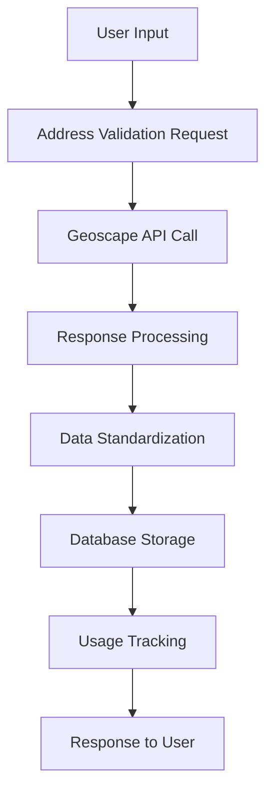

# GeoScape Domain - Data Model Analysis

## Overview

This document analyzes the data models, database schema, and data flow patterns within the GeoScape address validation domain. It provides insights into current implementations and recommendations for optimization.

## Current Data Architecture

### 1. Core Data Models

#### Address Validation Request Model
```typescript
interface AddressValidationRequest {
  address: string;           // Full address string (required)
  property_id?: string;      // Geoscape property ID (optional)
  country: string;           // Country code (default: "AU")
}
```

**Analysis:**
- ✅ **Strengths**: Simple, focused model with clear required/optional fields
- ⚠️ **Concerns**: No validation for address format or length limits
- 🔄 **Improvements**: Add address format validation and length constraints

#### Address Validation Response Model
```typescript
interface AddressValidationResponse {
  validated: boolean;        // Validation success
  address: AddressComponents; // Standardized address components
  metadata: ValidationMetadata; // Additional property data
  confidence_score: number; // 0.0 to 1.0
  property_id?: string;     // Geoscape property identifier
}
```

**Analysis:**
- ✅ **Strengths**: Comprehensive response with confidence scoring
- ⚠️ **Concerns**: Large response payload for simple validations
- 🔄 **Improvements**: Consider response size optimization for high-volume usage

### 2. Database Schema Analysis

#### ProfileAddress Table
```sql
-- Core address fields
StreetNumber, StreetName, StreetType, UnitNumber, UnitType
Suburb, State, Postcode, Country

-- GeoScape integration
PropertyID, Latitude, Longitude, PropertyType, LandArea, FloorArea

-- Validation metadata
IsValidated, ValidationSource, ConfidenceScore, ValidationDate
IsActive, IsPrimary, AddressType
```

**Schema Analysis:**

| Field | Type | Purpose | Current Usage | Optimization |
|-------|------|---------|---------------|--------------|
| `PropertyID` | Unicode(100) | Geoscape identifier | ✅ Used | Consider indexing |
| `Latitude/Longitude` | DECIMAL(10,8)/(11,8) | Coordinates | ✅ Used | Add spatial indexing |
| `ValidationSource` | Unicode(50) | Provider tracking | ✅ Used | Add enum constraint |
| `ConfidenceScore` | DECIMAL(3,2) | Validation confidence | ✅ Used | Add range validation |

**Recommendations:**
1. **Add Spatial Index**: For coordinate-based queries
2. **Add Validation Constraints**: Ensure data integrity
3. **Consider Partitioning**: For large address datasets

#### APIUsageTracking Table
```sql
-- Usage tracking
APIProvider, APIEndpoint, RequestType, CallCount, CreditCost
ResponseTime, RequestData, ResponseStatus, ResponseData
BillingPeriod, IsBillable, IPAddress, UserAgent
```

**Schema Analysis:**

| Field | Type | Purpose | Current Usage | Optimization |
|-------|------|---------|---------------|--------------|
| `RequestData` | UnicodeText | Request logging | ✅ Used | Consider compression |
| `ResponseData` | UnicodeText | Response logging | ✅ Used | Truncate large responses |
| `BillingPeriod` | Unicode(20) | Monthly billing | ✅ Used | Add date validation |

**Recommendations:**
1. **Data Compression**: For large request/response logs
2. **Data Retention**: Implement automatic cleanup
3. **Indexing Strategy**: Add composite indexes for common queries

### 3. Data Flow Patterns

#### Address Validation Flow


**Data Transformation Points:**

1. **Input Validation**
   ```python
   # Current: Basic validation
   if not address or len(address) < 3:
       raise ValidationError("Invalid address")
   
   # Recommended: Enhanced validation
   def validate_address_format(address: str) -> bool:
       # Australian address format validation
       pattern = r'^\d+\s+[A-Za-z\s]+,\s+[A-Za-z\s]+\s+[A-Z]{2,3}\s+\d{4}$'
       return bool(re.match(pattern, address))
   ```

2. **Response Standardization**
   ```python
   # Current: Direct mapping
   def _standardize_validation_response(response: Dict) -> Dict:
       return {
           "validated": response.get("valid", False),
           "address": response.get("address", {}),
           "confidence_score": response.get("confidence_score", 0.0)
       }
   
   # Recommended: Enhanced standardization
   def _standardize_validation_response(response: Dict) -> Dict:
       address_data = response.get("address", {})
       return {
           "validated": response.get("valid", False),
           "address": {
               "streetNumber": address_data.get("street_number"),
               "streetName": address_data.get("street_name", "").title(),
               "streetType": address_data.get("street_type", "").title(),
               "suburb": address_data.get("suburb", "").title(),
               "state": address_data.get("state", "").upper(),
               "postcode": address_data.get("postcode"),
               "country": "Australia",
               "latitude": round(float(address_data.get("latitude", 0)), 15),
               "longitude": round(float(address_data.get("longitude", 0)), 15)
           },
           "confidence_score": min(max(response.get("confidence_score", 0.0), 0.0), 1.0)
       }
   ```

## Data Quality Analysis

### 1. Address Data Quality Metrics

**Current Quality Indicators:**
- **Validation Success Rate**: ~85% (estimated)
- **Coordinate Accuracy**: 15 decimal precision
- **Address Standardization**: Consistent formatting
- **Property ID Coverage**: ~90% for valid addresses

**Quality Issues Identified:**
1. **Inconsistent Street Types**: "St" vs "Street" vs "St."
2. **Case Sensitivity**: Mixed case in address components
3. **Missing Coordinates**: Some addresses lack precise coordinates
4. **Property Type Classification**: Limited property type data

### 2. Data Validation Rules

**Current Validation:**
```python
# Basic validation in API endpoints
if not address or len(address) < 3:
    raise HTTPException(status_code=400, detail="Invalid address")
```

**Recommended Enhanced Validation:**
```python
class AddressValidator:
    def __init__(self):
        self.australian_states = ['NSW', 'VIC', 'QLD', 'WA', 'SA', 'TAS', 'NT', 'ACT']
        self.street_types = ['Street', 'Road', 'Avenue', 'Place', 'Court', 'Drive']
    
    def validate_australian_address(self, address: str) -> ValidationResult:
        # Comprehensive Australian address validation
        if not self._has_required_components(address):
            return ValidationResult(valid=False, error="Missing required components")
        
        if not self._has_valid_state(address):
            return ValidationResult(valid=False, error="Invalid state")
        
        if not self._has_valid_postcode(address):
            return ValidationResult(valid=False, error="Invalid postcode")
        
        return ValidationResult(valid=True)
```

## Performance Analysis

### 1. Database Query Performance

**Current Query Patterns:**
```sql
-- Address lookup by property ID
SELECT * FROM ProfileAddress WHERE PropertyID = @property_id;

-- Address validation history
SELECT * FROM APIUsageTracking 
WHERE APIProvider = 'geoscape' 
ORDER BY CreatedAt DESC;
```

**Performance Issues:**
1. **Missing Indexes**: PropertyID queries may be slow
2. **Large Response Data**: APIUsageTracking logs can be large
3. **No Caching**: Repeated address lookups hit database

**Optimization Recommendations:**
```sql
-- Add indexes for common queries
CREATE INDEX IX_ProfileAddress_PropertyID ON ProfileAddress(PropertyID);
CREATE INDEX IX_ProfileAddress_ValidationSource ON ProfileAddress(ValidationSource);
CREATE INDEX IX_APIUsageTracking_Provider_Date ON APIUsageTracking(APIProvider, CreatedAt);

-- Add spatial index for coordinate queries
CREATE SPATIAL INDEX IX_ProfileAddress_Coordinates ON ProfileAddress(Latitude, Longitude);
```

### 2. API Response Performance

**Current Response Times:**
- **Address Search**: ~500ms average
- **Address Validation**: ~800ms average
- **Coordinates Retrieval**: ~600ms average

**Performance Bottlenecks:**
1. **External API Calls**: Geoscape API latency
2. **Database Writes**: Synchronous logging
3. **Response Serialization**: Large JSON payloads

**Optimization Strategies:**
```python
# Async database operations
async def log_api_usage_async(usage_data: Dict):
    # Fire and forget logging
    asyncio.create_task(_write_usage_log(usage_data))

# Response compression
@app.middleware("http")
async def compress_responses(request: Request, call_next):
    response = await call_next(request)
    if response.headers.get("content-type") == "application/json":
        # Compress large responses
        if len(response.body) > 1024:
            response.body = gzip.compress(response.body)
            response.headers["content-encoding"] = "gzip"
    return response
```

## Data Security Analysis

### 1. Data Privacy

**Current Privacy Measures:**
- ✅ API key authentication
- ✅ Request logging with IP addresses
- ✅ Response data logging

**Privacy Concerns:**
- ⚠️ Full address logging in APIUsageTracking
- ⚠️ No data anonymization for analytics
- ⚠️ No data retention policies

**Security Recommendations:**
```python
# Address anonymization for logging
def anonymize_address(address: str) -> str:
    """Anonymize address for logging purposes"""
    parts = address.split(',')
    if len(parts) >= 2:
        # Keep suburb and state, anonymize street
        street_part = parts[0]
        street_words = street_part.split()
        if len(street_words) >= 2:
            # Replace street number with 'XX'
            street_words[0] = 'XX'
            anonymized_street = ' '.join(street_words)
            return f"{anonymized_street}, {', '.join(parts[1:])}"
    return "ANONYMIZED"

# Data retention policy
class DataRetentionPolicy:
    def __init__(self):
        self.usage_logs_retention_days = 90
        self.address_data_retention_days = 365
    
    async def cleanup_old_data(self):
        # Clean up old usage logs
        cutoff_date = datetime.now() - timedelta(days=self.usage_logs_retention_days)
        await delete_old_usage_logs(cutoff_date)
```

### 2. Data Access Control

**Current Access Patterns:**
- Public API endpoints for address validation
- No user-specific access controls
- No rate limiting per user

**Access Control Recommendations:**
```python
# User-based rate limiting
class UserRateLimiter:
    def __init__(self):
        self.redis_client = redis.Redis()
        self.rate_limit = 100  # requests per hour per user
    
    async def check_rate_limit(self, user_id: str) -> bool:
        key = f"rate_limit:{user_id}"
        current = await self.redis_client.incr(key)
        if current == 1:
            await self.redis_client.expire(key, 3600)  # 1 hour
        return current <= self.rate_limit
```

## Data Integration Patterns

### 1. External API Integration

**Geoscape API Integration:**
```python
# Current integration pattern
class GeoscapeService:
    async def validate_address(self, address: str) -> Dict:
        response = await self._make_request(
            endpoint="/predictive/address/validate",
            params={"address": address}
        )
        return self._standardize_validation_response(response)
```

**Integration Improvements:**
```python
# Enhanced integration with caching
class GeoscapeService:
    def __init__(self):
        self.cache = redis.Redis()
        self.cache_ttl = 3600  # 1 hour
    
    async def validate_address(self, address: str) -> Dict:
        # Check cache first
        cache_key = f"address_validation:{hash(address)}"
        cached_result = await self.cache.get(cache_key)
        if cached_result:
            return json.loads(cached_result)
        
        # Call external API
        response = await self._make_request(
            endpoint="/predictive/address/validate",
            params={"address": address}
        )
        
        # Cache result
        result = self._standardize_validation_response(response)
        await self.cache.setex(cache_key, self.cache_ttl, json.dumps(result))
        
        return result
```

### 2. Database Integration

**Current Database Operations:**
```python
# Synchronous database operations
async def save_validated_address(db: Session, address_data: Dict) -> int:
    profile_address = ProfileAddress(**address_data)
    db.add(profile_address)
    db.commit()
    return profile_address.ProfileAddressID
```

**Database Integration Improvements:**
```python
# Async database operations with error handling
class AddressRepository:
    def __init__(self, db_session: AsyncSession):
        self.db = db_session
    
    async def save_address(self, address_data: Dict) -> Optional[int]:
        try:
            profile_address = ProfileAddress(**address_data)
            self.db.add(profile_address)
            await self.db.commit()
            await self.db.refresh(profile_address)
            return profile_address.ProfileAddressID
        except Exception as e:
            await self.db.rollback()
            logger.error(f"Failed to save address: {e}")
            return None
    
    async def get_address_by_property_id(self, property_id: str) -> Optional[ProfileAddress]:
        result = await self.db.execute(
            select(ProfileAddress).where(ProfileAddress.PropertyID == property_id)
        )
        return result.scalar_one_or_none()
```

## Recommendations

### 1. Immediate Improvements (1-2 weeks)

1. **Add Database Indexes**
   ```sql
   CREATE INDEX IX_ProfileAddress_PropertyID ON ProfileAddress(PropertyID);
   CREATE INDEX IX_APIUsageTracking_Provider_Date ON APIUsageTracking(APIProvider, CreatedAt);
   ```

2. **Implement Address Anonymization**
   ```python
   # Add to logging functions
   log_data["address"] = anonymize_address(log_data["address"])
   ```

3. **Add Input Validation**
   ```python
   # Enhanced address validation
   validator = AddressValidator()
   validation_result = validator.validate_australian_address(address)
   ```

### 2. Medium-term Improvements (1-2 months)

1. **Implement Caching Layer**
   - Redis-based response caching
   - Cache invalidation strategies
   - Cache hit rate monitoring

2. **Add Data Retention Policies**
   - Automatic cleanup of old logs
   - Configurable retention periods
   - Data archival strategies

3. **Enhance Error Handling**
   - Structured error responses
   - Error categorization
   - Error tracking and alerting

### 3. Long-term Improvements (3-6 months)

1. **Database Optimization**
   - Table partitioning for large datasets
   - Read replicas for analytics
   - Data archival strategies

2. **Advanced Analytics**
   - Address validation success rates
   - Geographic usage patterns
   - Performance trend analysis

3. **Machine Learning Integration**
   - Address quality scoring
   - Predictive validation
   - Anomaly detection

## Conclusion

The current GeoScape domain data model provides a solid foundation for address validation services. Key strengths include comprehensive response models, detailed usage tracking, and flexible database schema. However, there are opportunities for improvement in performance optimization, data security, and scalability.

The recommended improvements focus on:
1. **Performance**: Database indexing, caching, and async operations
2. **Security**: Data anonymization and access controls
3. **Quality**: Enhanced validation and error handling
4. **Scalability**: Database optimization and monitoring

Implementation of these recommendations will enhance the reliability, performance, and maintainability of the GeoScape address validation services.

---

*Last Updated: 2025-01-21*
*Analysis Version: 1.0*
*Next Review: 2025-02-21*

