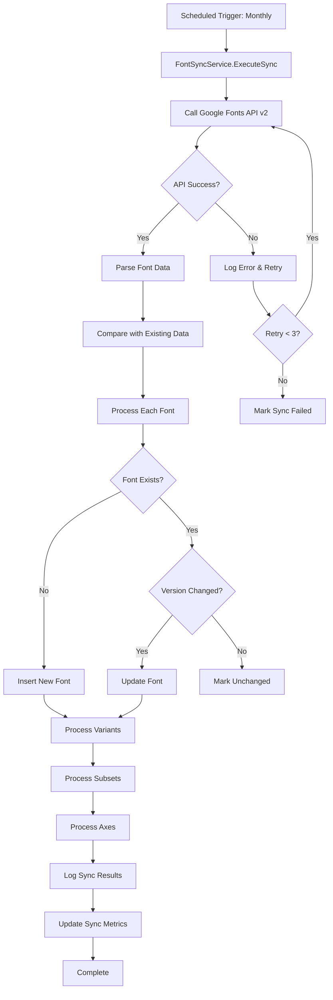

# Google Fonts Domain - Data Model Analysis

## Overview

This document analyzes the data models, database schema, and data flow patterns for implementing a local Google Fonts caching system. The goal is to cache Google Fonts metadata locally to improve platform responsiveness, reduce external API dependencies, and provide customers with comprehensive font selection capabilities.

**Business Justification:**
- **Performance**: Local database queries < 10ms vs external API calls ~500-800ms
- **Reliability**: No dependency on external API availability
- **Cost Savings**: Reduce API call volume and associated costs
- **Enhanced UX**: Faster font previews, search, and filtering
- **Customization**: Add platform-specific metadata and usage analytics

---

## 1. Google Fonts API Research

### 1.1 API Endpoints Available

| Endpoint | Version | Purpose | Rate Limits |
|----------|---------|---------|-------------|
| `/webfonts/v1/webfonts` | v1 | Basic font metadata | Standard Google quotas |
| `/webfonts/v2/webfonts` | v2 (Beta) | Extended metadata with variable fonts | Standard Google quotas |

### 1.2 API Response Structure

**API v1 Response Example:**
```json
{
  "kind": "webfonts#webfontList",
  "items": [
    {
      "kind": "webfonts#webfont",
      "family": "Roboto",
      "variants": ["100", "100italic", "300", "300italic", "regular", "italic", "500", "500italic", "700", "700italic", "900", "900italic"],
      "subsets": ["cyrillic", "cyrillic-ext", "greek", "greek-ext", "latin", "latin-ext", "vietnamese"],
      "version": "v30",
      "lastModified": "2023-08-17",
      "files": {
        "100": "https://fonts.gstatic.com/s/roboto/v30/xxx.ttf",
        "regular": "https://fonts.gstatic.com/s/roboto/v30/xxx.ttf",
        "700": "https://fonts.gstatic.com/s/roboto/v30/xxx.ttf"
      },
      "category": "sans-serif",
      "menu": "https://fonts.gstatic.com/s/roboto/v30/xxx.ttf"
    }
  ]
}
```

**API v2 Response Example (Extended - Variable Fonts):**
```json
{
  "kind": "webfonts#webfontList",
  "items": [
    {
      "kind": "webfonts#webfont",
      "family": "Roboto Flex",
      "variants": ["regular"],
      "subsets": ["cyrillic", "cyrillic-ext", "greek", "latin", "latin-ext", "vietnamese"],
      "version": "v9",
      "lastModified": "2023-04-27",
      "files": {
        "regular": "https://fonts.gstatic.com/s/robotoflex/v9/xxx.ttf"
      },
      "category": "sans-serif",
      "menu": "https://fonts.gstatic.com/s/robotoflex/v9/xxx.ttf",
      "axes": [
        { "tag": "GRAD", "start": -200, "end": 150 },
        { "tag": "XTRA", "start": 323, "end": 603 },
        { "tag": "YOPQ", "start": 25, "end": 135 },
        { "tag": "YTAS", "start": 649, "end": 854 },
        { "tag": "YTDE", "start": -305, "end": -98 },
        { "tag": "YTFI", "start": 560, "end": 788 },
        { "tag": "YTLC", "start": 416, "end": 570 },
        { "tag": "YTUC", "start": 528, "end": 760 },
        { "tag": "opsz", "start": 8, "end": 144 },
        { "tag": "slnt", "start": -10, "end": 0 },
        { "tag": "wdth", "start": 25, "end": 151 },
        { "tag": "wght", "start": 100, "end": 1000 }
      ],
      "colorCapabilities": []
    }
  ]
}
```

### 1.3 Complete Property Inventory

| Property | Type | Description | Source | Required |
|----------|------|-------------|--------|----------|
| `kind` | String | Resource type identifier | API | ✅ |
| `family` | String | Font family name | API | ✅ |
| `variants` | Array[String] | Available styles/weights | API | ✅ |
| `subsets` | Array[String] | Supported character sets | API | ✅ |
| `version` | String | Font version (e.g., "v30") | API | ✅ |
| `lastModified` | Date | Last update date | API | ✅ |
| `files` | Object | URLs to font files by variant | API | ✅ |
| `category` | String | Font classification | API | ✅ |
| `menu` | String | URL to menu preview file | API | ✅ |
| `axes` | Array[Object] | Variable font axes (v2 only) | API | ❌ |
| `colorCapabilities` | Array[String] | Color font features (v2 only) | API | ❌ |

### 1.4 API Query Parameters

| Parameter | Values | Purpose |
|-----------|--------|---------|
| `key` | API Key | Authentication |
| `sort` | `alpha`, `date`, `popularity`, `style`, `trending` | Sort order |
| `subset` | e.g., `latin`, `cyrillic` | Filter by character set |
| `capability` | `VF`, `COLR` | Filter by font capabilities |

---

## 2. Font Property Deep Dive

### 2.1 Font Categories

| Category | Description | Examples | Usage Context |
|----------|-------------|----------|---------------|
| `serif` | Traditional, formal fonts with serifs | Times New Roman, Georgia | Print, formal documents, body text |
| `sans-serif` | Modern, clean fonts without serifs | Roboto, Open Sans, Arial | UI, web, modern branding |
| `display` | Decorative fonts for headlines | Lobster, Pacifico | Headers, logos, emphasis |
| `handwriting` | Script and handwritten styles | Dancing Script, Caveat | Personal, creative, signatures |
| `monospace` | Fixed-width characters | Roboto Mono, Fira Code | Code, tables, technical |

### 2.2 Font Variants (Weights & Styles)

| Variant Code | Weight | Style | CSS Value |
|--------------|--------|-------|-----------|
| `100` | Thin | Normal | `font-weight: 100` |
| `100italic` | Thin | Italic | `font-weight: 100; font-style: italic` |
| `200` | Extra-Light | Normal | `font-weight: 200` |
| `300` | Light | Normal | `font-weight: 300` |
| `regular` (400) | Regular | Normal | `font-weight: 400` |
| `italic` | Regular | Italic | `font-style: italic` |
| `500` | Medium | Normal | `font-weight: 500` |
| `600` | Semi-Bold | Normal | `font-weight: 600` |
| `700` | Bold | Normal | `font-weight: 700` |
| `800` | Extra-Bold | Normal | `font-weight: 800` |
| `900` | Black | Normal | `font-weight: 900` |

### 2.3 Character Subsets

| Subset | Description | Languages Supported |
|--------|-------------|---------------------|
| `latin` | Basic Latin characters | English, Spanish, French, German, etc. |
| `latin-ext` | Extended Latin | Polish, Czech, Romanian, Vietnamese, etc. |
| `cyrillic` | Basic Cyrillic | Russian, Bulgarian |
| `cyrillic-ext` | Extended Cyrillic | Ukrainian, Serbian, Macedonian |
| `greek` | Greek alphabet | Greek |
| `greek-ext` | Extended Greek | Ancient Greek, Polytonic |
| `vietnamese` | Vietnamese diacritics | Vietnamese |
| `arabic` | Arabic script | Arabic, Persian, Urdu |
| `hebrew` | Hebrew script | Hebrew |
| `devanagari` | Devanagari script | Hindi, Sanskrit |
| `tamil` | Tamil script | Tamil |
| `thai` | Thai script | Thai |
| `korean` | Korean Hangul | Korean |
| `japanese` | Japanese Kanji/Hiragana/Katakana | Japanese |
| `chinese-simplified` | Simplified Chinese | Mandarin (China) |
| `chinese-traditional` | Traditional Chinese | Mandarin (Taiwan, Hong Kong) |

### 2.4 Variable Font Axes

| Axis Tag | Name | Description | Typical Range |
|----------|------|-------------|---------------|
| `wght` | Weight | Font weight | 100-900 |
| `wdth` | Width | Font width/stretch | 50-200 |
| `ital` | Italic | Italic degree | 0-1 |
| `slnt` | Slant | Oblique angle | -90 to 90 |
| `opsz` | Optical Size | Size optimization | 8-144 |
| `GRAD` | Grade | Stroke thickness | -200 to 150 |
| `XTRA` | X-height extra | Counter width | Variable |
| `YOPQ` | Y-opaque | Stroke contrast | Variable |
| `CASL` | Casual | Casual style | 0-1 |
| `CRSV` | Cursive | Cursive degree | 0-1 |
| `FILL` | Fill | Icon fill | 0-1 |
| `MONO` | Monospace | Fixed-width | 0-1 |
| `SOFT` | Softness | Corner rounding | 0-100 |
| `WONK` | Wonky | Irregularity | 0-1 |

### 2.5 Color Capabilities

| Capability | Description | Use Case |
|------------|-------------|----------|
| `COLR` | Color glyphs (COLRv0/v1) | Emoji fonts, decorative fonts |
| `SVG` | SVG-based color | Complex multi-color designs |
| `SBIX` | Apple color format | iOS/macOS emoji |
| `CBDT` | Google color format | Android emoji |

---

## 3. Database Schema Design

### 3.1 Schema Overview

Following EventLead Platform standards:
- **INT IDENTITY(1,1)** for primary keys [[memory:9925299]]
- **Logging tables under `log` schema** [[memory:9925294]]
- **PascalCase naming** (Solomon's standards)
- **NVARCHAR for text** (UTF-8 support)
- **DATETIME2 with UTC timestamps**
- **Soft deletes with audit trail**

### 3.2 Core Tables

#### FontFamily Table (Main font registry)

```sql
-- ============================================================================
-- Google Fonts Domain Schema
-- Version: 1.0.0
-- Author: Data Domain Architect
-- Date: December 2025
-- ============================================================================

-- Schema: dbo (core font data)
-- Schema: log (sync and usage logging)

-- ============================================================================
-- CORE TABLES
-- ============================================================================

-- FontFamily: Primary font registry
CREATE TABLE [dbo].[FontFamily] (
    -- Primary Key
    FontFamilyID INT IDENTITY(1,1) PRIMARY KEY,
    
    -- Core Identification
    GoogleFontID NVARCHAR(100) NOT NULL UNIQUE,  -- Google's unique identifier
    FamilyName NVARCHAR(200) NOT NULL,           -- Display name (e.g., "Roboto")
    FamilyNameNormalized NVARCHAR(200) NOT NULL, -- Lowercase for search
    
    -- Classification
    Category NVARCHAR(50) NOT NULL,              -- serif, sans-serif, display, handwriting, monospace
    SubCategory NVARCHAR(100) NULL,              -- Platform-specific sub-classification
    
    -- Version & Updates
    Version NVARCHAR(20) NOT NULL,               -- e.g., "v30"
    VersionNumber INT NULL,                      -- Numeric version for comparison
    LastModifiedDate DATE NOT NULL,              -- From Google API
    
    -- URLs
    MenuFileUrl NVARCHAR(500) NULL,              -- Preview font URL
    SpecimenUrl NVARCHAR(500) NULL,              -- Font specimen page
    
    -- Font Characteristics
    IsVariableFont BIT NOT NULL DEFAULT 0,       -- Has variable font axes
    HasColorCapabilities BIT NOT NULL DEFAULT 0, -- Has color font features
    
    -- Weight & Style Range (for quick filtering)
    MinWeight INT NULL,                          -- Lightest available (100-900)
    MaxWeight INT NULL,                          -- Heaviest available (100-900)
    HasItalic BIT NOT NULL DEFAULT 0,            -- Has italic variants
    HasRegular BIT NOT NULL DEFAULT 1,           -- Has regular variant
    
    -- Subset Summary (for quick filtering)
    SupportsLatin BIT NOT NULL DEFAULT 1,        -- Has latin subset
    SupportsCyrillic BIT NOT NULL DEFAULT 0,     -- Has cyrillic subset
    SupportsGreek BIT NOT NULL DEFAULT 0,        -- Has greek subset
    SupportsArabic BIT NOT NULL DEFAULT 0,       -- Has arabic subset
    SupportsHebrew BIT NOT NULL DEFAULT 0,       -- Has hebrew subset
    SupportsAsian BIT NOT NULL DEFAULT 0,        -- Has CJK/Thai/Vietnamese
    TotalSubsets INT NOT NULL DEFAULT 1,         -- Count of supported subsets
    
    -- Variant Summary
    TotalVariants INT NOT NULL DEFAULT 1,        -- Count of available variants
    VariantList NVARCHAR(500) NULL,              -- Comma-separated for quick display
    
    -- Platform Metadata (EventLead-specific)
    PopularityRank INT NULL,                     -- Our calculated popularity
    UsageCount INT NOT NULL DEFAULT 0,           -- Times used in our forms
    IsRecommended BIT NOT NULL DEFAULT 0,        -- Curated recommendation
    IsFeatured BIT NOT NULL DEFAULT 0,           -- Featured in UI
    DisplayOrder INT NULL,                       -- Custom sort order
    
    -- Licensing
    LicenseType NVARCHAR(100) DEFAULT 'Open Font License',
    LicenseUrl NVARCHAR(500) NULL,
    
    -- Designer/Foundry (enriched data)
    Designer NVARCHAR(200) NULL,
    DesignerUrl NVARCHAR(500) NULL,
    Foundry NVARCHAR(200) NULL,
    
    -- Sync Metadata
    FirstSyncDate DATETIME2 NOT NULL DEFAULT SYSUTCDATETIME(),
    LastSyncDate DATETIME2 NOT NULL DEFAULT SYSUTCDATETIME(),
    SyncVersion INT NOT NULL DEFAULT 1,          -- Incremented on each sync
    SyncStatus NVARCHAR(20) NOT NULL DEFAULT 'Active', -- Active, Deprecated, Removed
    
    -- Audit Trail
    IsActive BIT NOT NULL DEFAULT 1,
    IsDeleted BIT NOT NULL DEFAULT 0,
    CreatedDate DATETIME2 NOT NULL DEFAULT SYSUTCDATETIME(),
    CreatedBy NVARCHAR(100) NOT NULL DEFAULT 'SYSTEM',
    UpdatedDate DATETIME2 NULL,
    UpdatedBy NVARCHAR(100) NULL,
    DeletedDate DATETIME2 NULL,
    DeletedBy NVARCHAR(100) NULL,
    
    -- Indexes
    INDEX IX_FontFamily_FamilyName NONCLUSTERED (FamilyName),
    INDEX IX_FontFamily_FamilyNameNormalized NONCLUSTERED (FamilyNameNormalized),
    INDEX IX_FontFamily_Category NONCLUSTERED (Category),
    INDEX IX_FontFamily_PopularityRank NONCLUSTERED (PopularityRank),
    INDEX IX_FontFamily_LastModifiedDate NONCLUSTERED (LastModifiedDate DESC),
    INDEX IX_FontFamily_SyncStatus NONCLUSTERED (SyncStatus) WHERE IsDeleted = 0,
    INDEX IX_FontFamily_Featured NONCLUSTERED (IsFeatured, DisplayOrder) WHERE IsDeleted = 0 AND IsFeatured = 1
);

-- Check constraints
ALTER TABLE [dbo].[FontFamily]
ADD CONSTRAINT CK_FontFamily_Category 
CHECK (Category IN ('serif', 'sans-serif', 'display', 'handwriting', 'monospace'));

ALTER TABLE [dbo].[FontFamily]
ADD CONSTRAINT CK_FontFamily_SyncStatus 
CHECK (SyncStatus IN ('Active', 'Deprecated', 'Removed', 'Pending'));

ALTER TABLE [dbo].[FontFamily]
ADD CONSTRAINT CK_FontFamily_Weight 
CHECK (MinWeight IS NULL OR (MinWeight >= 100 AND MinWeight <= 900));
```

#### FontVariant Table (Weight/Style combinations)

```sql
-- FontVariant: Individual weight/style combinations
CREATE TABLE [dbo].[FontVariant] (
    -- Primary Key
    FontVariantID INT IDENTITY(1,1) PRIMARY KEY,
    
    -- Foreign Key
    FontFamilyID INT NOT NULL FOREIGN KEY REFERENCES [dbo].[FontFamily](FontFamilyID),
    
    -- Variant Identification
    VariantName NVARCHAR(50) NOT NULL,           -- e.g., "regular", "700italic"
    VariantNameNormalized NVARCHAR(50) NOT NULL, -- Lowercase for consistency
    
    -- Weight & Style
    Weight INT NOT NULL DEFAULT 400,             -- 100-900
    WeightName NVARCHAR(50) NULL,                -- "Thin", "Regular", "Bold", etc.
    IsItalic BIT NOT NULL DEFAULT 0,
    
    -- File URLs
    TtfFileUrl NVARCHAR(500) NULL,               -- TrueType font file
    WoffFileUrl NVARCHAR(500) NULL,              -- WOFF file (if available)
    Woff2FileUrl NVARCHAR(500) NULL,             -- WOFF2 file (if available)
    
    -- Local Caching (optional)
    IsFileCached BIT NOT NULL DEFAULT 0,         -- File stored locally
    CachedFilePath NVARCHAR(500) NULL,           -- Local file path
    FileSizeBytes BIGINT NULL,                   -- File size for cache management
    FileHash NVARCHAR(64) NULL,                  -- SHA-256 for integrity
    
    -- Display
    DisplayOrder INT NOT NULL DEFAULT 0,         -- Sort order within family
    IsDefault BIT NOT NULL DEFAULT 0,            -- Default variant for preview
    
    -- Audit Trail
    IsActive BIT NOT NULL DEFAULT 1,
    IsDeleted BIT NOT NULL DEFAULT 0,
    CreatedDate DATETIME2 NOT NULL DEFAULT SYSUTCDATETIME(),
    UpdatedDate DATETIME2 NULL,
    
    -- Composite unique constraint
    CONSTRAINT UQ_FontVariant_Family_Variant UNIQUE (FontFamilyID, VariantName),
    
    -- Indexes
    INDEX IX_FontVariant_FontFamilyID NONCLUSTERED (FontFamilyID),
    INDEX IX_FontVariant_Weight NONCLUSTERED (Weight, IsItalic)
);

-- Weight name constraint
ALTER TABLE [dbo].[FontVariant]
ADD CONSTRAINT CK_FontVariant_Weight 
CHECK (Weight IN (100, 200, 300, 400, 500, 600, 700, 800, 900));
```

#### FontSubset Table (Character set support)

```sql
-- FontSubset: Character set/language support
CREATE TABLE [dbo].[FontSubset] (
    -- Primary Key
    FontSubsetID INT IDENTITY(1,1) PRIMARY KEY,
    
    -- Foreign Key
    FontFamilyID INT NOT NULL FOREIGN KEY REFERENCES [dbo].[FontFamily](FontFamilyID),
    
    -- Subset Identification
    SubsetCode NVARCHAR(50) NOT NULL,            -- e.g., "latin", "cyrillic-ext"
    SubsetName NVARCHAR(100) NOT NULL,           -- Display name
    
    -- Categorization
    SubsetGroup NVARCHAR(50) NULL,               -- Grouping (Latin, Cyrillic, Asian, etc.)
    IsExtended BIT NOT NULL DEFAULT 0,           -- Extended variant (latin-ext)
    
    -- Language Support
    PrimaryLanguages NVARCHAR(500) NULL,         -- Main languages supported
    
    -- Display
    DisplayOrder INT NOT NULL DEFAULT 0,
    
    -- Audit
    IsActive BIT NOT NULL DEFAULT 1,
    CreatedDate DATETIME2 NOT NULL DEFAULT SYSUTCDATETIME(),
    
    -- Composite unique constraint
    CONSTRAINT UQ_FontSubset_Family_Subset UNIQUE (FontFamilyID, SubsetCode),
    
    -- Index
    INDEX IX_FontSubset_FontFamilyID NONCLUSTERED (FontFamilyID),
    INDEX IX_FontSubset_SubsetCode NONCLUSTERED (SubsetCode)
);
```

#### FontAxis Table (Variable font axes)

```sql
-- FontAxis: Variable font axes (for variable fonts only)
CREATE TABLE [dbo].[FontAxis] (
    -- Primary Key
    FontAxisID INT IDENTITY(1,1) PRIMARY KEY,
    
    -- Foreign Key
    FontFamilyID INT NOT NULL FOREIGN KEY REFERENCES [dbo].[FontFamily](FontFamilyID),
    
    -- Axis Identification
    AxisTag NVARCHAR(10) NOT NULL,               -- e.g., "wght", "wdth", "ital"
    AxisName NVARCHAR(100) NOT NULL,             -- Display name (e.g., "Weight")
    
    -- Range
    MinValue DECIMAL(10, 4) NOT NULL,            -- Minimum axis value
    MaxValue DECIMAL(10, 4) NOT NULL,            -- Maximum axis value
    DefaultValue DECIMAL(10, 4) NULL,            -- Default value
    Step DECIMAL(10, 4) NULL,                    -- Recommended step increment
    
    -- Classification
    IsStandard BIT NOT NULL DEFAULT 1,           -- Standard (wght, wdth) vs custom
    IsRegistered BIT NOT NULL DEFAULT 0,         -- Registered with OpenType
    
    -- Display
    DisplayOrder INT NOT NULL DEFAULT 0,
    CssProperty NVARCHAR(100) NULL,              -- Corresponding CSS property
    
    -- Audit
    IsActive BIT NOT NULL DEFAULT 1,
    CreatedDate DATETIME2 NOT NULL DEFAULT SYSUTCDATETIME(),
    
    -- Composite unique constraint
    CONSTRAINT UQ_FontAxis_Family_Tag UNIQUE (FontFamilyID, AxisTag),
    
    -- Index
    INDEX IX_FontAxis_FontFamilyID NONCLUSTERED (FontFamilyID),
    INDEX IX_FontAxis_AxisTag NONCLUSTERED (AxisTag)
);
```

#### FontColorCapability Table

```sql
-- FontColorCapability: Color font capabilities
CREATE TABLE [dbo].[FontColorCapability] (
    -- Primary Key
    FontColorCapabilityID INT IDENTITY(1,1) PRIMARY KEY,
    
    -- Foreign Key
    FontFamilyID INT NOT NULL FOREIGN KEY REFERENCES [dbo].[FontFamily](FontFamilyID),
    
    -- Capability
    CapabilityCode NVARCHAR(20) NOT NULL,        -- COLR, SVG, SBIX, CBDT
    CapabilityName NVARCHAR(100) NOT NULL,       -- Display name
    CapabilityVersion NVARCHAR(20) NULL,         -- e.g., "v0", "v1" for COLR
    
    -- Audit
    IsActive BIT NOT NULL DEFAULT 1,
    CreatedDate DATETIME2 NOT NULL DEFAULT SYSUTCDATETIME(),
    
    -- Composite unique constraint
    CONSTRAINT UQ_FontColorCapability_Family_Code UNIQUE (FontFamilyID, CapabilityCode),
    
    -- Index
    INDEX IX_FontColorCapability_FontFamilyID NONCLUSTERED (FontFamilyID)
);
```

### 3.3 Logging Tables (log schema)

```sql
-- ============================================================================
-- LOGGING TABLES (log schema)
-- ============================================================================

-- FontSyncLog: Track synchronization operations
CREATE TABLE [log].[FontSyncLog] (
    -- Primary Key
    FontSyncLogID INT IDENTITY(1,1) PRIMARY KEY,
    
    -- Sync Operation
    SyncStartTime DATETIME2 NOT NULL,
    SyncEndTime DATETIME2 NULL,
    SyncDuration AS DATEDIFF(SECOND, SyncStartTime, SyncEndTime),
    
    -- Status
    SyncStatus NVARCHAR(20) NOT NULL DEFAULT 'Running', -- Running, Success, Failed, Partial
    
    -- Metrics
    TotalFontsInAPI INT NULL,                    -- Total fonts returned by API
    FontsAdded INT NOT NULL DEFAULT 0,           -- New fonts added
    FontsUpdated INT NOT NULL DEFAULT 0,         -- Existing fonts updated
    FontsDeprecated INT NOT NULL DEFAULT 0,      -- Fonts marked deprecated
    FontsRemoved INT NOT NULL DEFAULT 0,         -- Fonts removed (soft delete)
    FontsUnchanged INT NOT NULL DEFAULT 0,       -- Fonts with no changes
    VariantsProcessed INT NOT NULL DEFAULT 0,    -- Total variants processed
    SubsetsProcessed INT NOT NULL DEFAULT 0,     -- Total subsets processed
    AxesProcessed INT NOT NULL DEFAULT 0,        -- Total axes processed
    
    -- API Details
    APIEndpoint NVARCHAR(500) NULL,
    APIVersion NVARCHAR(20) NULL,                -- v1 or v2
    APIResponseTime INT NULL,                    -- Response time in ms
    APIResponseSize BIGINT NULL,                 -- Response size in bytes
    
    -- Error Handling
    ErrorMessage NVARCHAR(MAX) NULL,
    ErrorDetails NVARCHAR(MAX) NULL,             -- Stack trace or detailed error
    RetryCount INT NOT NULL DEFAULT 0,
    
    -- Trigger
    TriggerType NVARCHAR(50) NOT NULL DEFAULT 'Scheduled', -- Scheduled, Manual, Webhook
    TriggeredBy NVARCHAR(100) NULL,
    
    -- Audit
    CreatedDate DATETIME2 NOT NULL DEFAULT SYSUTCDATETIME(),
    
    -- Indexes
    INDEX IX_FontSyncLog_SyncStartTime NONCLUSTERED (SyncStartTime DESC),
    INDEX IX_FontSyncLog_SyncStatus NONCLUSTERED (SyncStatus)
);

-- FontSyncDetail: Individual font sync details
CREATE TABLE [log].[FontSyncDetail] (
    -- Primary Key
    FontSyncDetailID INT IDENTITY(1,1) PRIMARY KEY,
    
    -- Foreign Keys
    FontSyncLogID INT NOT NULL FOREIGN KEY REFERENCES [log].[FontSyncLog](FontSyncLogID),
    FontFamilyID INT NULL FOREIGN KEY REFERENCES [dbo].[FontFamily](FontFamilyID),
    
    -- Font Identification
    GoogleFontID NVARCHAR(100) NULL,
    FamilyName NVARCHAR(200) NULL,
    
    -- Operation
    Operation NVARCHAR(20) NOT NULL,             -- Added, Updated, Deprecated, Removed, Unchanged, Error
    
    -- Change Details (for updates)
    PreviousVersion NVARCHAR(20) NULL,
    NewVersion NVARCHAR(20) NULL,
    ChangeSummary NVARCHAR(500) NULL,            -- Brief description of changes
    
    -- Error (if applicable)
    ErrorMessage NVARCHAR(MAX) NULL,
    
    -- Audit
    CreatedDate DATETIME2 NOT NULL DEFAULT SYSUTCDATETIME(),
    
    -- Indexes
    INDEX IX_FontSyncDetail_FontSyncLogID NONCLUSTERED (FontSyncLogID),
    INDEX IX_FontSyncDetail_FontFamilyID NONCLUSTERED (FontFamilyID),
    INDEX IX_FontSyncDetail_Operation NONCLUSTERED (Operation)
);

-- FontUsageLog: Track font usage in platform
CREATE TABLE [log].[FontUsageLog] (
    -- Primary Key
    FontUsageLogID INT IDENTITY(1,1) PRIMARY KEY,
    
    -- Font Reference
    FontFamilyID INT NOT NULL FOREIGN KEY REFERENCES [dbo].[FontFamily](FontFamilyID),
    FontVariantID INT NULL FOREIGN KEY REFERENCES [dbo].[FontVariant](FontVariantID),
    
    -- Context
    UsageContext NVARCHAR(50) NOT NULL,          -- FormBuilder, TemplateCreation, Preview, Export
    ContextEntityType NVARCHAR(50) NULL,         -- Form, Template, etc.
    ContextEntityID INT NULL,                    -- ID of the form, template, etc.
    
    -- User Context
    UserID INT NULL,                             -- User who used the font
    CompanyID INT NULL,                          -- Company context
    
    -- Action
    ActionType NVARCHAR(50) NOT NULL,            -- Selected, Applied, Previewed, Removed
    
    -- Audit
    CreatedDate DATETIME2 NOT NULL DEFAULT SYSUTCDATETIME(),
    IPAddress NVARCHAR(50) NULL,
    UserAgent NVARCHAR(500) NULL,
    
    -- Indexes
    INDEX IX_FontUsageLog_FontFamilyID NONCLUSTERED (FontFamilyID),
    INDEX IX_FontUsageLog_UserID NONCLUSTERED (UserID),
    INDEX IX_FontUsageLog_CreatedDate NONCLUSTERED (CreatedDate DESC),
    INDEX IX_FontUsageLog_UsageContext NONCLUSTERED (UsageContext, CreatedDate DESC)
);
```

### 3.4 Reference Tables

```sql
-- ============================================================================
-- REFERENCE TABLES
-- ============================================================================

-- FontCategoryRef: Category definitions
CREATE TABLE [dbo].[FontCategoryRef] (
    CategoryCode NVARCHAR(50) PRIMARY KEY,
    CategoryName NVARCHAR(100) NOT NULL,
    Description NVARCHAR(500) NULL,
    DisplayOrder INT NOT NULL DEFAULT 0,
    IconClass NVARCHAR(100) NULL,                -- CSS icon class for UI
    IsActive BIT NOT NULL DEFAULT 1
);

-- Seed data
INSERT INTO [dbo].[FontCategoryRef] (CategoryCode, CategoryName, Description, DisplayOrder, IconClass) VALUES
('serif', 'Serif', 'Traditional fonts with decorative strokes (serifs) at the ends of letters. Best for print and formal documents.', 1, 'icon-font-serif'),
('sans-serif', 'Sans Serif', 'Modern, clean fonts without decorative strokes. Excellent for digital interfaces and contemporary designs.', 2, 'icon-font-sans'),
('display', 'Display', 'Decorative fonts designed for headlines and large text. Use sparingly for impact.', 3, 'icon-font-display'),
('handwriting', 'Handwriting', 'Script and handwritten style fonts. Perfect for personal touches and creative projects.', 4, 'icon-font-handwriting'),
('monospace', 'Monospace', 'Fixed-width fonts where each character takes the same space. Ideal for code and technical content.', 5, 'icon-font-mono');

-- FontSubsetRef: Subset definitions
CREATE TABLE [dbo].[FontSubsetRef] (
    SubsetCode NVARCHAR(50) PRIMARY KEY,
    SubsetName NVARCHAR(100) NOT NULL,
    SubsetGroup NVARCHAR(50) NOT NULL,           -- Latin, Cyrillic, Greek, Asian, Middle Eastern
    Description NVARCHAR(500) NULL,
    PrimaryLanguages NVARCHAR(500) NULL,         -- Languages this subset supports
    DisplayOrder INT NOT NULL DEFAULT 0,
    IsActive BIT NOT NULL DEFAULT 1
);

-- Seed data for common subsets
INSERT INTO [dbo].[FontSubsetRef] (SubsetCode, SubsetName, SubsetGroup, PrimaryLanguages, DisplayOrder) VALUES
('latin', 'Latin', 'Latin', 'English, Spanish, French, German, Portuguese, Italian', 1),
('latin-ext', 'Latin Extended', 'Latin', 'Polish, Czech, Romanian, Vietnamese, Turkish', 2),
('cyrillic', 'Cyrillic', 'Cyrillic', 'Russian, Bulgarian', 3),
('cyrillic-ext', 'Cyrillic Extended', 'Cyrillic', 'Ukrainian, Serbian, Macedonian', 4),
('greek', 'Greek', 'Greek', 'Greek', 5),
('greek-ext', 'Greek Extended', 'Greek', 'Ancient Greek, Polytonic Greek', 6),
('vietnamese', 'Vietnamese', 'Asian', 'Vietnamese', 7),
('arabic', 'Arabic', 'Middle Eastern', 'Arabic, Persian, Urdu', 8),
('hebrew', 'Hebrew', 'Middle Eastern', 'Hebrew', 9),
('devanagari', 'Devanagari', 'Asian', 'Hindi, Sanskrit, Nepali', 10),
('thai', 'Thai', 'Asian', 'Thai', 11),
('korean', 'Korean', 'Asian', 'Korean', 12),
('japanese', 'Japanese', 'Asian', 'Japanese', 13),
('chinese-simplified', 'Chinese Simplified', 'Asian', 'Mandarin (China)', 14),
('chinese-traditional', 'Chinese Traditional', 'Asian', 'Mandarin (Taiwan, Hong Kong)', 15);

-- FontAxisRef: Standard axis definitions
CREATE TABLE [dbo].[FontAxisRef] (
    AxisTag NVARCHAR(10) PRIMARY KEY,
    AxisName NVARCHAR(100) NOT NULL,
    Description NVARCHAR(500) NULL,
    IsStandard BIT NOT NULL DEFAULT 1,           -- Standard OpenType axis
    DefaultMin DECIMAL(10, 4) NULL,
    DefaultMax DECIMAL(10, 4) NULL,
    CssProperty NVARCHAR(100) NULL,
    DisplayOrder INT NOT NULL DEFAULT 0,
    IsActive BIT NOT NULL DEFAULT 1
);

-- Seed data for standard axes
INSERT INTO [dbo].[FontAxisRef] (AxisTag, AxisName, Description, IsStandard, DefaultMin, DefaultMax, CssProperty, DisplayOrder) VALUES
('wght', 'Weight', 'Controls the thickness of the font strokes', 1, 100, 900, 'font-weight', 1),
('wdth', 'Width', 'Controls the horizontal scaling of the font', 1, 50, 200, 'font-stretch', 2),
('ital', 'Italic', 'Controls the degree of italic styling', 1, 0, 1, 'font-style', 3),
('slnt', 'Slant', 'Controls the angle of the font (oblique)', 1, -90, 90, 'font-style', 4),
('opsz', 'Optical Size', 'Optimizes the font for different display sizes', 1, 8, 144, 'font-optical-sizing', 5),
('GRAD', 'Grade', 'Adjusts stroke thickness without changing width', 0, -200, 150, NULL, 6),
('CASL', 'Casual', 'Transitions between formal and casual styles', 0, 0, 1, NULL, 7),
('CRSV', 'Cursive', 'Controls cursive styling', 0, 0, 1, NULL, 8),
('FILL', 'Fill', 'Controls icon fill (for icon fonts)', 0, 0, 1, NULL, 9),
('MONO', 'Monospace', 'Transitions between proportional and monospace', 0, 0, 1, NULL, 10);
```

---

## 4. Data Synchronization Strategy

### 4.1 Sync Flow Diagram



### 4.2 Synchronization Algorithm

```python
# Pseudo-code for font synchronization

async def sync_google_fonts():
    """
    Monthly font synchronization with Google Fonts API.
    """
    sync_log = create_sync_log(trigger_type="Scheduled")
    
    try:
        # 1. Fetch all fonts from Google API
        api_response = await call_google_fonts_api(
            endpoint="https://www.googleapis.com/webfonts/v2/webfonts",
            params={"key": API_KEY, "sort": "popularity"}
        )
        
        sync_log.api_response_time = api_response.time_ms
        sync_log.total_fonts_in_api = len(api_response.items)
        
        # 2. Get current fonts from database
        existing_fonts = await get_all_fonts_with_versions()
        existing_map = {f.google_font_id: f for f in existing_fonts}
        
        processed_ids = set()
        
        # 3. Process each font from API
        for api_font in api_response.items:
            google_id = generate_google_font_id(api_font.family)
            processed_ids.add(google_id)
            
            if google_id not in existing_map:
                # NEW FONT
                await insert_font(api_font)
                await insert_variants(api_font)
                await insert_subsets(api_font)
                await insert_axes(api_font)  # If variable font
                sync_log.fonts_added += 1
                
            elif existing_map[google_id].version != api_font.version:
                # UPDATED FONT
                await update_font(existing_map[google_id], api_font)
                await sync_variants(existing_map[google_id], api_font)
                await sync_subsets(existing_map[google_id], api_font)
                await sync_axes(existing_map[google_id], api_font)
                sync_log.fonts_updated += 1
                
            else:
                # UNCHANGED
                sync_log.fonts_unchanged += 1
        
        # 4. Handle removed fonts (in DB but not in API)
        for google_id, existing_font in existing_map.items():
            if google_id not in processed_ids:
                await mark_font_deprecated(existing_font)
                sync_log.fonts_deprecated += 1
        
        # 5. Complete sync
        sync_log.sync_status = "Success"
        sync_log.sync_end_time = utc_now()
        
    except Exception as e:
        sync_log.sync_status = "Failed"
        sync_log.error_message = str(e)
        sync_log.error_details = traceback.format_exc()
        
    finally:
        await save_sync_log(sync_log)
        
    return sync_log
```

### 4.3 Sync Schedule Configuration

| Setting | Value | Rationale |
|---------|-------|-----------|
| **Frequency** | Monthly (1st of month, 2:00 AM UTC) | Google Fonts updates infrequently; monthly is sufficient |
| **Retry Policy** | 3 attempts with exponential backoff | Handle transient API failures |
| **Retry Delays** | 5min, 15min, 60min | Allow time for API recovery |
| **Timeout** | 5 minutes | API response should be fast |
| **Batch Size** | N/A (single API call returns all fonts) | API returns full dataset |
| **Change Detection** | Version comparison + lastModified | Efficient change detection |

### 4.4 Initial Data Load

```sql
-- Initial load statistics (as of December 2025)
-- Estimated: ~1,600 font families
-- Estimated: ~15,000 variants
-- Estimated: ~25,000 subset associations
-- Estimated: ~500 variable font axes

-- Recommended initial load approach:
-- 1. Run full sync with fresh database
-- 2. Populate reference tables first
-- 3. Process fonts in alphabetical batches
-- 4. Verify data integrity after load
```

---

## 5. API Service Design

### 5.1 Service Interface

```python
# backend/services/fonts/google_fonts_service.py

from typing import List, Optional
from pydantic import BaseModel

class FontSearchParams(BaseModel):
    """Parameters for font search"""
    query: Optional[str] = None           # Search term
    category: Optional[str] = None        # Filter by category
    subset: Optional[str] = None          # Filter by subset support
    is_variable: Optional[bool] = None    # Filter variable fonts
    has_italic: Optional[bool] = None     # Filter fonts with italic
    min_weight: Optional[int] = None      # Minimum weight available
    max_weight: Optional[int] = None      # Maximum weight available
    is_featured: Optional[bool] = None    # Featured fonts only
    is_recommended: Optional[bool] = None # Recommended fonts only
    sort_by: str = "popularity"           # popularity, name, date
    page: int = 1
    page_size: int = 20


class FontFamilyDTO(BaseModel):
    """Font family data transfer object"""
    font_family_id: int
    family_name: str
    category: str
    version: str
    last_modified: str
    is_variable_font: bool
    has_color_capabilities: bool
    min_weight: Optional[int]
    max_weight: Optional[int]
    has_italic: bool
    total_variants: int
    total_subsets: int
    menu_file_url: Optional[str]
    is_featured: bool
    is_recommended: bool
    usage_count: int
    variants: List['FontVariantDTO']
    subsets: List[str]
    axes: Optional[List['FontAxisDTO']]


class GoogleFontsService:
    """Service for managing local Google Fonts cache"""
    
    async def search_fonts(
        self, 
        params: FontSearchParams
    ) -> tuple[List[FontFamilyDTO], int]:
        """
        Search fonts with filtering, sorting, and pagination.
        Returns: (fonts, total_count)
        """
        pass
    
    async def get_font_by_id(
        self, 
        font_family_id: int
    ) -> Optional[FontFamilyDTO]:
        """Get complete font details by ID"""
        pass
    
    async def get_font_by_name(
        self, 
        family_name: str
    ) -> Optional[FontFamilyDTO]:
        """Get font by family name"""
        pass
    
    async def get_popular_fonts(
        self, 
        limit: int = 20,
        category: Optional[str] = None
    ) -> List[FontFamilyDTO]:
        """Get most popular fonts"""
        pass
    
    async def get_featured_fonts(
        self
    ) -> List[FontFamilyDTO]:
        """Get curated featured fonts"""
        pass
    
    async def get_font_categories(
        self
    ) -> List[dict]:
        """Get all font categories with counts"""
        pass
    
    async def log_font_usage(
        self,
        font_family_id: int,
        context: str,
        action: str,
        user_id: Optional[int] = None,
        company_id: Optional[int] = None
    ) -> None:
        """Log font usage for analytics"""
        pass
    
    async def execute_sync(
        self,
        trigger_type: str = "Manual"
    ) -> dict:
        """Execute font synchronization with Google API"""
        pass
    
    async def get_sync_status(
        self
    ) -> dict:
        """Get last sync status and metrics"""
        pass
```

### 5.2 API Endpoints

```python
# backend/api/routes/fonts.py

from fastapi import APIRouter, Query, HTTPException

router = APIRouter(prefix="/api/fonts", tags=["Fonts"])

@router.get("/")
async def list_fonts(
    query: Optional[str] = Query(None, description="Search term"),
    category: Optional[str] = Query(None, description="Font category"),
    subset: Optional[str] = Query(None, description="Required subset"),
    is_variable: Optional[bool] = Query(None, description="Variable fonts only"),
    sort_by: str = Query("popularity", description="Sort order"),
    page: int = Query(1, ge=1),
    page_size: int = Query(20, ge=1, le=100)
):
    """
    List fonts with filtering and pagination.
    
    Returns paginated list of font families.
    """
    pass

@router.get("/featured")
async def get_featured_fonts():
    """Get curated featured fonts for quick selection."""
    pass

@router.get("/categories")
async def get_font_categories():
    """Get all font categories with font counts."""
    pass

@router.get("/popular")
async def get_popular_fonts(
    limit: int = Query(20, ge=1, le=50),
    category: Optional[str] = None
):
    """Get most popular fonts."""
    pass

@router.get("/{font_family_id}")
async def get_font_details(font_family_id: int):
    """Get complete font family details including variants and subsets."""
    pass

@router.get("/by-name/{family_name}")
async def get_font_by_name(family_name: str):
    """Get font by family name."""
    pass

@router.post("/{font_family_id}/usage")
async def log_font_usage(
    font_family_id: int,
    context: str,
    action: str
):
    """Log font usage for analytics."""
    pass

# Admin endpoints
@router.post("/sync", tags=["Admin"])
async def trigger_sync():
    """Manually trigger font synchronization (admin only)."""
    pass

@router.get("/sync/status", tags=["Admin"])
async def get_sync_status():
    """Get last sync status and metrics."""
    pass
```

---

## 6. Frontend Integration

### 6.1 Font Picker Component Data Requirements

| Property | Display | Purpose |
|----------|---------|---------|
| `familyName` | Primary text | Font identification |
| `category` | Badge/Filter | Quick categorization |
| `previewUrl` | Font preview | Visual selection |
| `variants` | Dropdown | Weight/style selection |
| `subsets` | Info tooltip | Language support check |
| `isVariable` | Badge | Variable font indicator |
| `popularityRank` | Sort option | Popularity-based ordering |
| `isFeatured` | Highlight | Curated recommendations |

### 6.2 Font Preview Strategy

```javascript
// Option 1: Use Google Fonts CSS API (recommended for previews)
const loadFontPreview = (familyName, variant = 'regular') => {
  const link = document.createElement('link');
  link.href = `https://fonts.googleapis.com/css2?family=${encodeURIComponent(familyName)}:wght@${variant}&display=swap`;
  link.rel = 'stylesheet';
  document.head.appendChild(link);
};

// Option 2: Use cached menu file URL (for offline/faster previews)
const loadFontFromCache = async (menuFileUrl) => {
  const font = new FontFace('PreviewFont', `url(${menuFileUrl})`);
  await font.load();
  document.fonts.add(font);
};
```

### 6.3 Recommended UI Patterns

1. **Category Tabs**: Quick filter by serif, sans-serif, display, etc.
2. **Search Autocomplete**: Search by font name with instant results
3. **Popular Section**: Show top 10 fonts for quick selection
4. **Featured Carousel**: Curated recommendations
5. **Variable Font Slider**: Interactive weight/width adjustment
6. **Language Filter**: Filter by required character set
7. **Preview Text**: Customizable preview text

---

## 7. Performance Considerations

### 7.1 Query Optimization

```sql
-- Optimized search query with proper indexing
SELECT 
    ff.FontFamilyID,
    ff.FamilyName,
    ff.Category,
    ff.IsVariableFont,
    ff.TotalVariants,
    ff.TotalSubsets,
    ff.MenuFileUrl,
    ff.PopularityRank
FROM [dbo].[FontFamily] ff
WHERE ff.IsDeleted = 0
    AND ff.IsActive = 1
    AND (@Category IS NULL OR ff.Category = @Category)
    AND (@Query IS NULL OR ff.FamilyNameNormalized LIKE '%' + LOWER(@Query) + '%')
    AND (@Subset IS NULL OR ff.SupportsLatin = 1)  -- Example: Latin filter
ORDER BY 
    CASE WHEN @SortBy = 'popularity' THEN ff.PopularityRank END ASC,
    CASE WHEN @SortBy = 'name' THEN ff.FamilyName END ASC,
    CASE WHEN @SortBy = 'date' THEN ff.LastModifiedDate END DESC
OFFSET @Offset ROWS
FETCH NEXT @PageSize ROWS ONLY;
```

### 7.2 Caching Strategy

| Layer | Cache Type | TTL | Purpose |
|-------|------------|-----|---------|
| **Database** | Query cache | Session | Repeated queries |
| **API** | Response cache | 1 hour | Reduce DB load |
| **CDN** | Static files | 1 week | Font file delivery |
| **Browser** | LocalStorage | 1 day | Font list caching |

### 7.3 Expected Performance

| Operation | Target | Method |
|-----------|--------|--------|
| Font search | < 50ms | Indexed queries |
| Font details | < 20ms | Primary key lookup |
| Full list load | < 200ms | Pagination + lazy load |
| Initial sync | < 5 min | Bulk insert |
| Monthly sync | < 2 min | Incremental update |

---

## 8. Recommendations

### 8.1 Immediate Implementation (Week 1-2)

1. **Create Database Schema**
   - Execute schema creation scripts
   - Populate reference tables
   - Set up logging tables

2. **Implement Sync Service**
   - Google Fonts API client
   - Data mapping and transformation
   - Initial data load

3. **Create Basic API Endpoints**
   - Font listing with pagination
   - Font search
   - Category filtering

### 8.2 Short-term Enhancements (Week 3-4)

1. **Frontend Integration**
   - Font picker component
   - Search autocomplete
   - Category tabs

2. **Usage Analytics**
   - Usage logging
   - Popularity calculation
   - Featured font curation

3. **Performance Optimization**
   - Query optimization
   - API response caching
   - Index tuning

### 8.3 Long-term Considerations (Month 2+)

1. **Local Font File Caching**
   - Download and cache font files locally
   - Reduce Google CDN dependency
   - Offline support

2. **Advanced Variable Font Support**
   - Interactive axis controls
   - Real-time preview with axis values
   - Custom axis combinations

3. **AI/ML Recommendations**
   - Font pairing suggestions
   - Usage-based recommendations
   - Industry-specific suggestions

---

## 9. API Reference

### 9.1 Google Fonts API

**Endpoint:** `https://www.googleapis.com/webfonts/v2/webfonts`

**Authentication:** API Key (query parameter)

**Parameters:**
| Parameter | Type | Description |
|-----------|------|-------------|
| `key` | string | Google API key (required) |
| `sort` | string | alpha, date, popularity, style, trending |
| `capability` | string | VF (variable fonts), COLR (color fonts) |

**Rate Limits:** Standard Google API quotas (configurable)

### 9.2 Alternative Tools

**NPM Package:** `google-font-metadata`
```bash
npm install google-font-metadata
```

```javascript
const { APIv2 } = require("google-font-metadata");
// Returns structured font metadata
console.dir(APIv2);
```

---

## 10. Appendix

### 10.1 Font Count Statistics (December 2025)

| Metric | Count |
|--------|-------|
| Total Font Families | ~1,600 |
| Variable Fonts | ~400 |
| Color Fonts | ~50 |
| Serif Fonts | ~250 |
| Sans-Serif Fonts | ~500 |
| Display Fonts | ~600 |
| Handwriting Fonts | ~150 |
| Monospace Fonts | ~100 |

### 10.2 Storage Estimates

| Data Type | Records | Size (MB) |
|-----------|---------|-----------|
| FontFamily | 1,600 | ~1 MB |
| FontVariant | 15,000 | ~3 MB |
| FontSubset | 25,000 | ~2 MB |
| FontAxis | 500 | ~0.1 MB |
| Sync Logs (1 year) | 12 | ~0.5 MB |
| Usage Logs (1 year) | 100,000+ | ~50 MB |
| **Total (excluding logs)** | | **~6 MB** |

### 10.3 Related Documentation

- [Google Fonts Developer API](https://developers.google.com/fonts/docs/developer_api)
- [Variable Fonts Guide](https://web.dev/variable-fonts/)
- [OpenType Axis Registry](https://docs.microsoft.com/typography/opentype/spec/dvaraxisreg)
- [google-font-metadata Package](https://github.com/fontsource/google-font-metadata)

---

*Last Updated: December 2025*
*Analysis Version: 1.0*
*Next Review: January 2026*

