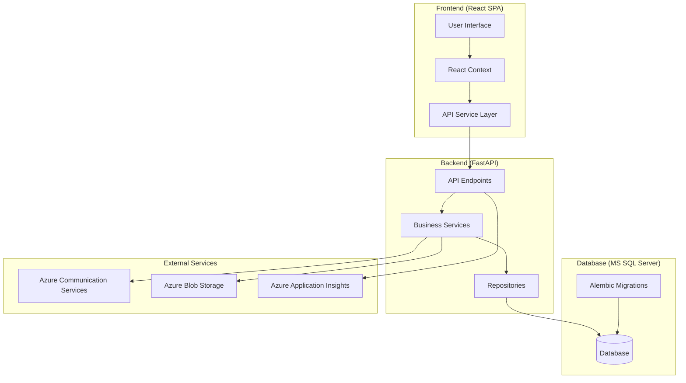
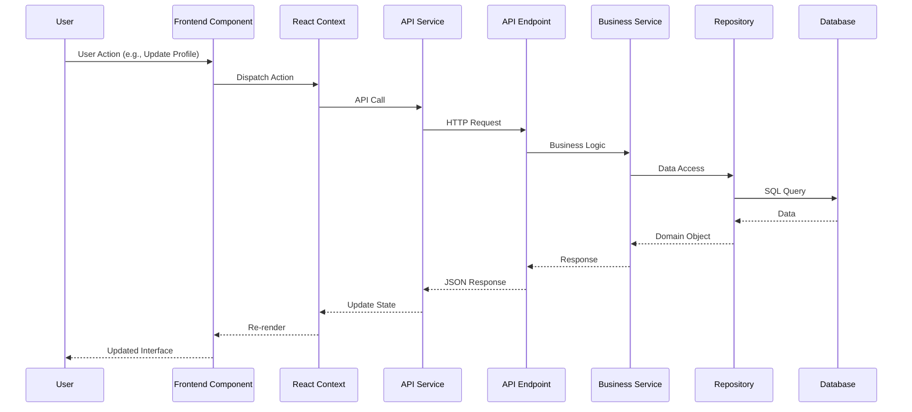

# Epic 2 Solution Architecture - EventLeadPlatform

**Author:** Winston (System Architect)  
**Date:** 2025-01-15  
**Project:** Epic 2 - Enhanced User Experience & Multi-Domain Integration  
**User:** Anthony Keevy (Data Engineer, Learning Frontend/Backend)  

---

## Executive Summary

**Epic 2: Enhanced User Experience & Multi-Domain Integration** builds upon the solid Epic 1 foundation to deliver personalized user experiences, streamlined approval workflows, comprehensive event management, and form foundation capabilities. This architecture is designed to support Anthony's learning journey while delivering production-ready features that prepare the platform for Epic 3's complex Form Builder.

**Key Architectural Principles:**
- **Database-First Approach**: Continue Epic 1's proven pattern
- **Learning-Focused**: Detailed explanations for frontend components and backend relationships
- **Epic 3 Preparation**: Establish patterns and infrastructure for Form Builder
- **Performance Maintenance**: Enhance without degrading existing performance
- **Cross-Domain Integration**: Seamless data flow between all domains

---

## Technology Stack and Decisions

| Category | Technology | Version | Rationale |
|----------|------------|---------|-----------|
| **Frontend Framework** | React | 18.2.0 | Proven in Epic 1, excellent for component learning |
| **State Management** | React Context + useReducer | Built-in | Simple, perfect for learning, sufficient for Epic 2 |
| **Styling** | Tailwind CSS | 3.3.0 | Utility-first, consistent with Epic 1, theme system ready |
| **HTTP Client** | Axios | 1.6.0 | Reliable, good error handling, easy to understand |
| **Real-time Updates** | Polling (Axios) | - | Simple, debuggable, upgrade path to WebSockets |
| **Backend Framework** | FastAPI | 0.104.0 | Proven in Epic 1, excellent API documentation |
| **Database ORM** | SQLAlchemy | 2.0.0 | Mature, works well with MS SQL Server |
| **Database** | MS SQL Server | 2022 | Epic 1 foundation, Anthony's strength |
| **Migration Tool** | Alembic | 1.12.0 | Proven rollback capability from Epic 1 |
| **Authentication** | JWT | - | Existing Epic 1 pattern, secure |
| **Email Service** | Azure Communication Services | - | Epic 1 integration, reliable |
| **File Storage** | Azure Blob Storage | - | Epic 1 integration, scalable |
| **Hosting** | Azure App Service | - | Epic 1 infrastructure, proven |
| **Monitoring** | Azure Application Insights | - | Epic 1 integration, comprehensive |

---

## Repository and Service Architecture

### Monorepo Structure (Enhanced from Epic 1)

```
EventLeadPlatform/
├── frontend/                    # React SPA
│   ├── src/
│   │   ├── components/         # Domain-based organization
│   │   │   ├── user/          # User domain components
│   │   │   ├── company/       # Company domain components
│   │   │   ├── events/        # Events domain components
│   │   │   ├── forms/         # Forms domain components
│   │   │   └── shared/        # Shared components
│   │   ├── services/          # API integration layer
│   │   ├── contexts/          # React Context providers
│   │   ├── hooks/             # Custom React hooks
│   │   └── utils/             # Utility functions
│   └── package.json
├── backend/                    # FastAPI application
│   ├── app/
│   │   ├── api/               # API endpoints
│   │   │   ├── v1/            # API version 1
│   │   │   │   ├── user.py    # User domain endpoints
│   │   │   │   ├── company.py # Company domain endpoints
│   │   │   │   ├── events.py  # Events domain endpoints
│   │   │   │   └── forms.py   # Forms domain endpoints
│   │   ├── core/              # Core configuration
│   │   ├── models/            # SQLAlchemy models
│   │   ├── schemas/           # Pydantic schemas
│   │   ├── services/          # Business logic layer
│   │   │   ├── user_service.py
│   │   │   ├── company_service.py
│   │   │   ├── events_service.py
│   │   │   └── forms_service.py
│   │   ├── repositories/      # Data access layer
│   │   │   ├── user_repository.py
│   │   │   ├── company_repository.py
│   │   │   ├── events_repository.py
│   │   │   └── forms_repository.py
│   │   └── utils/             # Utility functions
│   └── requirements.txt
├── database/                   # Database schemas and migrations
│   ├── schemas/               # SQL schema files
│   └── migrations/            # Alembic migrations
└── docs/                      # Documentation
    ├── epic2-prd.md
    ├── epic2-stories.md
    └── epic2-solution-architecture.md
```

---

## System Architecture

### High-Level Architecture Diagram



### Data Flow Architecture



---

## Data Architecture

### Epic 2 Database Extensions

**Building on Epic 1 Foundation:**
- **Epic 1 Tables**: 15+ tables with proper audit trails
- **Epic 2 Extensions**: 15+ new tables building on existing schema
- **Naming Consistency**: Maintain Epic 1 patterns (`[TableName]ID`, `CreatedDate`, etc.)

### User Domain Extensions

```sql
-- User table extensions (Epic 2)
ALTER TABLE dbo.User ADD
    Bio NVARCHAR(500) NULL,
    ThemePreferenceID BIGINT NULL,
    LayoutDensityID BIGINT NULL,
    FontSizeID BIGINT NULL,
    IsExternalApprover BIT NOT NULL DEFAULT 0;

-- New reference tables
CREATE TABLE ref.ThemePreference (
    ThemePreferenceID BIGINT IDENTITY(1,1) PRIMARY KEY,
    Name NVARCHAR(50) NOT NULL,
    Description NVARCHAR(200) NULL,
    CreatedDate DATETIME2 NOT NULL DEFAULT GETUTCDATE()
);

CREATE TABLE ref.LayoutDensity (
    LayoutDensityID BIGINT IDENTITY(1,1) PRIMARY KEY,
    Name NVARCHAR(50) NOT NULL,
    Description NVARCHAR(200) NULL,
    CreatedDate DATETIME2 NOT NULL DEFAULT GETUTCDATE()
);

CREATE TABLE ref.FontSize (
    FontSizeID BIGINT IDENTITY(1,1) PRIMARY KEY,
    Name NVARCHAR(50) NOT NULL,
    Description NVARCHAR(200) NULL,
    CreatedDate DATETIME2 NOT NULL DEFAULT GETUTCDATE()
);

-- User-Industry junction table
CREATE TABLE dbo.UserIndustry (
    UserIndustryID BIGINT IDENTITY(1,1) PRIMARY KEY,
    UserID BIGINT NOT NULL,
    IndustryID BIGINT NOT NULL,
    IsPrimary BIT NOT NULL DEFAULT 0,
    PriorityOrder INT NULL,
    CreatedDate DATETIME2 NOT NULL DEFAULT GETUTCDATE(),
    FOREIGN KEY (UserID) REFERENCES dbo.User(UserID),
    FOREIGN KEY (IndustryID) REFERENCES dbo.Industry(IndustryID)
);
```

### Company Domain Extensions

```sql
-- Approval workflow extensions
CREATE TABLE audit.ApprovalAuditTrail (
    ApprovalAuditTrailID BIGINT IDENTITY(1,1) PRIMARY KEY,
    EntityType NVARCHAR(50) NOT NULL,
    EntityID BIGINT NOT NULL,
    Action NVARCHAR(50) NOT NULL,
    UserID BIGINT NULL,
    ExternalApproverEmail NVARCHAR(255) NULL,
    Comments NVARCHAR(1000) NULL,
    CreatedDate DATETIME2 NOT NULL DEFAULT GETUTCDATE(),
    FOREIGN KEY (UserID) REFERENCES dbo.User(UserID)
);

-- CompanySwitchRequest extensions
ALTER TABLE dbo.CompanySwitchRequest ADD
    CostAmount DECIMAL(10,2) NULL,
    ApprovalThreshold DECIMAL(10,2) NULL,
    ApprovalStatus NVARCHAR(50) NULL,
    ApprovedByUserID BIGINT NULL,
    ApprovedDate DATETIME2 NULL;
```

### Events Domain (New)

```sql
-- Core Event table
CREATE TABLE dbo.Event (
    EventID BIGINT IDENTITY(1,1) PRIMARY KEY,
    CompanyID BIGINT NOT NULL,
    Name NVARCHAR(200) NOT NULL,
    Description NVARCHAR(1000) NULL,
    EventTypeID BIGINT NOT NULL,
    EventStatusID BIGINT NOT NULL,
    StartDate DATETIME2 NULL,
    EndDate DATETIME2 NULL,
    Location NVARCHAR(200) NULL,
    IsPublic BIT NOT NULL DEFAULT 0,
    CreatedByUserID BIGINT NOT NULL,
    CreatedDate DATETIME2 NOT NULL DEFAULT GETUTCDATE(),
    UpdatedDate DATETIME2 NULL,
    UpdatedByUserID BIGINT NULL,
    FOREIGN KEY (CompanyID) REFERENCES dbo.Company(CompanyID),
    FOREIGN KEY (EventTypeID) REFERENCES ref.EventType(EventTypeID),
    FOREIGN KEY (EventStatusID) REFERENCES ref.EventStatus(EventStatusID),
    FOREIGN KEY (CreatedByUserID) REFERENCES dbo.User(UserID)
);

-- Event reference tables
CREATE TABLE ref.EventType (
    EventTypeID BIGINT IDENTITY(1,1) PRIMARY KEY,
    Name NVARCHAR(50) NOT NULL,
    Description NVARCHAR(200) NULL,
    CreatedDate DATETIME2 NOT NULL DEFAULT GETUTCDATE()
);

CREATE TABLE ref.EventStatus (
    EventStatusID BIGINT IDENTITY(1,1) PRIMARY KEY,
    Name NVARCHAR(50) NOT NULL,
    Description NVARCHAR(200) NULL,
    CreatedDate DATETIME2 NOT NULL DEFAULT GETUTCDATE()
);
```

### Forms Domain (Foundation for Epic 3)

```sql
-- Form header table (foundation for Epic 3 Form Builder)
CREATE TABLE dbo.Form (
    FormID BIGINT IDENTITY(1,1) PRIMARY KEY,
    CompanyID BIGINT NOT NULL,
    EventID BIGINT NULL,
    Name NVARCHAR(200) NOT NULL,
    Description NVARCHAR(1000) NULL,
    FormStatusID BIGINT NOT NULL,
    FormApprovalStatusID BIGINT NULL,
    CreatedByUserID BIGINT NOT NULL,
    CreatedDate DATETIME2 NOT NULL DEFAULT GETUTCDATE(),
    UpdatedDate DATETIME2 NULL,
    UpdatedByUserID BIGINT NULL,
    FOREIGN KEY (CompanyID) REFERENCES dbo.Company(CompanyID),
    FOREIGN KEY (EventID) REFERENCES dbo.Event(EventID),
    FOREIGN KEY (FormStatusID) REFERENCES ref.FormStatus(FormStatusID),
    FOREIGN KEY (FormApprovalStatusID) REFERENCES ref.FormApprovalStatus(FormApprovalStatusID),
    FOREIGN KEY (CreatedByUserID) REFERENCES dbo.User(UserID)
);

-- Form access control
CREATE TABLE dbo.FormAccessControl (
    FormAccessControlID BIGINT IDENTITY(1,1) PRIMARY KEY,
    FormID BIGINT NOT NULL,
    AccessTypeID BIGINT NOT NULL,
    UserID BIGINT NULL,
    ExternalEmail NVARCHAR(255) NULL,
    ExpiryDate DATETIME2 NULL,
    CreatedByUserID BIGINT NOT NULL,
    CreatedDate DATETIME2 NOT NULL DEFAULT GETUTCDATE(),
    FOREIGN KEY (FormID) REFERENCES dbo.Form(FormID),
    FOREIGN KEY (AccessTypeID) REFERENCES ref.FormAccessControlAccessType(AccessTypeID),
    FOREIGN KEY (UserID) REFERENCES dbo.User(UserID),
    FOREIGN KEY (CreatedByUserID) REFERENCES dbo.User(UserID)
);
```

---

## API/Interface Design

### RESTful API Design (Building on Epic 1)

**Base URL**: `https://api.eventleadplatform.com/v1`

### User Domain API

```python
# User Profile Management
GET    /users/profile                    # Get current user profile
PUT    /users/profile                    # Update user profile
GET    /users/{user_id}                  # Get user by ID (team members)

# Theme and Preferences
GET    /users/preferences                # Get user preferences
PUT    /users/preferences                # Update user preferences
GET    /users/preferences/themes         # Get available themes
GET    /users/preferences/densities      # Get available layout densities
GET    /users/preferences/font-sizes     # Get available font sizes

# Industry Management
GET    /users/industries                 # Get user's industries
POST   /users/industries                 # Add industry to user
PUT    /users/industries/{industry_id}   # Update industry priority
DELETE /users/industries/{industry_id}   # Remove industry from user
```

### Company Domain API

```python
# Approval Workflows
GET    /companies/approvals              # Get pending approvals
POST   /companies/approvals              # Create approval request
PUT    /companies/approvals/{id}         # Approve/reject request
GET    /companies/approvals/{id}/audit   # Get approval audit trail

# External Approvers
GET    /companies/external-approvers     # Get external approvers
POST   /companies/external-approvers     # Add external approver
PUT    /companies/external-approvers/{id} # Update external approver
DELETE /companies/external-approvers/{id} # Remove external approver

# Billing Relationships
GET    /companies/billing-relationships  # Get billing relationships
POST   /companies/billing-relationships  # Create billing relationship
PUT    /companies/billing-relationships/{id} # Update billing relationship
```

### Events Domain API

```python
# Event Management
GET    /events                          # Get company events
POST   /events                          # Create event
GET    /events/{event_id}               # Get event details
PUT    /events/{event_id}               # Update event
DELETE /events/{event_id}               # Delete event

# Event Types and Status
GET    /events/types                    # Get event types
GET    /events/statuses                 # Get event statuses

# Event Forms
GET    /events/{event_id}/forms         # Get forms for event
POST   /events/{event_id}/forms         # Create form for event
```

### Forms Domain API

```python
# Form Header Management
GET    /forms                           # Get company forms
POST   /forms                           # Create form header
GET    /forms/{form_id}                 # Get form details
PUT    /forms/{form_id}                 # Update form header
DELETE /forms/{form_id}                 # Delete form

# Form Access Control
GET    /forms/{form_id}/access          # Get form access control
POST   /forms/{form_id}/access          # Grant form access
PUT    /forms/{form_id}/access/{id}     # Update form access
DELETE /forms/{form_id}/access/{id}     # Revoke form access

# Form Status and Approval
PUT    /forms/{form_id}/status          # Update form status
POST   /forms/{form_id}/approve         # Submit for approval
PUT    /forms/{form_id}/approve         # Approve/reject form
```

---

## Cross-Cutting Concerns

### Theme System Architecture

**Frontend Theme Implementation:**

```typescript
// Theme Context (React Context + useReducer)
interface ThemeState {
  currentTheme: 'light' | 'dark' | 'high-contrast' | 'system';
  layoutDensity: 'compact' | 'comfortable' | 'spacious';
  fontSize: 'small' | 'medium' | 'large';
  user: User | null;
}

// Theme Provider
export const ThemeProvider: React.FC<{ children: React.ReactNode }> = ({ children }) => {
  const [state, dispatch] = useReducer(themeReducer, initialState);
  
  // Apply theme to document
  useEffect(() => {
    document.documentElement.setAttribute('data-theme', state.currentTheme);
    document.documentElement.setAttribute('data-density', state.layoutDensity);
    document.documentElement.setAttribute('data-font-size', state.fontSize);
  }, [state]);
  
  return (
    <ThemeContext.Provider value={{ state, dispatch }}>
      {children}
    </ThemeContext.Provider>
  );
};
```

**CSS Custom Properties (Tailwind Integration):**

```css
/* Theme variables */
:root {
  --color-primary: 20 184 166; /* teal-500 */
  --color-secondary: 139 92 246; /* violet-500 */
  --color-background: 255 255 255; /* white */
  --color-foreground: 17 24 39; /* gray-900 */
}

[data-theme="dark"] {
  --color-background: 17 24 39; /* gray-900 */
  --color-foreground: 255 255 255; /* white */
}

[data-theme="high-contrast"] {
  --color-primary: 0 0 0; /* black */
  --color-secondary: 255 255 255; /* white */
  --color-background: 255 255 255; /* white */
  --color-foreground: 0 0 0; /* black */
}

/* Density variables */
[data-density="compact"] {
  --spacing-base: 0.75rem; /* 12px */
  --spacing-lg: 1rem; /* 16px */
}

[data-density="comfortable"] {
  --spacing-base: 1rem; /* 16px */
  --spacing-lg: 1.5rem; /* 24px */
}

[data-density="spacious"] {
  --spacing-base: 1.5rem; /* 24px */
  --spacing-lg: 2rem; /* 32px */
}
```

### Real-time Updates (Polling Strategy)

**Frontend Polling Service:**

```typescript
// Polling service for real-time updates
class PollingService {
  private intervals: Map<string, NodeJS.Timeout> = new Map();
  
  startPolling(key: string, callback: () => Promise<void>, interval: number = 5000) {
    this.stopPolling(key); // Stop existing polling
    
    const intervalId = setInterval(async () => {
      try {
        await callback();
      } catch (error) {
        console.error(`Polling error for ${key}:`, error);
      }
    }, interval);
    
    this.intervals.set(key, intervalId);
  }
  
  stopPolling(key: string) {
    const intervalId = this.intervals.get(key);
    if (intervalId) {
      clearInterval(intervalId);
      this.intervals.delete(key);
    }
  }
}

// Usage in components
const useApprovalPolling = () => {
  const { state, dispatch } = useTheme();
  
  useEffect(() => {
    const pollingService = new PollingService();
    
    pollingService.startPolling('approvals', async () => {
      const response = await api.get('/companies/approvals');
      dispatch({ type: 'UPDATE_APPROVALS', payload: response.data });
    });
    
    return () => pollingService.stopPolling('approvals');
  }, []);
};
```

### Audit Trail Implementation

**Backend Audit Service:**

```python
class AuditService:
    def __init__(self, db: Session):
        self.db = db
    
    def log_action(self, 
                   entity_type: str, 
                   entity_id: int, 
                   action: str, 
                   user_id: int = None, 
                   external_email: str = None, 
                   comments: str = None):
        """Log an action to the audit trail"""
        audit_record = ApprovalAuditTrail(
            EntityType=entity_type,
            EntityID=entity_id,
            Action=action,
            UserID=user_id,
            ExternalApproverEmail=external_email,
            Comments=comments,
            CreatedDate=datetime.utcnow()
        )
        
        self.db.add(audit_record)
        self.db.commit()
    
    def get_audit_trail(self, entity_type: str, entity_id: int):
        """Get audit trail for an entity"""
        return self.db.query(ApprovalAuditTrail)\
            .filter(ApprovalAuditTrail.EntityType == entity_type)\
            .filter(ApprovalAuditTrail.EntityID == entity_id)\
            .order_by(ApprovalAuditTrail.CreatedDate.desc())\
            .all()
```

---

## Component and Integration Overview

### Frontend Component Architecture

**Domain-Based Component Organization:**

```
src/components/
├── user/
│   ├── ProfileCard.tsx           # User profile display
│   ├── ProfileEditor.tsx         # Profile editing form
│   ├── ThemeSelector.tsx         # Theme selection component
│   ├── DensitySelector.tsx       # Layout density selector
│   ├── FontSizeSelector.tsx      # Font size selector
│   └── IndustrySelector.tsx      # Industry selection component
├── company/
│   ├── ApprovalDashboard.tsx     # Approval management dashboard
│   ├── ApprovalCard.tsx          # Individual approval display
│   ├── ExternalApproverForm.tsx  # External approver management
│   └── BillingRelationshipCard.tsx # Billing relationship display
├── events/
│   ├── EventCard.tsx             # Event display card
│   ├── EventEditor.tsx           # Event creation/editing
│   ├── EventList.tsx             # Event listing component
│   └── EventFilter.tsx           # Event filtering component
├── forms/
│   ├── FormCard.tsx              # Form header display
│   ├── FormEditor.tsx            # Form header editing
│   ├── AccessControlPanel.tsx    # Form access control
│   └── FormStatusBadge.tsx       # Form status indicator
└── shared/
    ├── ThemeProvider.tsx         # Theme context provider
    ├── LoadingSpinner.tsx        # Loading indicator
    ├── ErrorBoundary.tsx         # Error handling
    └── ConfirmDialog.tsx         # Confirmation dialog
```

### Backend Service Architecture

**Domain-Based Service Organization:**

```python
# User Service
class UserService:
    def __init__(self, user_repo: UserRepository, audit_service: AuditService):
        self.user_repo = user_repo
        self.audit_service = audit_service
    
    def update_profile(self, user_id: int, profile_data: dict) -> User:
        """Update user profile with audit trail"""
        user = self.user_repo.update_profile(user_id, profile_data)
        
        # Log the action
        self.audit_service.log_action(
            entity_type="User",
            entity_id=user_id,
            action="PROFILE_UPDATED",
            user_id=user_id,
            comments=f"Updated profile fields: {list(profile_data.keys())}"
        )
        
        return user
    
    def update_preferences(self, user_id: int, preferences: dict) -> User:
        """Update user preferences (theme, density, font size)"""
        user = self.user_repo.update_preferences(user_id, preferences)
        
        # Log the action
        self.audit_service.log_action(
            entity_type="User",
            entity_id=user_id,
            action="PREFERENCES_UPDATED",
            user_id=user_id,
            comments=f"Updated preferences: {list(preferences.keys())}"
        )
        
        return user

# Company Service
class CompanyService:
    def __init__(self, company_repo: CompanyRepository, audit_service: AuditService):
        self.company_repo = company_repo
        self.audit_service = audit_service
    
    def create_approval_request(self, company_id: int, request_data: dict) -> CompanySwitchRequest:
        """Create approval request with audit trail"""
        request = self.company_repo.create_approval_request(company_id, request_data)
        
        # Log the action
        self.audit_service.log_action(
            entity_type="CompanySwitchRequest",
            entity_id=request.CompanySwitchRequestID,
            action="APPROVAL_REQUESTED",
            user_id=request.CreatedByUserID,
            comments=f"Approval requested for: {request_data.get('description', 'N/A')}"
        )
        
        return request
    
    def process_approval(self, request_id: int, decision: str, user_id: int, comments: str = None):
        """Process approval decision with audit trail"""
        request = self.company_repo.process_approval(request_id, decision, user_id)
        
        # Log the action
        self.audit_service.log_action(
            entity_type="CompanySwitchRequest",
            entity_id=request_id,
            action=f"APPROVAL_{decision.upper()}",
            user_id=user_id,
            comments=comments
        )
        
        return request
```

### Cross-Domain Integration

**Event-Driven Architecture for Real-time Updates:**

```python
# Event Bus for cross-domain communication
class EventBus:
    def __init__(self):
        self.subscribers = {}
    
    def subscribe(self, event_type: str, callback):
        if event_type not in self.subscribers:
            self.subscribers[event_type] = []
        self.subscribers[event_type].append(callback)
    
    def publish(self, event_type: str, data: dict):
        if event_type in self.subscribers:
            for callback in self.subscribers[event_type]:
                callback(data)

# Usage in services
class UserService:
    def __init__(self, user_repo: UserRepository, event_bus: EventBus):
        self.user_repo = user_repo
        self.event_bus = event_bus
    
    def update_theme(self, user_id: int, theme: str):
        user = self.user_repo.update_theme(user_id, theme)
        
        # Publish theme change event
        self.event_bus.publish('theme_changed', {
            'user_id': user_id,
            'theme': theme,
            'timestamp': datetime.utcnow()
        })
        
        return user

class CompanyService:
    def __init__(self, company_repo: CompanyRepository, event_bus: EventBus):
        self.company_repo = company_repo
        self.event_bus = event_bus
    
    def process_approval(self, request_id: int, decision: str, user_id: int):
        request = self.company_repo.process_approval(request_id, decision, user_id)
        
        # Publish approval decision event
        self.event_bus.publish('approval_processed', {
            'request_id': request_id,
            'decision': decision,
            'user_id': user_id,
            'timestamp': datetime.utcnow()
        })
        
        return request
```

---

## Architecture Decision Records

### ADR-001: Theme System Implementation

**Status**: Accepted  
**Date**: 2025-01-15  
**Context**: Epic 2 requires comprehensive theme system (light/dark/high-contrast/system) with layout density and font size preferences.

**Decision**: Implement CSS custom properties with React Context + useReducer for state management.

**Rationale**:
- CSS custom properties provide excellent performance and browser support
- React Context + useReducer is simple and perfect for learning
- Tailwind CSS integration maintains consistency with Epic 1
- System theme detection provides modern UX expectation

**Consequences**:
- ✅ Simple implementation and debugging
- ✅ Excellent performance (no JavaScript theme switching)
- ✅ Easy to extend for Epic 3 Form Builder
- ⚠️ Requires careful CSS organization
- ⚠️ Testing theme combinations requires multiple test scenarios

### ADR-002: Real-time Updates Strategy

**Status**: Accepted  
**Date**: 2025-01-15  
**Context**: Epic 2 requires real-time updates for approvals, notifications, and dashboard data.

**Decision**: Implement polling-based real-time updates with upgrade path to WebSockets.

**Rationale**:
- Polling is simpler to understand and debug for learning
- Easy to implement and test
- Can upgrade to WebSockets for Epic 3 Form Builder
- Sufficient performance for Epic 2 requirements

**Consequences**:
- ✅ Simple implementation and debugging
- ✅ Easy to test and maintain
- ✅ Upgrade path to WebSockets
- ⚠️ Slightly higher bandwidth usage
- ⚠️ Small delay in updates (5 seconds)

### ADR-003: Cross-Domain Integration Pattern

**Status**: Accepted  
**Date**: 2025-01-15  
**Context**: Epic 2 requires seamless integration between User, Company, Events, and Forms domains.

**Decision**: Implement event-driven architecture with centralized state management.

**Rationale**:
- Event-driven pattern provides loose coupling between domains
- React Context provides centralized state management
- Easy to understand and debug
- Scales well for Epic 3 Form Builder complexity

**Consequences**:
- ✅ Loose coupling between domains
- ✅ Easy to add new domains
- ✅ Simple debugging and testing
- ⚠️ Requires careful event naming conventions
- ⚠️ State management complexity grows with features

---

## Implementation Guidance

### Phase 1: Foundation (Week 1)

**Database Migrations:**
1. Create Epic 2 database schema extensions
2. Run Alembic migrations with rollback testing
3. Seed reference data (themes, densities, font sizes, event types)

**Backend Services:**
1. Implement User Service with theme/preference management
2. Create User Repository with new table access
3. Add User API endpoints for profile and preferences
4. Implement audit trail logging

**Frontend Components:**
1. Create Theme Provider with React Context
2. Implement theme selection components
3. Add CSS custom properties for theme system
4. Create user profile editing components

### Phase 2: Workflows (Week 2)

**Backend Services:**
1. Implement Company Service with approval workflows
2. Create Company Repository with approval table access
3. Add Company API endpoints for approvals
4. Implement external approver email system

**Frontend Components:**
1. Create approval dashboard components
2. Implement approval workflow UI
3. Add external approver management
4. Create notification components

### Phase 3: Events and Forms (Week 3)

**Backend Services:**
1. Implement Events Service with CRUD operations
2. Create Events Repository with event table access
3. Add Events API endpoints
4. Implement Forms Service with header management

**Frontend Components:**
1. Create event management components
2. Implement event filtering and search
3. Create form header components
4. Add form access control UI

### Phase 4: Integration and Performance (Week 4)

**Cross-Domain Integration:**
1. Implement event bus for cross-domain communication
2. Add real-time polling for updates
3. Create cross-domain data synchronization
4. Implement performance monitoring

**Testing and Validation:**
1. Create comprehensive test suite
2. Implement Epic 1 regression testing
3. Add performance testing scenarios
4. Create end-to-end user workflow testing

---

## Proposed Source Tree

### Frontend Structure

```
frontend/src/
├── components/
│   ├── user/
│   │   ├── ProfileCard.tsx
│   │   ├── ProfileEditor.tsx
│   │   ├── ThemeSelector.tsx
│   │   ├── DensitySelector.tsx
│   │   ├── FontSizeSelector.tsx
│   │   └── IndustrySelector.tsx
│   ├── company/
│   │   ├── ApprovalDashboard.tsx
│   │   ├── ApprovalCard.tsx
│   │   ├── ExternalApproverForm.tsx
│   │   └── BillingRelationshipCard.tsx
│   ├── events/
│   │   ├── EventCard.tsx
│   │   ├── EventEditor.tsx
│   │   ├── EventList.tsx
│   │   └── EventFilter.tsx
│   ├── forms/
│   │   ├── FormCard.tsx
│   │   ├── FormEditor.tsx
│   │   ├── AccessControlPanel.tsx
│   │   └── FormStatusBadge.tsx
│   └── shared/
│       ├── ThemeProvider.tsx
│       ├── LoadingSpinner.tsx
│       ├── ErrorBoundary.tsx
│       └── ConfirmDialog.tsx
├── services/
│   ├── api.ts
│   ├── userService.ts
│   ├── companyService.ts
│   ├── eventsService.ts
│   └── formsService.ts
├── contexts/
│   ├── ThemeContext.tsx
│   ├── UserContext.tsx
│   └── CompanyContext.tsx
├── hooks/
│   ├── useTheme.ts
│   ├── useUser.ts
│   ├── useApprovals.ts
│   └── useEvents.ts
└── utils/
    ├── constants.ts
    ├── helpers.ts
    └── validation.ts
```

### Backend Structure

```
backend/app/
├── api/
│   └── v1/
│       ├── user.py
│       ├── company.py
│       ├── events.py
│       └── forms.py
├── core/
│   ├── config.py
│   ├── security.py
│   └── database.py
├── models/
│   ├── user.py
│   ├── company.py
│   ├── events.py
│   └── forms.py
├── schemas/
│   ├── user.py
│   ├── company.py
│   ├── events.py
│   └── forms.py
├── services/
│   ├── user_service.py
│   ├── company_service.py
│   ├── events_service.py
│   ├── forms_service.py
│   └── audit_service.py
├── repositories/
│   ├── user_repository.py
│   ├── company_repository.py
│   ├── events_repository.py
│   └── forms_repository.py
└── utils/
    ├── email.py
    ├── notifications.py
    └── event_bus.py
```

---

## Performance Optimization

### Caching Strategy

**Frontend Caching:**
- React Query for API response caching
- Local storage for user preferences
- Theme CSS caching in browser

**Backend Caching:**
- Redis for frequently accessed data
- Database query result caching
- API response caching

### Database Optimization

**Indexing Strategy:**
- Composite indexes for multi-tenant queries
- Foreign key indexes for join performance
- Audit trail indexes for reporting

**Query Optimization:**
- Repository pattern for query reuse
- Lazy loading for related entities
- Pagination for large datasets

### Real-time Performance

**Polling Optimization:**
- Intelligent polling intervals
- Conditional polling based on user activity
- Error handling and retry logic

**State Management:**
- Minimal re-renders with React Context
- Efficient state updates with useReducer
- Component memoization for expensive operations

---

## Security Considerations

### Authentication and Authorization

**JWT Token Management:**
- Secure token storage
- Token refresh mechanism
- Role-based access control

**API Security:**
- Input validation with Pydantic
- SQL injection prevention
- Rate limiting for API endpoints

### Data Protection

**Audit Trail Security:**
- Immutable audit records
- Secure audit log access
- Compliance reporting

**Multi-tenant Security:**
- Row-level security
- Company data isolation
- Cross-tenant access prevention

---

## Testing Strategy

### Unit Testing

**Frontend Testing:**
- Component testing with React Testing Library
- Hook testing with custom test utilities
- Service testing with mocked APIs

**Backend Testing:**
- Service testing with mocked repositories
- API endpoint testing with FastAPI TestClient
- Repository testing with test database

### Integration Testing

**Cross-Domain Testing:**
- Event bus integration testing
- Real-time update testing
- Cross-domain data synchronization testing

**Database Testing:**
- Migration testing with rollback
- Data integrity testing
- Performance testing with large datasets

### End-to-End Testing

**User Workflow Testing:**
- Complete user journeys
- Cross-browser testing
- Mobile responsiveness testing

**Performance Testing:**
- Load testing with realistic data
- Theme switching performance
- Real-time update performance

---

## Monitoring and Observability

### Enhanced Diagnostic Logging (Epic 2)

**Building on Epic 1 Foundation:**
- **Existing Tables**: AuthEvent, ApplicationError, ApiRequest, EmailDelivery
- **Epic 2 Enhancements**: Request/response payloads, stack traces, user actions
- **New Tables**: ApprovalAuditTrail, UserAction, PerformanceMetric, IntegrationEvent

**Diagnostic Tool Usage:**
```bash
# Basic usage (Epic 1 pattern)
python backend/enhanced_diagnostic_logs.py

# Advanced usage (Epic 2 features)
python backend/enhanced_diagnostic_logs.py --limit 10 --performance-hours 24
python backend/enhanced_diagnostic_logs.py --request-id "req_12345"
```

**Agent Integration:**
- **When to Use**: Authentication issues, API errors, frontend errors, Epic 2 specific issues
- **Agent Commands**: Quick error check, full diagnostic, specific request analysis
- **Logging Checklist**: Before/during/after story implementation

### Application Monitoring

**Azure Application Insights (Production):**
- Performance monitoring
- Error tracking and alerting
- User behavior analytics
- Custom Epic 2 metrics (theme switching, approval workflows)

**Local Development Monitoring:**
- Enhanced diagnostic logs with payloads
- Performance metrics tracking
- Cross-domain integration health
- Real-time error correlation

### Logging Strategy

**Structured Logging:**
- JSON-formatted logs with correlation IDs
- Request/response payload logging (sanitized)
- Stack trace logging for all errors
- User action logging for Epic 2 features

**Epic 2 Specific Logging:**
- **ApprovalAuditTrail**: Every approval decision, comment, status change
- **UserAction**: Theme changes, preference updates, navigation
- **PerformanceMetric**: Slow queries, API response times, frontend render times
- **IntegrationEvent**: Cross-domain events, theme changes affecting components

**Log Levels:**
- DEBUG: Development and debugging
- INFO: Normal operations and user actions
- WARN: Performance issues, potential problems
- ERROR: Error conditions with stack traces
- CRITICAL: System failures requiring immediate attention

---

## Epic 3 Preparation

### Form Builder Foundation

**Component Architecture:**
- Reusable UI component library
- Drag-and-drop infrastructure
- Canvas rendering system

**State Management:**
- Form state management patterns
- Undo/redo functionality
- Real-time collaboration

**Performance:**
- Virtual scrolling for large forms
- Optimized rendering for complex layouts
- Efficient state updates

### Learning Path for Anthony

**Frontend Learning:**
1. **Week 1**: React Context and component composition
2. **Week 2**: State management and API integration
3. **Week 3**: Cross-domain integration and real-time updates
4. **Week 4**: Performance optimization and testing

**Backend Learning:**
1. **Week 1**: Service layer patterns and business logic
2. **Week 2**: Repository patterns and data access
3. **Week 3**: Cross-domain integration and event handling
4. **Week 4**: Performance optimization and monitoring

**Epic 3 Readiness:**
- Solid understanding of component relationships
- Experience with complex state management
- Knowledge of real-time update patterns
- Foundation for drag-and-drop implementation

---

## Conclusion

This Epic 2 solution architecture provides a solid foundation for enhanced user experiences while serving as an excellent learning vehicle for Anthony's frontend and backend development skills. The architecture balances simplicity for learning with production-ready patterns that will scale to Epic 3's complex Form Builder requirements.

**Key Success Factors:**
- Database-first approach leveraging Anthony's strengths
- Detailed explanations for frontend component relationships
- Clear backend service patterns and data flow
- Cross-domain integration preparation for Epic 3
- Performance maintenance throughout Epic 2

**Ready for Implementation:**
- Comprehensive database schema extensions
- Clear API design and integration patterns
- Detailed component architecture and relationships
- Performance optimization and monitoring strategy
- Epic 3 preparation and learning path

This architecture will enable Anthony to build Epic 2 features while developing the deep understanding needed for Epic 3's complex Form Builder implementation.

---

**Document Status**: ✅ **COMPLETE** - Ready for Epic 2 Implementation  
**Next Steps**: Begin Epic 2.1 User Domain Implementation  
**Epic 3 Preparation**: ✅ **FOUNDATION ESTABLISHED**
