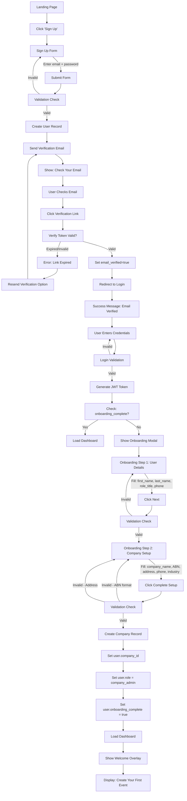
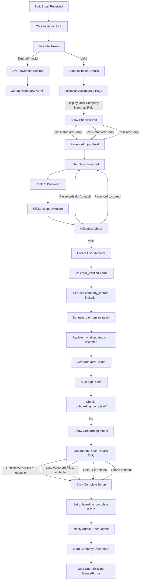
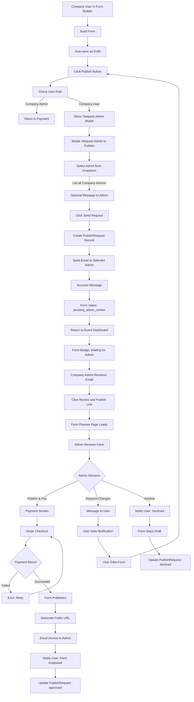
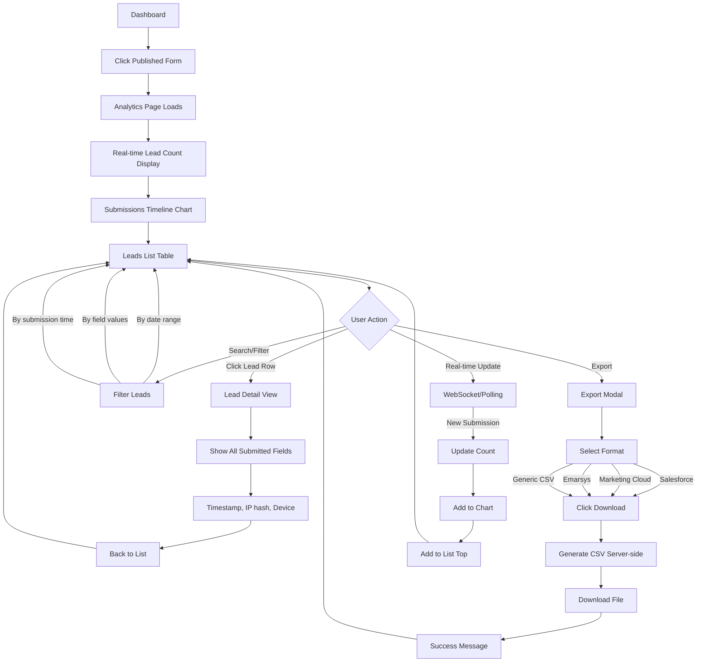
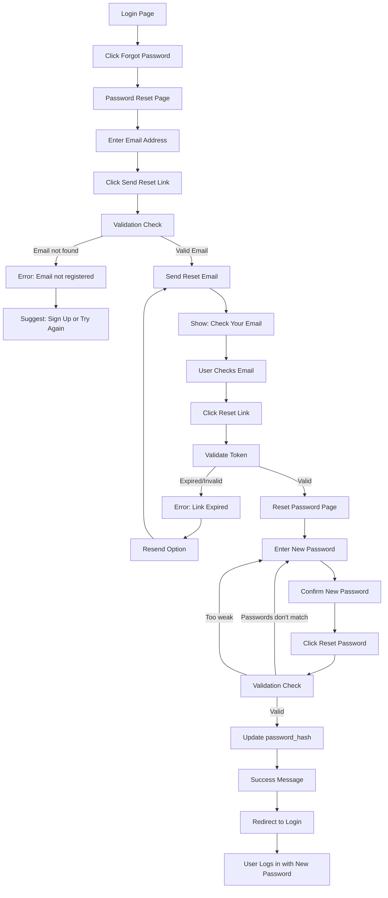
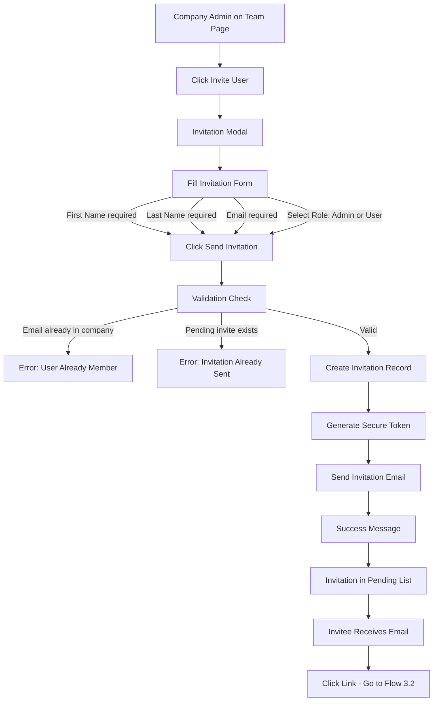

```mermaid
flowchart TD
    A[Dashboard - Events View] --> B[Click Create Event]
    B --> C[Event Creation Modal]
    C --> |Enter: name, dates, location, description| D[Click Create]
    D --> E[Validation Check]
    E --> |Invalid dates| C
    E --> |Missing required| C
    E --> |Valid| F[Create Event Record]
    F --> G[Event Dashboard Loads]
    G --> H[Show: Create Form for This Event]
    
    H --> I[Click Create Form]
    I --> J[Form Builder Opens New Tab]
    J --> K{Choose Starting Point}
    K --> |Template| L[Template Gallery Modal]
    L --> M[Select Template]
    M --> N[Template Applied to Canvas]
    K --> |Custom Background| O[Upload Image Modal]
    O --> P[Select Image File]
    P --> Q[Upload to Azure Blob]
    Q --> N[Background Applied to Canvas]
    K --> |Blank| N
    
    N --> R[Canvas Workspace Ready]
    R --> S[Drag Components from Library]
    S --> T[Position Components Anywhere]
    T --> U[Resize & Style Components]
    U --> V[Real-time Preview Updates]
    V --> W[Auto-save Draft]
    W --> X{User Action}
    
    X --> |Continue Editing| S
    X --> |Click Preview| Y[Preview Mode Toggle]
    Y --> |Tablet/Desktop/Mobile Views| X
    X --> |Click Publish| Z[Pre-Publish Check]
    
    Z --> AA[Validate Form]
    AA --> |Has Required Fields?| AB
    AA --> |Missing Fields| AC[Error: Add Required Fields]
    AC --> S
    AB --> |All Valid| AD[Payment Screen Modal]
    
    AD --> AE[Show Price Breakdown]
    AE --> |$90 ex GST + $9 GST = $99| AF[Stripe Checkout]
    AF --> AG{Payment Result}
    AG --> |Failed| AH[Error Message]
    AH --> AI[Retry Payment Option]
    AI --> AF
    AG --> |Succeeded| AJ[Generate Public URL]
    AJ --> AK[Set form.status = published]
    AK --> AL[Generate Invoice PDF]
    AL --> AM[Email Invoice to Admin]
    AM --> AN[Payment Success Screen]
    
    AN --> AO[Display Public URL]
    AO --> AP[Show QR Code]
    AP --> AQ[Share Options]
    AQ --> AR[Click Return to Dashboard]
    AR --> AS[Event Dashboard]
    AS --> AT[Form Shows as Published]
```

# Event Lead Platform UX/UI Specification

_Generated on 2025-10-11 by Anthony Keevy_

## Executive Summary

**Event Lead Platform** is a web-based form builder designed for businesses exhibiting at trade shows, conferences, and events. The platform enables users to create beautiful, branded lead collection forms with custom backgrounds and drag-and-drop design capabilities, then publish them for use at their events.

**Key UX Challenges:**
- Complex drag-and-drop interface with freeform component placement
- Must be intuitive enough for non-technical marketers to build forms in <5 minutes
- Tablet-optimized experience (primary use case: event booth iPad/tablets)
- Balance between power (custom backgrounds, positioning) and simplicity (templates, quick start)
- "Create free, pay to publish" model requires clear value demonstration before payment

**Platform Context:**
- **Users:** B2B event exhibitors (professional services, tech startups, healthcare, education)
- **Primary Use Case:** Create branded forms quickly before events, collect leads on tablets at events
- **Technical Stack:** React (frontend), FastAPI (backend), Azure hosting
- **Target Devices:** Desktop/laptop (builder), Tablet (public forms), Mobile (secondary)

---

## 1. UX Goals and Principles

### 1.1 Target User Personas

**Primary Persona: "Marketing Michelle"**
- **Role:** Marketing Manager at mid-sized B2B company
- **Demographics:** 28-45 years old, non-technical background
- **Context:** Attends 6-10 trade shows/conferences per year
- **Goals:** 
  - Create professional-looking branded forms quickly (under 5 minutes)
  - Collect quality leads efficiently at events
  - Export leads to CRM after event
  - Justify marketing spend with measurable results
- **Pain Points:**
  - Currently pays contractor $200/form with 2-3 day turnaround (too slow, too expensive)
  - Google Forms look unprofessional and generic
  - Needs something that matches brand guidelines
  - Frustrated by complex tools that require technical knowledge
- **Tech Savvy:** Moderate - comfortable with web apps but not a developer

**Secondary Persona: "Event Coordinator Emma"**
- **Role:** Events/Operations coordinator
- **Demographics:** 24-35 years old
- **Context:** Manages logistics for multiple events, less concerned with design
- **Goals:**
  - Quick setup at event booth (tablet-friendly)
  - Reliable lead collection with no data loss
  - Simple process to retrieve and share lead data
- **Pain Points:**
  - Tablets/iPads at booth need simple, touch-friendly interface
  - Network reliability concerns at event venues
  - Need forms to "just work" without technical troubleshooting
- **Tech Savvy:** Basic to moderate

### 1.2 Usability Goals

**Primary Goals:**
- **Speed:** Form creation in <5 minutes (PRD success metric)
- **Professional Output:** Forms look custom-designed, not template-based
- **Ease of Learning:** First-time users can build form without tutorial or onboarding
- **Error Prevention:** Validation and auto-save prevent data loss and bad submissions
- **Reliability:** 99.5% uptime, forms never go down during critical event hours
- **Data Quality:** >90% valid leads collected (key retention driver from PRD)

**Supporting Goals:**
- Efficient workflow for return users (6-10 events/year)
- Clear value demonstration before payment ($99 conversion point)
- Tablet-optimized public forms for event booth usage
- Seamless data export to existing CRM workflows

### 1.3 Design Principles

**1. "Speed without Sacrifice"**  
Fast creation doesn't mean generic output. Balance quick workflows with customization power. Users should feel they're creating something unique in minutes, not compromising quality for speed.

**2. "Show, Don't Tell"**  
Real-time preview beats documentation. Users see results immediately as they build. Every action has instant visual feedback. WYSIWYG (What You See Is What You Get) philosophy throughout.

**3. "Progressive Disclosure"**  
Start simple (templates), reveal complexity as needed (custom backgrounds, freeform positioning). Don't overwhelm beginners, don't limit power users. Graceful path from novice to expert.

**4. "Trust Through Transparency"**  
Auto-save, clear status indicators, no surprises. Users trust their work is safe and understand system state at all times. Especially critical for "Create Free, Pay to Publish" model - users must feel confident investing time before payment.

**5. "Tablet-First, Desktop-Built"**  
Builder optimized for desktop/laptop (precision, complexity). Published forms optimized for tablets (touch-friendly, event booth context). Design for the actual usage context of each interface.

---

## 2. Information Architecture

### 2.1 Site Map

```
Event Lead Platform
│
├── Public Marketing Site
│   ├── Landing Page (homepage)
│   ├── Pricing Page
│   ├── About/How It Works
│   ├── Login
│   └── Sign Up
│
├── Onboarding Flow (First-Time User)
│   ├── Email Verification
│   ├── User Details Form (name, role, phone)
│   ├── Company Setup Form (company name, ABN, address)
│   └── Welcome/Tutorial Overlay
│
├── Onboarding Flow (Invited User)
│   ├── Invitation Landing (from email link)
│   ├── Sign Up with Pre-filled Email
│   ├── Email Verification
│   ├── User Details Form
│   └── Land in Company Dashboard
│
├── Main Dashboard (Post-Login)
│   │
│   ├── Events View (Primary)
│   │   ├── Events List (grid/list view)
│   │   │   ├── Upcoming Events
│   │   │   ├── Past Events
│   │   │   └── Draft Events
│   │   ├── Create Event (modal)
│   │   └── Event Dashboard (detail view)
│   │       ├── Event Details Header
│   │       ├── Forms List for Event
│   │       ├── Create Form (→ Builder)
│   │       ├── Event Analytics Summary
│   │       └── Event Actions (edit, delete, duplicate)
│   │
│   ├── All Forms View (Secondary)
│   │   ├── Forms List (all company forms across events)
│   │   ├── Filter by Event
│   │   ├── Filter by Status (draft/published)
│   │   └── Search Forms
│   │
│   ├── Analytics View
│   │   ├── Company-wide Analytics
│   │   ├── Per-Event Analytics
│   │   ├── Per-Form Analytics Detail
│   │   │   ├── Real-time Lead Count
│   │   │   ├── Submissions Timeline Chart
│   │   │   ├── Leads List View
│   │   │   ├── Lead Detail View
│   │   │   └── Export Modal
│   │   └── Activity Feed
│   │
│   ├── Team Management (Company Admin Only)
│   │   ├── Team Members List
│   │   │   ├── Active Users
│   │   │   ├── Pending Invitations
│   │   │   └── User Roles Displayed
│   │   ├── Invite User Modal
│   │   │   ├── Email Input
│   │   │   └── Role Selection (Admin/User)
│   │   ├── Manage User
│   │   │   ├── Change Role
│   │   │   ├── Remove User
│   │   │   └── View User Activity
│   │   └── Invitation Management
│   │       ├── Resend Invitation
│   │       └── Cancel Invitation
│   │
│   ├── Company Settings (Admin Full, User Read-only)
│   │   ├── Company Profile
│   │   │   ├── Company Name
│   │   │   ├── ABN
│   │   │   ├── Billing Address
│   │   │   ├── Phone
│   │   │   └── Industry
│   │   └── Activity Log (who did what, when)
│   │
│   ├── Billing (Company Admin Only)
│   │   ├── Invoices List
│   │   │   ├── Invoice Number
│   │   │   ├── Date, Amount, Status
│   │   │   └── Download PDF
│   │   ├── Payment History
│   │   └── Update Billing Details
│   │
│   └── Account Settings (Personal)
│       ├── User Profile
│       │   ├── Name, Email
│       │   ├── Role/Title
│       │   └── Phone Number
│       ├── Password Management
│       └── Notification Preferences
│
├── Form Builder (Opens in New Tab/Window)
│   │
│   ├── Builder Interface
│   │   ├── Top Bar
│   │   │   ├── Back to Dashboard
│   │   │   ├── Form Name (editable)
│   │   │   ├── Auto-save Indicator
│   │   │   ├── Preview Toggle
│   │   │   └── Publish Button
│   │   │
│   │   ├── Left Panel - Component Library
│   │   │   ├── Form Fields Section
│   │   │   │   ├── Name (first, last, full)
│   │   │   │   ├── Email
│   │   │   │   ├── Phone
│   │   │   │   ├── Text Input
│   │   │   │   ├── Dropdown/Select
│   │   │   │   ├── Checkbox
│   │   │   │   ├── Radio Buttons
│   │   │   │   └── Multi-line Text
│   │   │   └── Background/Template Section
│   │   │       ├── Choose Template (gallery)
│   │   │       └── Upload Background
│   │   │
│   │   ├── Center - Canvas Workspace
│   │   │   ├── Freeform Drag-and-Drop Area
│   │   │   ├── Background Image Preview
│   │   │   ├── Component Placement
│   │   │   ├── Resize Handles
│   │   │   ├── Selection Indicators
│   │   │   └── Grid/Guides (toggle)
│   │   │
│   │   └── Right Panel - Properties
│   │       ├── Component Properties
│   │       │   ├── Label
│   │       │   ├── Required Toggle
│   │       │   ├── Validation Rules
│   │       │   ├── Styling Options
│   │       │   └── Position/Size
│   │       └── Form-level Settings
│   │           ├── Form Name
│   │           ├── Thank You Message
│   │           └── Redirect URL
│   │
│   ├── Template Gallery (Modal)
│   │   ├── Categories Filter
│   │   ├── Template Thumbnails
│   │   └── Preview & Select
│   │
│   ├── Preview Mode (Toggle)
│   │   ├── Desktop Preview
│   │   ├── Tablet Preview
│   │   └── Mobile Preview
│   │
│   └── Publish Flow
│       ├── Pre-publish Check
│       │   ├── Validation Status
│       │   └── Form Preview
│       ├── Payment Screen
│       │   ├── Price Breakdown ($99 inc GST)
│       │   ├── GST Amount Display
│       │   └── Stripe Checkout
│       ├── Payment Success
│       │   ├── Public URL Display
│       │   ├── QR Code Generation
│       │   ├── Share Options
│       │   └── Return to Dashboard
│       └── Payment Failed
│           ├── Error Message
│           └── Retry Option
│
└── Public Form View (Published Forms - Standalone)
    ├── Form Submission Page (unique URL per form)
    │   ├── Custom Background Display
    │   ├── Form Fields (as designed)
    │   ├── Real-time Validation
    │   └── Submit Button
    ├── Success/Thank You State
    │   └── Custom Thank You Message
    └── Error States
        ├── Validation Errors
        ├── Network Errors
        └── Form Offline Message
```

### 2.2 Navigation Structure

**Main Dashboard - Top Navigation Bar:**
```
┌─────────────────────────────────────────────────────────────────┐
│ [Logo] Events | Forms | Analytics | Team* | Settings | [Profile▼]│
└─────────────────────────────────────────────────────────────────┘
* Team tab only visible to Company Admins
```

**Primary Navigation Items:**
1. **Events** (Default landing view)
   - Shows all company events (upcoming, past, drafts)
   - Primary CTA: "Create Event"
   
2. **Forms** (Alternative view)
   - Shows all forms across all events
   - Filter by event, status, creator
   - Search functionality

3. **Analytics** (Data view)
   - Company-wide stats
   - Drill down to event → form → submissions
   - Export capabilities

4. **Team** (Admin only)
   - Manage team members
   - Send invitations
   - View/change roles

5. **Settings** (Dropdown)
   - Company Settings (Admin: full access, User: read-only)
   - Billing (Admin only)
   - Personal Account Settings

**Profile Menu (Top Right Icon):**
```
[User Avatar/Initials ▼]
├── Anthony Keevy
├── Marketing Manager
├── ─────────────────
├── Account Settings
├── Company Settings*
├── Billing*
├── ─────────────────
└── Logout

* Admin-only items
```

**Form Builder - Context Navigation:**
```
Top Bar (Fixed):
[← Back to Dashboard] | [Form Name: Editable] | [Auto-saved ●] | [Preview ⚡] | [Publish →]

NO side navigation - maximized workspace
```

**Breadcrumb Pattern (Context Awareness):**
```
Events > Tech Summit 2026 > Lead Capture Form > Analytics
Events > Tech Summit 2026 > [Edit: Lead Capture Form] (in Builder)
Settings > Company > Billing
Settings > Team > Invite User
```

**Mobile Navigation Strategy:**
- **Public Forms:** No nav (single-purpose submission page)
- **Dashboard (Tablet):** Hamburger menu collapses top nav
- **Form Builder:** Desktop-only for MVP (too complex for mobile editing)

**Role-Based Navigation Rendering:**

**Company Admin sees:**
- All nav items
- Team tab visible
- Company Settings (full edit)
- Billing section
- All event/form actions

**Company User sees:**
- Events, Forms, Analytics, Settings
- NO Team tab
- Company Settings (read-only view)
- NO Billing section
- Can create events/forms, limited delete permissions

**System Admin (Backend Only for MVP):**
- No special UI in MVP
- Backend database access only
- Admin screens are Post-MVP

---

## 3. User Flows

### 3.1 User Flow 1: New Company Sign Up & Onboarding

**User Goal:** Create account, verify email, complete onboarding, land in dashboard ready to create first event

**Entry Points:**
- Landing page "Get Started" CTA
- Landing page "Sign Up" button
- Pricing page "Start Free Trial" CTA

**Detailed Flow:**



**Success Criteria:**
- User account created and email verified
- User and company details collected and validated
- User assigned as Company Admin
- Dashboard loads successfully
- User ready to create first event

**Error States:**
- Email already in use → Show error, redirect to login
- Verification link expired → Offer resend option
- Invalid ABN format → Show validation error with format guide
- Network error during submission → Show retry option
- Password too weak → Show password requirements

### 3.2 User Flow 2: Invited User Join Flow

**User Goal:** Accept company invitation, create account, join existing company team

**Entry Points:**
- Email invitation link from Company Admin

**Detailed Flow:**



**Success Criteria:**
- Invitation token valid and not expired
- User account created successfully
- Email marked as verified (invitation = verification)
- User joins company with correct role
- User completes onboarding (personal details only)
- Dashboard loads with existing company data visible

**Error States:**
- Invitation expired → Show error, suggest contacting Company Admin
- Token invalid → Show error page
- Email already has account → Redirect to login with message
- Network error → Show retry option

---

### 3.3 User Flow 3: Create Event & Publish Form (Company Admin)

**User Goal:** Create new event, build branded form, publish and pay, get public URL for event

**Entry Points:**
- Dashboard: "Create Event" button
- Empty state: "Create Your First Event" prompt

**Detailed Flow:**



**Success Criteria:**
- Event created successfully
- Form builder loads and is usable
- Components can be dragged and positioned
- Preview shows accurate representation
- Draft saves automatically (no data loss)
- Payment processes successfully
- Public URL generated and accessible
- Invoice emailed to Company Admin
- Form appears in Event Dashboard as published

**Error States & Edge Cases:**
- Network error during drag → Show reconnecting indicator, retry
- Image upload fails → Show error, allow retry
- Image too large → Show size limit, suggest compression
- Auto-save fails → Show warning banner, manual save option
- Payment declined → Clear error message, suggest retry or contact bank
- Stripe API error → Graceful fallback, support contact info
- User navigates away mid-build → Confirm "Unsaved changes" (if auto-save failed)

---

### 3.4 User Flow 4: Company User Requests Admin to Publish Form

**User Goal:** Create form, request Company Admin approval to publish and pay

**Entry Points:**
- Event Dashboard: "Create Form" button
- Company User creates form in builder

**Detailed Flow:**



**Success Criteria:**
- Company User can create forms
- Publish button triggers correct flow based on role
- Admin receives clear notification with form link
- Admin can review form before publishing
- Payment processed by Admin (not User)
- User notified when form published
- Form status updates correctly throughout workflow

**Error States:**
- No Company Admins exist → Show error: "Contact platform support"
- Admin doesn't respond within X days → Reminder email? (future)
- User tries to publish while pending → Show: "Already waiting for Admin approval"
- Multiple publish requests for same form → Handle duplicates gracefully

---

### 3.5 User Flow 5: View Analytics & Export Leads

**User Goal:** View real-time lead submissions, analyze data, export to CRM

**Entry Points:**
- Dashboard: Click on published form
- Event Dashboard: Click "View Analytics" on form
- Analytics tab: Select form from dropdown

**Detailed Flow:**



**Success Criteria:**
- Analytics load quickly (<2 seconds)
- Real-time updates appear without refresh
- Charts render correctly
- Search/filter works instantly
- Export generates correct format
- CSV downloads successfully
- Data matches form submissions exactly

**Error States:**
- No submissions yet → Show empty state: "No leads collected yet. Share your form URL!"
- Export fails → Show error, retry option
- Real-time connection drops → Fall back to manual refresh
- Large dataset slow → Show loading indicator, pagination
- Network error → Show cached data with "Offline" indicator

---

### 3.6 User Flow 6: Password Reset

**User Goal:** Reset forgotten password and regain access to account

**Entry Points:**
- Login page: "Forgot Password?" link

**Detailed Flow:**



**Success Criteria:**
- Reset email sent successfully
- Token validation works correctly
- Password updated securely
- User can log in with new password immediately

**Error States:**
- Email not found → Helpful message without revealing if email exists (security)
- Link expired → Offer resend with clear timeframe
- Password requirements not met → Show specific requirements
- Network error → Retry option

---

### 3.7 User Flow 7: Admin Invite Team Member (Detailed)

**User Goal:** Add new team member to company account with appropriate role

**Entry Points:**
- Dashboard: Team tab → "Invite User" button
- Settings: Team section → "Add Team Member"

**Detailed Flow:**



**Success Criteria:**
- Admin can invite users with minimal friction
- Invitation email delivered successfully
- Pending invitations tracked visibly
- Duplicate invitations prevented
- Role assignment clear during invitation

**Error States:**
- Email already belongs to user in company → Clear error message
- Invalid email format → Validation error
- Email send fails → Show error, retry option
- Admin accidentally invites self → Prevent with validation

---

## 4. Component Library and Design System

### 4.1 Design System Approach

**Strategy: Custom Component Library**

**Foundation:**
- **CSS Framework:** Tailwind CSS for utility-first styling
- **Component Architecture:** React functional components with hooks
- **State Management:** React Context for global state, local state for components
- **Styling:** Tailwind + CSS modules for component-specific styles
- **Icons:** Lucide React or Heroicons (SVG icon library)

**Form Builder Specific Libraries:**
- **Drag-and-Drop:** dnd-kit (modern, performant, accessible)
- **Resizing:** react-resizable or custom resize handles
- **Canvas Rendering:** Custom SVG/Canvas-based preview system
- **Image Handling:** react-dropzone for uploads, Azure Blob for storage

**Rationale:**
- Complete control over brand and UX
- Lighter weight (no heavy UI library overhead)
- Tailwind enables rapid prototyping with consistency
- Custom components perfectly suited to unique form builder needs
- Better performance for drag-and-drop interactions
- Full customization for tablet-optimized public forms

**Design Tokens (Tailwind Config):**
- Colors (custom palette)
- Typography scale
- Spacing system (4px base unit)
- Shadows and elevations
- Border radius values
- Transition timings

### 4.2 Core Components

**Foundation Components (Used Throughout Platform):**

**1. Button**
- **Variants:** 
  - Primary (solid background, high contrast)
  - Secondary (outlined, less prominent)
  - Ghost (text-only, minimal)
  - Danger (red, for destructive actions)
- **Sizes:** Small, Medium, Large
- **States:** Default, Hover, Active, Disabled, Loading
- **Props:** icon, iconPosition (left/right), fullWidth, onClick
- **Accessibility:** ARIA labels, keyboard navigation, focus states

**2. Input Fields**
- **Types:** Text, Email, Password, Tel, Number, Textarea
- **States:** Default, Focus, Error, Disabled, Success
- **Features:** 
  - Label (required/optional indicator)
  - Helper text
  - Error message
  - Character count (for limited fields)
  - Clear button (×)
  - Show/hide password toggle
- **Validation:** Real-time + on blur
- **Accessibility:** Proper labels, error announcements

**3. Select/Dropdown**
- **Types:** Single select, Multi-select, Searchable
- **States:** Default, Open, Disabled, Error
- **Features:**
  - Placeholder text
  - Search within options (for large lists)
  - Clear selection
  - Custom option rendering
- **Accessibility:** Keyboard navigation, screen reader support

**4. Checkbox & Radio**
- **Variants:** Individual, Group
- **States:** Unchecked, Checked, Indeterminate, Disabled
- **Features:**
  - Label positioning (left/right)
  - Helper text
  - Group validation
- **Accessibility:** Keyboard toggle, clear focus indicators

**5. Modal/Dialog**
- **Variants:** Small, Medium, Large, Full-screen
- **Features:**
  - Header with title and close button
  - Body content area
  - Footer with action buttons
  - Backdrop overlay
  - Close on ESC key
  - Trap focus within modal
- **Animations:** Fade in/out, scale up
- **Accessibility:** Focus trap, ESC to close, ARIA modal

**6. Card**
- **Variants:** Default, Clickable, Selected, Elevated
- **Features:**
  - Header, Body, Footer sections
  - Optional image area
  - Hover states for clickable cards
  - Action menu (overflow menu)
- **Use Cases:** Event cards, Form cards, Team member cards

**7. Table**
- **Features:**
  - Sortable columns
  - Row selection (checkbox)
  - Row actions (inline buttons/menu)
  - Pagination
  - Empty state
  - Loading state (skeleton)
- **Responsive:** Collapses to cards on mobile
- **Use Cases:** Leads list, Forms list, Invoices, Team members

**8. Badge/Tag**
- **Variants:** Status badges (draft, published, pending, etc.)
- **Colors:** Success (green), Warning (yellow), Error (red), Info (blue), Neutral (gray)
- **Sizes:** Small, Medium
- **Use Cases:** Form status, Role badges, Event status

**9. Toast Notifications**
- **Types:** Success, Error, Warning, Info
- **Features:**
  - Auto-dismiss (configurable duration)
  - Manual dismiss (× button)
  - Action button (optional, e.g., "Undo")
  - Stack multiple toasts
- **Position:** Top-right (default) or configurable
- **Use Cases:** Save confirmation, Error messages, Success notifications

**10. Loading States**
- **Variants:**
  - Spinner (inline, overlay, full-page)
  - Skeleton screens (for content loading)
  - Progress bar (for uploads, multi-step processes)
- **Use Cases:** Form saves, Analytics loading, Image uploads, Payment processing

**Form Builder Specific Components:**

**11. DraggableComponent (Canvas Items)**
- **Features:**
  - Drag handles (visible on hover/selection)
  - Resize handles (8 points: corners + sides)
  - Selection outline
  - Delete button (×)
  - Duplicate button
  - Z-index controls (bring forward/backward)
- **States:** Default, Hover, Selected, Dragging, Resizing
- **Types:** Name field, Email field, Phone field, Text input, Dropdown, Checkbox, Radio, Textarea

**12. ComponentLibrary (Left Panel)**
- **Features:**
  - Collapsible sections
  - Component icons/previews
  - Drag-to-canvas interaction
  - Search/filter components
  - Tooltips with component descriptions
- **Sections:**
  - Form Fields
  - Background/Template

**13. PropertiesPanel (Right Panel)**
- **Context-Sensitive:** Shows properties for selected component OR form-level settings
- **Features:**
  - Component label editor
  - Required toggle
  - Validation rules builder
  - Styling options (font, size, color)
  - Position/Size inputs (x, y, width, height)
  - Delete component button

**14. Canvas**
- **Features:**
  - Background image display (with aspect ratio)
  - Drop zone for components
  - Grid overlay (toggle on/off)
  - Snap-to-grid option
  - Zoom controls (for precision)
  - Pan/scroll for large canvases
- **Interactions:**
  - Click to select component
  - Click canvas to deselect
  - Marquee selection (drag to select multiple)
  - Keyboard shortcuts (delete, duplicate, arrow keys for nudge)

**15. PreviewPane**
- **Modes:** Desktop, Tablet, Mobile
- **Features:**
  - Device frame rendering
  - Interactive (can test form submission)
  - Responsive breakpoint visualization
  - Exact representation of published form
- **Toggle:** Preview mode vs Edit mode

**Dashboard/Admin Components:**

**16. EventCard**
- **Displays:** Event name, dates, location, form count, status
- **Actions:** Edit, View Forms, Duplicate, Delete
- **States:** Upcoming (highlighted), Past (muted), Draft (dashed border)
- **Click:** Opens Event Dashboard

**17. FormCard**
- **Displays:** Form name, event, status, submission count, created by
- **Actions:** Edit, View Analytics, Duplicate, Unpublish, Delete
- **Status Badges:** Draft, Published, Pending Admin Review, Unpublished
- **Click:** Opens Analytics (if published) or Builder (if draft)

**18. StatsCard**
- **Purpose:** Dashboard KPIs
- **Displays:** Metric name, value, trend (up/down), time period
- **Variants:** Lead count, Forms published, Events upcoming, Revenue
- **Visual:** Large number with supporting context

**19. NavigationTabs**
- **Variants:** Primary navigation, Secondary filters
- **Features:**
  - Active tab indicator
  - Badge counts (e.g., "Pending Invitations (3)")
  - Responsive collapse to dropdown on mobile
- **Use Cases:** Events/Forms/Analytics/Team tabs

**20. UserAvatar**
- **Displays:** User initials or uploaded photo
- **Sizes:** XS, S, M, L, XL
- **States:** Online status indicator (optional)
- **Features:** Hover tooltip with full name and role
- **Use Cases:** Profile menu, Team list, Activity log

**Total Component Count:** ~20 core components + variations
**Build Approach:** Start with foundation components (1-10), add form builder components (11-15), then dashboard components (16-20)

---

## 5. Visual Design Foundation

### 5.1 Color Palette

**Brand Personality:** Balanced & Accessible - Professional but friendly, broad B2B appeal

**Primary Colors:**

| Color Name | Hex | Tailwind | Usage |
|------------|-----|----------|-------|
| Primary 50 | `#F0FDFA` | `teal-50` | Subtle backgrounds, hover states |
| Primary 100 | `#CCFBF1` | `teal-100` | Light backgrounds, disabled states |
| Primary 500 | `#14B8A6` | `teal-500` | **Primary brand color** - CTAs, links, focus states |
| Primary 600 | `#0D9488` | `teal-600` | Hover states on primary buttons |
| Primary 700 | `#0F766E` | `teal-700` | Active/pressed states |
| Primary 900 | `#134E4A` | `teal-900` | Dark accents, headers |

**Secondary Colors:**

| Color Name | Hex | Tailwind | Usage |
|------------|-----|----------|-------|
| Secondary 500 | `#8B5CF6` | `violet-500` | Accent color - highlights, badges |
| Secondary 600 | `#7C3AED` | `violet-600` | Hover states |

**Neutral/Gray Scale:**

| Color Name | Hex | Tailwind | Usage |
|------------|-----|----------|-------|
| Gray 50 | `#F9FAFB` | `gray-50` | Page backgrounds |
| Gray 100 | `#F3F4F6` | `gray-100` | Card backgrounds, subtle dividers |
| Gray 200 | `#E5E7EB` | `gray-200` | Borders, dividers |
| Gray 400 | `#9CA3AF` | `gray-400` | Placeholder text, disabled text |
| Gray 600 | `#4B5563` | `gray-600` | Secondary text |
| Gray 700 | `#374151` | `gray-700` | Body text |
| Gray 900 | `#111827` | `gray-900` | Headers, primary text |
| White | `#FFFFFF` | `white` | Backgrounds, text on dark |

**Semantic Colors:**

| Color Name | Hex | Tailwind | Usage |
|------------|-----|----------|-------|
| Success 500 | `#10B981` | `emerald-500` | Success messages, published status |
| Success 50 | `#ECFDF5` | `emerald-50` | Success backgrounds |
| Warning 500 | `#F59E0B` | `amber-500` | Warnings, pending states |
| Warning 50 | `#FFFBEB` | `amber-50` | Warning backgrounds |
| Error 500 | `#EF4444` | `red-500` | Errors, validation failures, danger |
| Error 50 | `#FEF2F2` | `red-50` | Error backgrounds |
| Info 500 | `#3B82F6` | `blue-500` | Info messages, helpful tips |
| Info 50 | `#EFF6FF` | `blue-50` | Info backgrounds |

**Tailwind Config:**
```javascript
colors: {
  primary: colors.teal,
  secondary: colors.violet,
  success: colors.emerald,
  warning: colors.amber,
  error: colors.red,
  info: colors.blue,
}
```

**Usage Guidelines:**
- **Primary (Teal):** Main CTAs ("Create Event", "Publish", "Invite User"), links, active states
- **Secondary (Violet):** Premium features, highlights, secondary CTAs
- **Success (Green):** Published forms, payment success, positive feedback
- **Warning (Amber):** Draft status, pending review, cautionary messages
- **Error (Red):** Validation errors, destructive actions, failures
- **Info (Blue):** Helpful tips, informational badges, tooltips
- **Gray:** Text hierarchy, backgrounds, borders, neutral elements

### 5.2 Typography

**Font Families:**

**Primary Font: Inter** (Sans-serif)
- **Usage:** All UI text (headings, body, buttons, forms)
- **Weights:** 400 (Regular), 500 (Medium), 600 (Semibold), 700 (Bold)
- **Source:** Google Fonts
- **Rationale:** Modern, highly readable, excellent on screens, professional yet friendly
- **Fallback:** `system-ui, -apple-system, sans-serif`

**Monospace Font: JetBrains Mono** (For code/technical)
- **Usage:** Technical data (URLs, tokens, JSON), code snippets
- **Weight:** 400 (Regular), 500 (Medium)
- **Source:** Google Fonts
- **Use Cases:** Public URL display, ABN, invoice numbers

**Type Scale (Tailwind):**

| Element | Size | Line Height | Weight | Tailwind Class |
|---------|------|-------------|--------|----------------|
| **Display** | 48px | 1.1 | 700 | `text-5xl font-bold` |
| **H1** | 36px | 1.2 | 700 | `text-4xl font-bold` |
| **H2** | 30px | 1.3 | 600 | `text-3xl font-semibold` |
| **H3** | 24px | 1.4 | 600 | `text-2xl font-semibold` |
| **H4** | 20px | 1.5 | 600 | `text-xl font-semibold` |
| **H5** | 18px | 1.5 | 600 | `text-lg font-semibold` |
| **Body Large** | 18px | 1.6 | 400 | `text-lg` |
| **Body** | 16px | 1.6 | 400 | `text-base` |
| **Body Small** | 14px | 1.5 | 400 | `text-sm` |
| **Caption** | 12px | 1.5 | 500 | `text-xs font-medium` |
| **Button Large** | 16px | 1.5 | 600 | `text-base font-semibold` |
| **Button** | 14px | 1.5 | 600 | `text-sm font-semibold` |
| **Button Small** | 12px | 1.5 | 600 | `text-xs font-semibold` |

**Typography Guidelines:**
- **Headers:** Bold/semibold weights, tighter line-height for hierarchy
- **Body Text:** Regular weight (400), comfortable line-height (1.6) for readability
- **Buttons:** Semibold (600) for prominence and clickability
- **Labels:** Medium weight (500), small size for form labels
- **Links:** Primary color, underline on hover
- **Placeholders:** Gray-400, regular weight
- **Error Text:** Error-500 color, small size, medium weight

### 5.3 Spacing and Layout

**Spacing System (4px Base Unit):**

| Name | Value | Tailwind | Usage |
|------|-------|----------|-------|
| **0** | 0px | `0` | Reset/none |
| **1** | 4px | `1` | Tight spacing (icon gaps) |
| **2** | 8px | `2` | Compact spacing (inline elements) |
| **3** | 12px | `3` | Small gaps (form field groups) |
| **4** | 16px | `4` | **Default spacing** (most common) |
| **5** | 20px | `5` | Comfortable spacing |
| **6** | 24px | `6` | Section spacing |
| **8** | 32px | `8` | Large gaps (between sections) |
| **10** | 40px | `10` | Extra large gaps |
| **12** | 48px | `12` | Major section dividers |
| **16** | 64px | `16` | Page sections |
| **20** | 80px | `20` | Hero sections |

**Layout Grid:**
- **Desktop:** 12-column grid, 24px gutter
- **Tablet:** 8-column grid, 16px gutter
- **Mobile:** 4-column grid, 16px gutter
- **Max Content Width:** 1280px (container)
- **Dashboard Content:** 1120px max (comfortable reading width)

**Container Padding:**
- **Desktop:** 32px horizontal padding
- **Tablet:** 24px horizontal padding
- **Mobile:** 16px horizontal padding

**Border Radius:**
- **None:** 0px (`rounded-none`) - rare use
- **Small:** 4px (`rounded`) - inputs, buttons
- **Medium:** 8px (`rounded-lg`) - cards, modals
- **Large:** 12px (`rounded-xl`) - prominent cards, images
- **Full:** 9999px (`rounded-full`) - avatars, badges, pills

**Shadows (Elevation):**
- **Level 1:** `shadow-sm` - Subtle lift (inputs on focus)
- **Level 2:** `shadow` - Default cards
- **Level 3:** `shadow-md` - Elevated cards (hover)
- **Level 4:** `shadow-lg` - Modals, dropdowns
- **Level 5:** `shadow-xl` - Overlays, important modals
- **Level 6:** `shadow-2xl` - Floating toolbars, form builder panels

**Component Spacing Guidelines:**
- **Form Fields:** 16px vertical gap between fields
- **Card Padding:** 24px on desktop, 16px on mobile
- **Modal Padding:** 24px all around
- **Button Padding:** 12px vertical, 24px horizontal (medium size)
- **Icon + Text Gap:** 8px
- **Section Gaps:** 48px between major sections

**Dashboard Layout:**
- **Sidebar (if used):** 240px wide, fixed on desktop
- **Main Content:** Fluid width with max-width constraint
- **Panel Spacing:** 24px between cards/sections
- **Grid Gap:** 24px for card grids

**Form Builder Layout:**
- **Left Panel (Component Library):** 280px fixed width
- **Right Panel (Properties):** 320px fixed width
- **Canvas:** Fluid center (takes remaining space)
- **Panel Padding:** 16px internal padding

---

## 6. Responsive Design

### 6.1 Breakpoints

**Tailwind Default Breakpoints (Mobile-First):**

| Breakpoint | Min Width | Target Devices | Usage |
|------------|-----------|----------------|-------|
| **sm** | 640px | Large phones (landscape) | Minor adjustments |
| **md** | 768px | **Tablets (Portrait)** | **PRIMARY tablet optimization** |
| **lg** | 1024px | **Tablets (Landscape)**, Small laptops | Dashboard comfortable view |
| **xl** | 1280px | **Desktop/Laptop** | **PRIMARY builder optimization** |
| **2xl** | 1536px | Large desktop | Enhanced spacing, multi-panel layouts |

**Platform-Specific Breakpoints:**

**Public Forms (Tablet-First):**
- **Primary Target:** 768px - 1024px (iPads at event booths)
- **Secondary:** 1024px+ (desktop preview)
- **Tertiary:** 640px - 768px (large phones - fallback)
- **Not Optimized:** <640px (small phones - acceptable but not primary)

**Form Builder (Desktop-First):**
- **Primary Target:** 1280px+ (desktop/laptop with enough space for 3-panel layout)
- **Minimum:** 1024px (functional but cramped)
- **Not Supported:** <1024px (show message: "Please use desktop for form builder")

**Dashboard (Responsive):**
- **Desktop:** 1280px+ (multi-column layouts, comfortable spacing)
- **Tablet:** 768px - 1280px (responsive columns, collapsible navigation)
- **Mobile:** 640px - 768px (single column, hamburger menu)

### 6.2 Adaptation Patterns

**Navigation Adaptation:**

**Desktop (≥1280px):**
```
[Logo] Events | Forms | Analytics | Team | Settings | [Profile▼]
Full horizontal navigation bar
```

**Tablet (768px - 1279px):**
```
[☰ Menu] [Logo] ..................... [Profile▼]
Hamburger menu for main navigation
```

**Mobile (640px - 767px):**
```
[☰] [Logo] ............ [Profile▼]
Condensed hamburger + profile only
```

**Dashboard Layout Adaptation:**

**Desktop (≥1280px):**
- 3-4 column card grid for events/forms
- Side-by-side panels (list + detail view)
- Full tables with all columns visible
- Hover states prominent

**Tablet (768px - 1279px):**
- 2 column card grid
- Stacked panels (list above detail)
- Tables show fewer columns, horizontal scroll for more
- Touch-friendly hit areas (44px minimum)

**Mobile (640px - 767px):**
- Single column cards
- Full-width modals
- Tables collapse to card format
- Sticky headers for long lists

**Form Builder Adaptation:**

**Desktop (≥1280px) - Full Experience:**
```
[Left Panel: 280px] [Canvas: Fluid] [Right Panel: 320px]
All three panels visible simultaneously
```

**Laptop (1024px - 1279px) - Functional:**
```
[Left: 240px] [Canvas: Fluid] [Right: 280px]
Narrower panels, still functional
```

**<1024px - Not Supported:**
```
[Message: "Form builder requires desktop/laptop screen"]
[Redirect to: View forms on this device, edit on desktop]
```

**Public Form Adaptation:**

**Tablet (768px - 1024px) - PRIMARY:**
- Full-width form with optimal touch targets
- Background image scaled to fit viewport
- Components maintain aspect ratio from design
- 44px minimum touch target for all inputs
- Large, clear labels
- Generous spacing between fields

**Desktop (≥1024px):**
- Form centered with max-width (600px)
- Background image fills container
- Desktop-optimized (mouse + keyboard)

**Mobile (640px - 767px):**
- Full-width form
- Single column layout
- Simplified background (or hide if too complex)
- Stack radio/checkbox options vertically

**Modal/Overlay Adaptation:**

**Desktop:**
- Centered modal with backdrop
- Max width based on content (sm: 400px, md: 600px, lg: 800px)
- ESC key to close

**Tablet/Mobile:**
- Full-screen or slide-up drawer
- Close button top-right
- Swipe down to dismiss (mobile)

**Table to Card Adaptation:**

**Desktop:**
```
| Event Name | Date | Forms | Status | Actions |
|------------|------|-------|--------|---------|
| Tech Summit| Jan 15| 3    | Active | [•••]  |
```

**Mobile:**
```
┌────────────────────────┐
│ Tech Summit            │
│ Jan 15, 2026           │
│ 3 Forms • Active       │
│ [Edit] [View] [Delete] │
└────────────────────────┘
```

### 6.3 Image Handling (Responsive)

**Custom Background Images:**
- Upload max size: 5MB
- Recommended resolution: 1920x1080 (16:9) or 1600x900
- Accepted formats: JPEG, PNG, WebP
- Server-side optimization: Generate multiple sizes (thumbnail, preview, full)
- Responsive serving: Appropriate size based on device
- Lazy loading for performance

**Template Thumbnails:**
- Fixed size: 320x180 (16:9 aspect ratio)
- WebP format for efficiency
- Eager loading (above fold)

---

## 7. Accessibility

### 7.1 Compliance Target

**Target: WCAG 2.1 Level AA**

**Rationale:**
- Australian Disability Discrimination Act encourages accessibility
- Level AA is achievable for MVP within 3-month timeline
- Level AAA may require specialized testing (post-MVP)
- Focus on public forms (customer-facing) as priority
- Dashboard accessibility important but secondary

**Phased Approach:**
- **MVP:** Public forms meet WCAG 2.1 AA
- **MVP:** Dashboard meets most AA criteria (acknowledge gaps for post-MVP)
- **Phase 2:** Full AA compliance across entire platform
- **Future:** AAA compliance and accessibility audit

### 7.2 Key Requirements

**Perceivable:**
- **Color Contrast:** 
  - Text contrast ratio ≥4.5:1 (normal text)
  - Text contrast ratio ≥3:1 (large text 18px+)
  - UI component contrast ≥3:1 (buttons, borders, focus indicators)
  - Test with tools: WebAIM Contrast Checker
  - Primary teal (#14B8A6) on white passes AA ✓
  
- **Alternative Text:**
  - All images have alt text (decorative: alt="")
  - Form field icons have ARIA labels
  - Template thumbnails describe template content
  
- **Responsive Text:**
  - Text resizable up to 200% without loss of functionality
  - No horizontal scrolling when zoomed
  - Relative units (rem, em) not fixed px

**Operable:**
- **Keyboard Navigation:**
  - All interactive elements reachable via Tab
  - Tab order follows visual flow (top→bottom, left→right)
  - Focus indicators clearly visible (3px teal outline)
  - Skip to main content link
  - Shortcuts for form builder (Del to delete, Ctrl+D to duplicate, etc.)
  
- **No Keyboard Traps:**
  - Can Tab out of modals (or ESC to close)
  - Dropdown menus don't trap focus
  - Form builder canvas doesn't trap keyboard
  
- **Timing:**
  - No time limits on forms (event attendees can take time)
  - Auto-save doesn't interrupt user
  - Session timeout with warning (30min notice before logout)

**Understandable:**
- **Clear Labels:**
  - All form fields have visible labels (not placeholder-only)
  - Error messages specific and actionable
  - Buttons have clear text (not icon-only without label)
  
- **Predictable Navigation:**
  - Consistent navigation across all pages
  - Breadcrumbs show current location
  - Links and buttons behave as expected
  
- **Input Assistance:**
  - Error identification (red outline + message)
  - Error suggestions ("Did you mean...?")
  - Required field indicators (* or "Required")
  - Form validation on blur + submit (not just submit)

**Robust:**
- **Semantic HTML:**
  - Proper heading hierarchy (H1 → H2 → H3, no skips)
  - `<button>` for buttons (not `<div>` with onClick)
  - `<nav>` for navigation
  - `<main>` for main content
  - `<form>` for actual forms
  
- **ARIA When Needed:**
  - `aria-label` for icon buttons
  - `aria-describedby` for error messages
  - `aria-live` for dynamic updates (analytics real-time count)
  - `role="status"` for loading states
  - `role="alert"` for errors
  
- **Form Validation:**
  - `aria-invalid` on error fields
  - `aria-required` on required fields
  - Error messages linked via `aria-describedby`

**Screen Reader Support:**
- Test with NVDA (Windows), VoiceOver (Mac), TalkBack (Android)
- Announce page changes (SPA routing)
- Announce dynamic content updates (new leads, form status changes)
- Skip navigation links
- Descriptive link text (not "Click here")

**Focus Management:**
- Visible focus indicators (never remove outline without replacement)
- Focus moves to modal when opened
- Focus returns to trigger when modal closes
- Focus moves to first error on validation failure
- Focus on new elements (e.g., new form in list after creation)

**Touch Targets (Tablet/Mobile):**
- Minimum 44x44px touch target size (WCAG 2.1 AA)
- Adequate spacing between touch targets (8px minimum)
- Larger targets for primary actions (48x48px or more)
- Form submit buttons: Generous size for easy tapping

**Specific to Public Forms (Priority):**
- High contrast between background and form fields
- Clear visual distinction for required fields
- Error messages immediately visible (not tooltip-only)
- Large touch-friendly inputs (48px height minimum)
- Success confirmation clearly visible after submit

---

## 8. Interaction and Motion

### 8.1 Motion Principles

**Design Philosophy:** Motion should feel natural, purposeful, and never gratuitous. Every animation serves a functional purpose - providing feedback, guiding attention, or building trust.

**Core Principles:**

**1. Responsive & Immediate**
- User actions receive instant visual feedback (<100ms)
- No perceived lag between action and response
- Micro-feedback for every interaction (button press, hover, click)
- Builds trust that system is working

**2. Natural & Physics-Based**
- Animations follow natural motion (easing curves, not linear)
- Objects have weight and momentum
- Bounce/spring for playful moments (success states)
- Smooth deceleration (ease-out) for most transitions

**3. Purposeful, Not Decorative**
- Every animation has a reason (feedback, guidance, or state change)
- No animation for animation's sake
- Can be reduced/disabled for accessibility (prefers-reduced-motion)
- Performance-first (GPU-accelerated transforms)

**4. Fast but Noticeable**
- Most transitions: 200-300ms (perceptible but not slow)
- Quick feedback: 100-150ms (button hovers, toggles)
- Complex sequences: 400-600ms (modals, page transitions)
- Never block user from next action

**5. Consistent Timing**
- Use standard durations across similar interactions
- Maintain consistent easing curves for same action types
- Predictable behavior builds familiarity

**Timing Variables (Tailwind Config):**
```javascript
transitionDuration: {
  fast: '150ms',      // Hovers, simple state changes
  base: '250ms',      // Default for most transitions
  slow: '400ms',      // Modals, complex animations
}

transitionTimingFunction: {
  'in-out': 'cubic-bezier(0.4, 0, 0.2, 1)',  // Default
  'out': 'cubic-bezier(0, 0, 0.2, 1)',       // Ease-out (most common)
  'in': 'cubic-bezier(0.4, 0, 1, 1)',        // Ease-in (rare)
  'bounce': 'cubic-bezier(0.68, -0.55, 0.265, 1.55)', // Playful
}
```

### 8.2 Key Animations

**Authentication & Onboarding:**

**1. Email Verification Success**
- **Trigger:** User clicks verification link
- **Animation:** 
  - Checkmark icon scales in with bounce (400ms)
  - Green success background fades in (250ms)
  - Message slides up from bottom (300ms, stagger 100ms delay)
- **Purpose:** Clear confirmation of successful verification
- **Easing:** Bounce for checkmark, ease-out for rest

**2. Onboarding Progress**
- **Trigger:** User completes each onboarding step
- **Animation:**
  - Progress bar fills smoothly (300ms)
  - Checkmark appears on completed step (150ms scale-in)
  - Next step highlights/pulses gently (250ms)
- **Purpose:** Show progress, guide user through flow
- **Easing:** Ease-out

**3. Welcome Dashboard Overlay**
- **Trigger:** First login after onboarding complete
- **Animation:**
  - Overlay fades in (250ms)
  - Content slides up from center (300ms, ease-out)
  - Spotlight effect highlights "Create Your First Event" (pulse 2s infinite)
- **Purpose:** Onboard user to first action
- **Easing:** Ease-out for overlay, gentle pulse for CTA

---

**Form Builder Interactions:**

**4. Component Drag & Drop**
- **Trigger:** User drags component from library to canvas
- **Animation:**
  - Component lift effect (shadow increases, 100ms)
  - Drag cursor shows component preview (ghost image)
  - Drop zone highlights when dragging over (teal border pulse)
  - Component snaps into position with slight bounce (200ms)
- **Purpose:** Clear feedback during drag, confirm successful drop
- **Easing:** Ease-out for movement, subtle bounce on drop

**5. Component Selection**
- **Trigger:** User clicks component on canvas
- **Animation:**
  - Teal selection outline appears (150ms)
  - Resize handles fade in (150ms, stagger 20ms each)
  - Properties panel slides in from right (250ms)
  - Previously selected component deselects smoothly (150ms)
- **Purpose:** Clear indication of selected state
- **Easing:** Ease-out

**6. Component Resize**
- **Trigger:** User drags resize handle
- **Animation:**
  - Component dimensions update in real-time (no delay)
  - Bounding box shows during resize
  - Numbers display showing width x height (fade in 100ms)
  - Snap indicator if near standard sizes
- **Purpose:** Precise control with visual feedback
- **Easing:** Linear (real-time), ease-out on release

**7. Auto-save Indicator**
- **Trigger:** Form content changes, auto-save triggered
- **Animation:**
  - Icon changes: "Saving..." spinner (rotates)
  - After save: Checkmark with pulse (200ms)
  - Fades to neutral "Saved" after 2 seconds
  - If error: Red indicator with shake animation (300ms)
- **Purpose:** Build trust, confirm work is safe
- **Easing:** Linear for spinner, ease-out for checkmark

**8. Template Selection**
- **Trigger:** User clicks template in gallery
- **Animation:**
  - Template thumbnail scales up slightly (150ms)
  - Background fades in behind canvas (300ms)
  - Components appear one by one (stagger 50ms each)
  - Gallery modal fades out (250ms)
- **Purpose:** Smooth transition from selection to editing
- **Easing:** Ease-out, gentle stagger for components

**9. Preview Toggle**
- **Trigger:** User clicks preview button
- **Animation:**
  - Edit panels slide out to sides (300ms)
  - Canvas zooms/scales to centered preview (300ms, synchronized)
  - Device frame fades in (200ms)
  - Toggle button icon rotates/changes (150ms)
- **Purpose:** Clear mode change, focus on form preview
- **Easing:** Ease-in-out for synchronized movements

---

**Payment & Publishing:**

**10. Publish Button Click**
- **Trigger:** User clicks "Publish" in builder
- **Animation:**
  - Button shows loading spinner (replaces text)
  - Pre-publish validation runs (progress indicator)
  - If errors: Shake animation + red highlight on invalid fields (300ms)
  - If valid: Smooth transition to payment modal (250ms)
- **Purpose:** Indicate processing, highlight errors clearly
- **Easing:** Ease-out, shake uses cubic-bezier with bounce

**11. Payment Processing**
- **Trigger:** Stripe payment initiated
- **Animation:**
  - Full-screen overlay with subtle pulse animation
  - "Processing payment..." message
  - Spinner rotates continuously
  - Success: Confetti or checkmark burst (600ms)
  - Failure: Shake + error icon appears (300ms)
- **Purpose:** Indicate important async operation, celebrate success
- **Easing:** Linear for spinner, bounce for success, shake for error

**12. Payment Success**
- **Trigger:** Payment completes successfully
- **Animation:**
  - Large checkmark scales in with bounce (500ms)
  - Confetti particles fall (2s, can be subtle)
  - Public URL appears with typewriter effect (400ms)
  - QR code fades in and pulses once (300ms)
  - "Copy URL" button has subtle pulse animation (infinite, slow)
- **Purpose:** Celebrate success, draw attention to important info (URL)
- **Easing:** Bounce for checkmark, ease-out for reveals

**13. Form Published Badge**
- **Trigger:** Form status changes to published
- **Animation:**
  - Badge color changes from warning (draft) to success (published) (250ms)
  - Brief scale pulse (150ms)
  - Submission count appears with slide-in (200ms)
- **Purpose:** Confirm status change
- **Easing:** Ease-out

---

**Dashboard & Analytics:**

**14. Real-time Lead Counter**
- **Trigger:** New form submission received
- **Animation:**
  - Count number animates from old to new (count-up animation, 400ms)
  - Brief pulse/glow effect around number (200ms)
  - New row slides into leads table from top (300ms)
  - Chart updates smoothly (300ms line/bar growth)
- **Purpose:** Show real-time activity, draw attention to new data
- **Easing:** Ease-out for number, smooth for chart

**15. Card Hover States**
- **Trigger:** Mouse hovers over Event/Form card
- **Animation:**
  - Card lifts (shadow increases, 200ms)
  - Subtle scale up (1.02x, 200ms)
  - Border color brightens (150ms)
  - Action buttons fade in (150ms)
- **Purpose:** Indicate clickability, reveal actions
- **Easing:** Ease-out

**16. Modal Open/Close**
- **Trigger:** User opens/closes modal
- **Animation:**
  - Backdrop fades in (200ms)
  - Modal scales from 0.95 to 1.0 while fading in (250ms)
  - Close: Modal scales down to 0.95 while fading out (200ms)
  - Backdrop fades out (200ms)
- **Purpose:** Smooth entry/exit, focus attention
- **Easing:** Ease-out for open, ease-in for close

**17. Tab Navigation**
- **Trigger:** User switches tabs (Events/Forms/Analytics/Team)
- **Animation:**
  - Active indicator slides to new tab (250ms)
  - Previous content fades out (150ms)
  - New content fades in (200ms, slight delay)
  - Badge counts update with scale pulse if changed
- **Purpose:** Clear navigation feedback, smooth content transition
- **Easing:** Ease-in-out

---

**Notifications & Feedback:**

**18. Toast Notification**
- **Trigger:** System needs to show feedback (save, error, success)
- **Animation:**
  - Slides in from right (300ms)
  - Rests for duration (3-5 seconds based on type)
  - Slides out to right on dismiss (250ms)
  - Auto-dismiss: Fades out then slides (400ms total)
  - If multiple: Stack with stagger (100ms delay each)
- **Purpose:** Non-blocking feedback
- **Easing:** Ease-out for slide-in, ease-in for slide-out

**19. Form Validation Errors**
- **Trigger:** User submits form with errors or blur on invalid field
- **Animation:**
  - Field border turns red (150ms)
  - Error message slides down below field (200ms)
  - Field gently shakes side-to-side if submit attempted (300ms, 3 shakes)
  - Icon appears next to label (scale-in, 150ms)
- **Purpose:** Clear error indication, draw attention to problem
- **Easing:** Ease-out, shake uses stepped timing

**20. Loading States**
- **Trigger:** Async operation in progress
- **Animation:**
  - **Skeleton Screens:** Pulse/shimmer effect (1.5s loop, infinite)
  - **Spinners:** Smooth rotation (1s loop, infinite, linear)
  - **Progress Bars:** Fill animation with smooth growth (variable duration)
  - **Button Loading:** Spinner replaces text, button slightly wider (200ms)
- **Purpose:** Indicate loading without blocking UI
- **Easing:** Linear for spinners, ease-out for state changes

---

**Special Interactions:**

**21. Copy to Clipboard**
- **Trigger:** User clicks "Copy URL" or "Copy QR Code"
- **Animation:**
  - Button text changes "Copy" → "Copied!" (instant)
  - Checkmark icon appears (scale-in, 150ms)
  - Button background briefly flashes success color (300ms)
  - Reverts to normal after 2 seconds (fade, 250ms)
- **Purpose:** Confirm copy action succeeded
- **Easing:** Ease-out

**22. Delete Confirmation**
- **Trigger:** User attempts to delete event/form/user
- **Animation:**
  - Item to delete pulses/highlights in warning color (500ms)
  - Confirmation modal scales in (300ms)
  - Destructive button ("Delete") has subtle warning pulse
  - If confirmed: Item fades out and collapses (400ms)
  - If cancelled: Modal scales out, item returns to normal
- **Purpose:** Prevent accidental deletion, clear feedback
- **Easing:** Ease-out for modal, ease-in-out for item removal

**23. Drag Snap-to-Grid**
- **Trigger:** Component being dragged near grid line
- **Animation:**
  - Component "magnetically" snaps to grid (100ms)
  - Haptic/visual feedback (brief highlight of grid line)
  - Component settles with slight bounce (150ms)
- **Purpose:** Precision alignment, satisfying feedback
- **Easing:** Ease-out with subtle bounce

**24. Image Upload Progress**
- **Trigger:** User uploads background image
- **Animation:**
  - Progress bar fills from 0-100% (variable duration)
  - Thumbnail preview fades in as upload completes (250ms)
  - Success checkmark appears (scale-in with bounce, 300ms)
  - If error: Progress bar turns red, shake animation (300ms)
- **Purpose:** Show upload progress, confirm success/failure
- **Easing:** Linear for progress, bounce for success, shake for error

---

**Performance Considerations:**

**GPU-Accelerated Properties (Use These):**
- `transform` (translate, scale, rotate)
- `opacity`
- `filter` (blur, backdrop-filter)

**Avoid Animating (Performance):**
- `width`, `height` (use transform: scale instead)
- `top`, `left` (use transform: translate instead)
- `background-color` (okay for subtle changes, avoid heavy use)

**Reduced Motion:**
```css
@media (prefers-reduced-motion: reduce) {
  * {
    animation-duration: 0.01ms !important;
    animation-iteration-count: 1 !important;
    transition-duration: 0.01ms !important;
  }
}
```

**Animation Library:**
- Consider Framer Motion for React (declarative animations)
- Or CSS transitions + Tailwind classes for simpler approach
- Auto-animate library for list/grid transitions

---

**Summary of Key Animations:**

| Interaction | Duration | Easing | Purpose |
|-------------|----------|--------|---------|
| Button hover | 150ms | ease-out | Feedback |
| Button click | 100ms | ease-in | Press feedback |
| Modal open | 250ms | ease-out | Focus attention |
| Toast slide-in | 300ms | ease-out | Non-blocking feedback |
| Drag & drop | 200ms | ease-out + bounce | Satisfying placement |
| Auto-save indicator | 200ms | ease-out | Build trust |
| Payment success | 500ms | bounce | Celebrate |
| Validation error | 300ms | shake | Draw attention |
| Tab switch | 250ms | ease-in-out | Smooth transition |
| Loading spinner | 1000ms | linear (loop) | Indicate processing |
| Form publish | 400ms | ease-out | Important state change |
| Copy feedback | 150ms | ease-out | Confirm action |

**Total Unique Animations:** 24 distinct micro-interactions defined

---

## 9. Design Files and Wireframes

### 9.1 Design Files

**Approach:** Development directly from UX specification (no separate design files)

**Rationale:**
- Solo founder, 3-month MVP timeline
- Comprehensive UX spec provides sufficient detail for development
- Custom component library with Tailwind enables rapid iteration
- Design decisions embedded in component specs and visual foundation
- Agentic development tools (Cursor + BMAD) work well from detailed specs

**Design References:**
- Color palette: Section 5.1
- Typography: Section 5.2
- Component specs: Section 4.2
- Layout system: Section 5.3
- User flows: Section 3 (with Mermaid diagrams)
- Micro-interactions: Section 8.2

### 9.2 Key Screen Layouts

**Not applicable** - Development will proceed directly from UX specification without separate wireframes.

**Screens are fully specified in:**
- Site Map (Section 2.1) - All 50+ screens mapped
- Navigation Structure (Section 2.2) - Layout patterns defined
- User Flows (Section 3) - Interaction patterns with Mermaid diagrams
- Component Library (Section 4) - All UI elements specified
- Visual Foundation (Section 5) - Complete design system

---

## 10. Next Steps

### 10.1 Immediate Actions

**For UX/Design:**
- [x] UX specification complete and comprehensive
- [x] All user flows documented with Mermaid diagrams
- [x] Component library fully defined (20 components)
- [x] Visual design system established (colors, typography, spacing)
- [x] Responsive strategy defined (breakpoints, adaptation patterns)
- [x] Accessibility requirements specified (WCAG 2.1 AA)
- [x] Micro-interactions defined (24 animations)

**Next Phase - Technical Architecture:**
- [ ] Return to Winston (Architect) to create solution architecture
- [ ] Architecture will reference this UX spec for:
  - Frontend component structure (from Component Library section)
  - API design (driven by user flows and data needs)
  - State management approach (from Design System section)
  - Performance requirements (from responsive design section)
- [ ] Command: `@bmad/bmm/agents/architect` then select `*solution-architecture`

**For Development Planning:**
- [ ] After architecture complete, engage Product Owner for story breakdown
- [ ] User stories will reference UX flows and component specs
- [ ] Acceptance criteria will reference accessibility and interaction requirements

### 10.2 Design Handoff Checklist

**UX Specification Completeness:**
- [x] User personas defined (Marketing Michelle, Event Coordinator Emma)
- [x] Usability goals established (5 design principles)
- [x] Complete site map (50+ screens/views)
- [x] Navigation structure (top nav, breadcrumbs, role-based rendering)
- [x] 7 critical user flows with Mermaid diagrams
- [x] 20 core components specified with states and variants
- [x] Complete visual design system:
  - [x] Color palette (primary, secondary, semantic colors)
  - [x] Typography scale (Inter font, 12 type sizes)
  - [x] Spacing system (4px base unit, 15 spacing values)
  - [x] Layout grids and breakpoints
  - [x] Border radius and shadow elevations
- [x] Responsive design strategy (tablet-first for forms, desktop-first for builder)
- [x] Accessibility requirements (WCAG 2.1 AA with specific criteria)
- [x] 24 micro-interactions defined with timing and easing

**Ready for Architecture Phase:**
- [x] All screens identified and mapped
- [x] All user journeys documented
- [x] UI complexity understood (complex drag-and-drop builder)
- [x] Component boundaries clear
- [x] Design system provides implementation guidance
- [x] Performance targets established (<5 min form creation, <2s load time)
- [x] Multi-tenant and RBAC requirements documented

**Developer Handoff (After Architecture):**
- [ ] Component build order: Foundation (1-10) → Builder (11-15) → Dashboard (16-20)
- [ ] Start with authentication and onboarding (foundational)
- [ ] Build component library before complex features
- [ ] Test accessibility as components are built (not retrofit later)
- [ ] Use Tailwind config from Section 5 for consistency

**Missing/Future Items:**
- High-fidelity mockups (not needed for MVP - spec is sufficient)
- Figma design system (can create post-MVP for handoff to designers)
- User testing plan (conduct after MVP launch with beta customers)
- Analytics for UX metrics (add instrumentation during development)
- Animation library selection (decide between Framer Motion vs CSS during development)

---

## Appendix

### Related Documents

- PRD: `docs/prd.md`
- Brainstorming Session: `docs/brainstorming-session-results-2025-10-10.md`
- Architecture: (To be created after UX spec)

### Version History

| Date       | Version | Changes               | Author         |
| ---------- | ------- | --------------------- | -------------- |
| 2025-10-11 | 1.0     | Initial specification | Anthony Keevy  |

