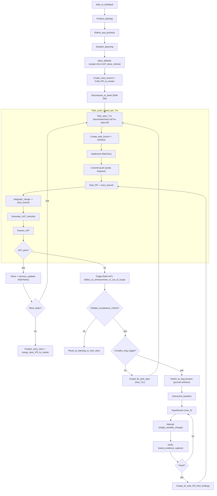

# Agentic Git + Worktrees Workflow (BMAD + Ralf + Cursor)

**Purpose:** Prevent lost work, make UAT + bugfixes first-class, and enable parallel dev/agent work with predictable integration.

This document is the **single source of truth** for how we work in this repo.

---

## Who this is for

- **Humans (primary):** you follow this while planning, coding, and doing UAT.
- **Agents (secondary):** the agent should treat this as authoritative process guidance.

To make sure agents consistently follow Git discipline, **paste the prompt snippet below** into any story/task prompt you run (PM/SM/dev/ralf) until it becomes muscle memory.

### Agent prompt snippet (copy/paste)

```markdown
Git discipline (mandatory):
- Do not implement on `master`.
- If a branch/PR does not exist for this work, STOP and create:
  - Story branch + Draft PR to `master` (for story/UAT cycle), or
  - Task branch + PR into story branch (for a fix task)
- Push at least once per session so no work is local-only.
- Follow: docs/workflows/AGENTIC-GIT-WORKTREE-WORKFLOW.md
```

---

## Principles (non-negotiable)

- **Never lose work:** meaningful changes are **committed and pushed** the same day.
- **UAT is work:** UAT failures become **tracked fix tasks** (not “side work”).
- **Small slices:** one task should be finishable in one focused session.
- **Integrator owns merges:** conflict resolution and integration testing are an explicit step.
- **PowerShell-safe:** do **not** use `&&` in commands.
- **Evidence over opinion:** link to logs/snapshots/notes; avoid narrative-only debugging.

---

## Roles (who does what)

- **PM (product):** priorities, scope, acceptance criteria, “Done” definition.
- **Architect (tech):** boundaries, forbidden zones, integration contracts.
- **Ralf-SM:** decomposes story → `TASK-PLAN.md` + `Txx-*.md` task specs.
- **Ralf-Dev:** implements **one** task spec with verification + completion note + auto-generated UAT checklist.
- **Ralf-UAT:** records human UAT results; routes defects vs enhancements vs out-of-scope.
- **Ralf-Retro:** extracts lessons, updates memory/test playbook.
- **Integrator (human or agent):** merges task PRs into story branch, resolves conflicts, runs integration checks, keeps story branch green.

---

## Naming conventions

### Branches

- **Story:** `story/<epic>-<story>-<slug>`
  - Example: `story/epic3-3.10-grid-layout`
- **Task:** `task/<story>/<Txx>-<slug>`
  - Example: `task/3.10/T03-grid-css-rendering`
- **Bugfix (off master):** `bugfix/<date>-<slug>` or `bugfix/<issue>-<slug>`
  - Example: `bugfix/2026-02-02-public-link-403`
- **Recovery (safety net):** `recovery/<date>-<slug>`

### PRs

- **Story PR:** `story/*` → `master` (**Draft** immediately)
- **Task PR:** `task/*` → `story/*`
- **Bugfix PR:** `bugfix/*` → `master`

---

## Worktrees (recommended layout)

Create a dedicated folder outside the repo root for worktrees.

### Windows path length note (important)

On Windows, deep folders (especially `node_modules`) can hit path-length limits. If you see “path too long” style errors, **use a short worktree root** (outside OneDrive), e.g. `C:\wt\elp`, and keep worktree folder names short.

Recommended per-machine setup:

```powershell
$env:ELP_WORKTREE_ROOT = "C:\wt\elp"
```

You can also pass `-WorktreeRoot` to the helper scripts (`scripts/git/new-story.ps1`, `scripts/git/new-task.ps1`).

```
C:\Users\tonyk\OneDrive\Projects\
  EventLeadPlatform\                (main checkout)
  EventLeadPlatform.wt\
    story-epic3-3.10-grid-layout\   (story integration worktree)
    task-3.10-T03-grid-css\         (task worktree)
```

Rule of thumb:
- Keep **one** long-lived story worktree (integration branch).
- Create **short-lived** task worktrees (delete after merge).

---

## High-level flow (Agile + bugs + bug-session)



---

## Step-by-step: Story workflow

### 0) Pre-flight (always)

- Confirm you’re not working directly on `master`.
- Make sure anything you changed yesterday is **pushed**.

### 1) Create story branch + Draft PR (immediately)

From the main checkout:

```powershell
git fetch origin
git switch master
git pull

git switch -c "story/epic3-3.10-grid-layout"
git push -u origin HEAD
```

Create Draft PR (GitHub CLI recommended):

```powershell
gh pr create --draft --base master --head "story/epic3-3.10-grid-layout" --title "epic3: Story 3.10 - Grid Layout" --body "Draft story PR. Tasks will merge into this branch."
```

### 2) Create the story integration worktree

```powershell
mkdir "..\\EventLeadPlatform.wt"
git worktree add "..\\EventLeadPlatform.wt\\story-epic3-3.10-grid-layout" "story/epic3-3.10-grid-layout"
```

### 3) Decompose story into tasks (Ralf-SM)

- Use `@ralf-sm *decompose-story` (main chat).
- Output goes to: `docs/tasks/<story-id>/...`

### 4) Execute tasks (repeat per Txx)

For each task:

1) Create task branch:

```powershell
git switch "story/epic3-3.10-grid-layout"
git pull

git switch -c "task/3.10/T03-grid-css-rendering"
git push -u origin HEAD
```

2) Create task worktree:

```powershell
git worktree add "..\\EventLeadPlatform.wt\\task-3.10-T03-grid-css" "task/3.10/T03-grid-css-rendering"
```

2b) **Task kickoff (before implementation or PR):** In the task worktree, update the task spec Status to `In Progress`, update `STATUS.md`, commit + push. This creates the first commit so the PR can be opened. See Epic 5 workflow: `docs/stories/EPIC-5-WORKFLOW-GUIDE.md` § Task kickoff.

3) Implement in the task worktree (Task Chat):
- `@ralf-dev *run-task` using the task spec path.
- Commit **small and often** (but always coherent).
- Push at least once per session.

4) Open Task PR: `task/*` → `story/*`

```powershell
gh pr create --base "story/epic3-3.10-grid-layout" --head "task/3.10/T03-grid-css-rendering" --title "epic3(3.10): T03 grid css rendering" --body "Implements task T03. See docs/tasks/3.10/... for completion + UAT."
```

5) Human UAT:
- Run the generated checklist (`docs/tasks/<story>/<Txx>.uat.md`).
- Record results via `@ralf-uat *record-uat` (same task chat).
- Run `@ralf-retro *run-retro` after pass.

### 5) Integrate (Integrator step)

The Integrator merges each task PR into the story branch and keeps it green:
- Resolve conflicts
- Run integration checks
- Update story-level docs if needed (`TASK-PLAN.md`, story completion notes)

After merge, delete the task worktree:

```powershell
git worktree remove "..\\EventLeadPlatform.wt\\task-3.10-T03-grid-css"
```

### 6) Close story (merge to master)

When all tasks are merged and UAT passes:
- Finalize story docs + status docs
- Merge story PR → `master` (**prefer GitHub merge UI or `gh pr merge`** so the PR shows merged and reviews stay auditable)
- Delete story worktree and branch when safe

**Story merge hygiene (Epic 6 BMAD — also see `docs/stories/EPIC-6-WORKFLOW-GUIDE.md`):**
- Update **`EPIC-6-WORKFLOW-GUIDE.md` header** (“Current focus” / completed story lines) in the **same** merge or immediate follow-up commit so the next session does not start on stale “in progress” text.
- **`EPIC-6-STATUS.md`:** correct story row + **PR number** (avoid mixing PRs from adjacent stories).
- **`story-6.x.md`:** DoD text matches reality (no “draft PR” wording after merge).
- **`STORY-6.x-GATE-EVIDENCE`:** full backend test summary when required, or explicit note if only focused tests + CI will run full suite.
- Optional **`STORY-6.x-CLOSEOUT-REPORT.md`** for deferrals and audit.
- Remove stray binaries/scratch files from the tree before the final push.

**Before starting the next story:** `git fetch origin`; `git switch master`; `git pull origin master`; `gh pr list` (confirm prior story closed). Then create the new story branch/worktree.

---

## Bugfix workflow

### Bug found during story UAT

- Treat as a **new task** under the same story.
- Create `task/<story>/<Txx>-bugfix-...` branch and follow the same loop.

### Bug found on master (hotfix)

```powershell
git switch master
git pull
git switch -c "bugfix/2026-02-02-public-link-403"
git push -u origin HEAD
```

Open PR: `bugfix/*` → `master`.

**Required artifacts:**
- Repro steps
- Fix evidence (logs/snapshot)
- At least one regression check (automated if feasible)

---

## Debugging ladder (cost-aware)

Use the cheapest tool that produces enough evidence:

1) **Quick triage:** Cursor `debug-report` skill (fast evidence + 1–3 hypotheses)\n+2) **Normal defect fix:** create a task and run `@ralf-dev` loop\n+3) **Hard bug:** switch to `bug-session` (scientific loop + ledger)\n+
### “Complex bug” triggers (switch to bug-session)

- 2+ failed fix attempts, or repeated regressions
- Cross-cutting issue (frontend+backend+data/state)
- Non-deterministic repro (timing/race/layout measurement)
- High severity (data loss, auth/security, corrupted saves)

---

## End-of-day rule (the safety net)

Before you stop:
- `git status` is clean **or**
- you have a WIP commit **and** the branch is pushed (`git push` done)

If you’re unsure: push anyway (branches are cheap; lost work is expensive).

